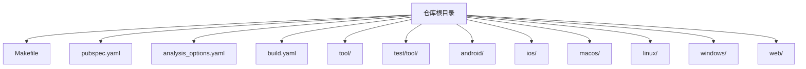
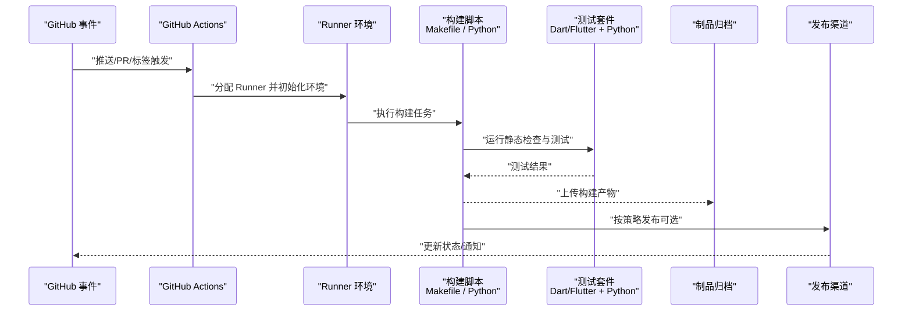
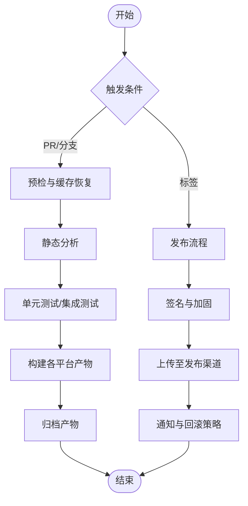
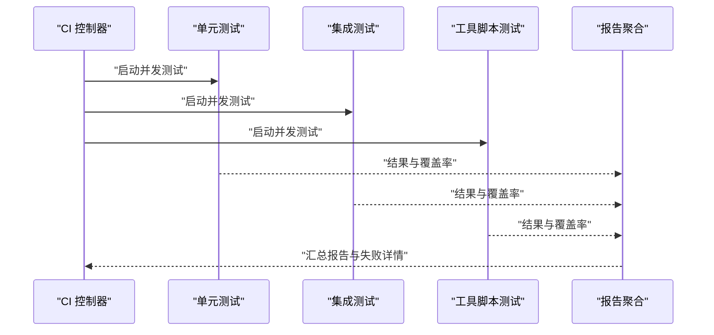
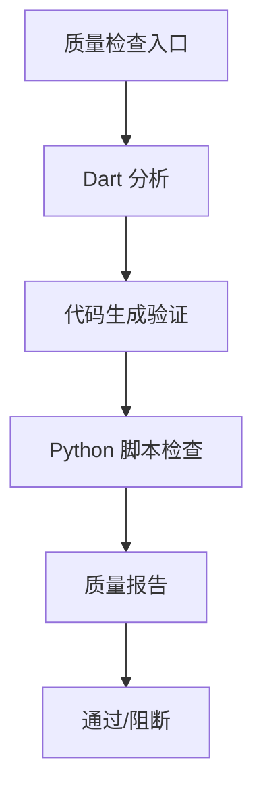
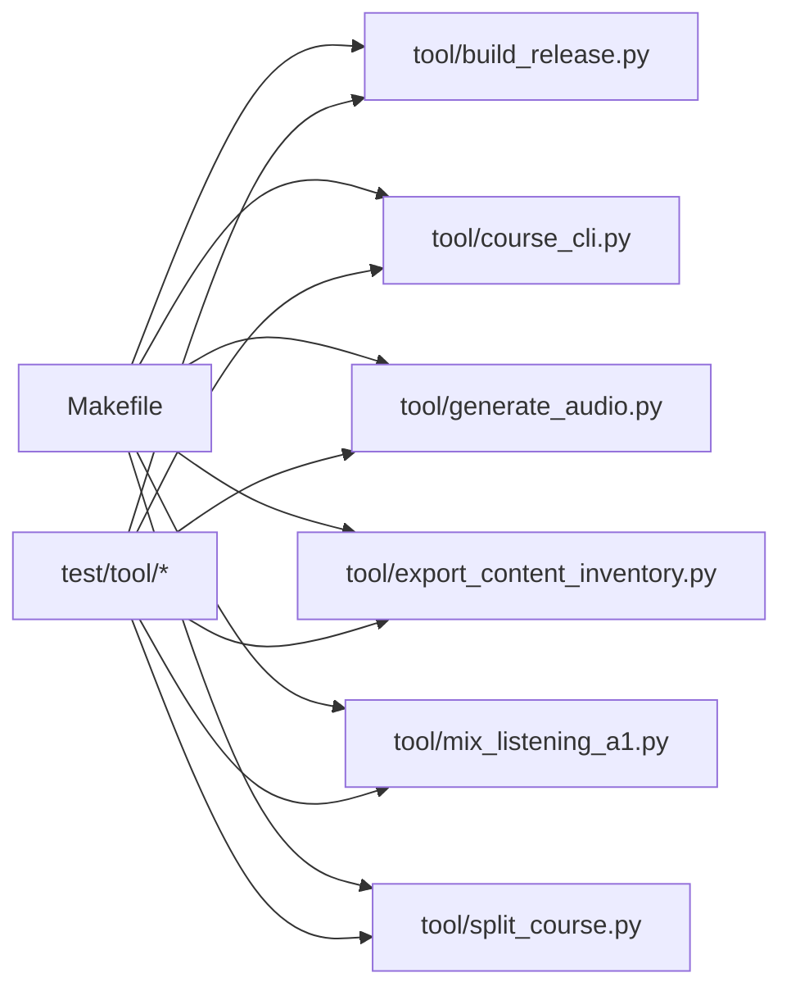

# CI/CD 流水线

<cite>
**本文引用的文件**   
- [Makefile](file://Makefile)
- [pubspec.yaml](file://pubspec.yaml)
- [analysis_options.yaml](file://analysis_options.yaml)
- [build.yaml](file://build.yaml)
- [tool/build_release.py](file://tool/build_release.py)
- [tool/course_cli.py](file://tool/course_cli.py)
- [tool/generate_audio.py](file://tool/generate_audio.py)
- [tool/export_content_inventory.py](file://tool/export_content_inventory.py)
- [tool/mix_listening_a1.py](file://tool/mix_listening_a1.py)
- [tool/split_course.py](file://tool/split_course.py)
- [android/app/build.gradle](file://android/app/build.gradle)
- [android/build.gradle](file://android/build.gradle)
- [android/gradle.properties](file://android/gradle.properties)
- [android/settings.gradle](file://android/settings.gradle)
- [ios/Podfile](file://ios/Podfile)
- [macos/Podfile](file://macos/Podfile)
- [linux/CMakeLists.txt](file://linux/CMakeLists.txt)
- [windows/CMakeLists.txt](file://windows/CMakeLists.txt)
- [web/index.html](file://web/index.html)
- [test/tool/build_release_test.py](file://test/tool/build_release_test.py)
- [test/tool/course_cli_validate_test.py](file://test/tool/course_cli_validate_test.py)
- [test/tool/gui_round_trip_test.py](file://test/tool/gui_round_trip_test.py)
- [tool/gui/build_gui.py](file://tool/gui/build_gui.py)
</cite>

## 目录
1. [简介](#简介)
2. [项目结构](#项目结构)
3. [核心组件](#核心组件)
4. [架构总览](#架构总览)
5. [详细组件分析](#详细组件分析)
6. [依赖关系分析](#依赖关系分析)
7. [性能考量](#性能考量)
8. [故障排查指南](#故障排查指南)
9. [结论](#结论)
10. [附录](#附录)

## 简介
本文件为 Varnamalaplus 项目的 CI/CD 流水线配置与实施指南，聚焦于 GitHub Actions 工作流设计、自动化测试执行、代码质量检查、构建与发布流程。内容涵盖环境变量与密钥管理、安全最佳实践、流水线故障排查、性能监控与日志收集方案，帮助团队建立稳定高效的持续集成与持续交付体系。

## 项目结构
仓库采用 Flutter 多端工程组织方式，包含 Android、iOS、macOS、Linux、Windows 与 Web 平台目标。CI/CD 相关能力主要分布在以下位置：
- 根级构建脚本与工具：Makefile、tool/*（Python 脚本）、test/tool/*（工具测试）
- 平台构建配置：android/*、ios/*、macos/*、linux/*、windows/*、web/*
- Dart/Flutter 工程配置：pubspec.yaml、analysis_options.yaml、build.yaml

**章节来源**
- [Makefile:1-200](file://Makefile#L1-L200)
- [pubspec.yaml:1-200](file://pubspec.yaml#L1-L200)
- [analysis_options.yaml:1-200](file://analysis_options.yaml#L1-L200)
- [build.yaml:1-200](file://build.yaml#L1-L200)

## 核心组件
- 构建入口与任务编排
  - Makefile：统一封装常用构建、测试、清理命令，便于在 CI 中调用
  - tool/build_release.py：跨平台发布构建脚本（Android/iOS/Web 等）
  - tool/course_cli.py：课程内容 CLI 工具（校验、导出等）
  - tool/generate_audio.py：音频资源生成
  - tool/export_content_inventory.py：内容清单导出
  - tool/mix_listening_a1.py / tool/split_course.py：课程素材处理
- 平台构建配置
  - Android：app/build.gradle、build.gradle、gradle.properties、settings.gradle
  - iOS/macOS：Podfile
  - Linux/Windows：CMakeLists.txt
  - Web：index.html
- 质量与静态检查
  - analysis_options.yaml：Dart 分析选项
  - build.yaml：构建阶段代码生成配置
  - test/tool/*：对工具脚本的单元测试与回归测试

**章节来源**
- [Makefile:1-200](file://Makefile#L1-L200)
- [tool/build_release.py:1-200](file://tool/build_release.py#L1-L200)
- [tool/course_cli.py:1-200](file://tool/course_cli.py#L1-L200)
- [tool/generate_audio.py:1-200](file://tool/generate_audio.py#L1-L200)
- [tool/export_content_inventory.py:1-200](file://tool/export_content_inventory.py#L1-L200)
- [tool/mix_listening_a1.py:1-200](file://tool/mix_listening_a1.py#L1-L200)
- [tool/split_course.py:1-200](file://tool/split_course.py#L1-L200)
- [android/app/build.gradle:1-200](file://android/app/build.gradle#L1-L200)
- [android/build.gradle:1-200](file://android/build.gradle#L1-L200)
- [android/gradle.properties:1-200](file://android/gradle.properties#L1-L200)
- [android/settings.gradle:1-200](file://android/settings.gradle#L1-L200)
- [ios/Podfile:1-200](file://ios/Podfile#L1-L200)
- [macos/Podfile:1-200](file://macos/Podfile#L1-L200)
- [linux/CMakeLists.txt:1-200](file://linux/CMakeLists.txt#L1-L200)
- [windows/CMakeLists.txt:1-200](file://windows/CMakeLists.txt#L1-L200)
- [web/index.html:1-200](file://web/index.html#L1-L200)
- [analysis_options.yaml:1-200](file://analysis_options.yaml#L1-L200)
- [build.yaml:1-200](file://build.yaml#L1-L200)

## 架构总览
下图展示 CI/CD 流水线从触发到产物产出的整体流程，包括代码拉取、环境准备、静态检查、测试、构建与发布等环节。

说明：
- 触发器：push、pull_request、release 标签等
- 环境：Flutter/Dart、Android SDK、Xcode、Node.js（Web）、Python（工具脚本）
- 产物：APK/AAB、IPA、DMG、AppImage、Windows Installer、Web 包
- 发布：内部制品库或应用商店（需凭据）

[本图为概念性流程图，不直接映射具体源码文件]

## 详细组件分析

### 构建与发布流水线
- 构建入口
  - Makefile：封装 flutter build、flutter analyze、dart pub get、python 工具脚本调用等
  - tool/build_release.py：根据参数选择目标平台，执行签名、打包、输出产物路径
- 发布策略
  - 分支策略：main/release 分支触发发布；feature 分支仅构建与测试
  - 标签策略：v* 标签触发正式版本发布，自动创建 Release 并上传产物
  - 缓存策略：Flutter/Dart/Gradle/ CocoaPods/ pip 缓存加速构建

**章节来源**
- [Makefile:1-200](file://Makefile#L1-L200)
- [tool/build_release.py:1-200](file://tool/build_release.py#L1-L200)

### 自动化测试执行
- 测试范围
  - Dart/Flutter 单元测试与集成测试（test/*）
  - 工具脚本测试（test/tool/*）
  - Golden 视觉回归测试（test/golden/*）
- 执行策略
  - 并行化：按模块/文件并行执行，缩短总时长
  - 隔离：每个 Job 独立环境，避免污染
  - 报告：JUnit XML 与 HTML 报告上传，便于查看失败用例

**章节来源**
- [test/tool/build_release_test.py:1-200](file://test/tool/build_release_test.py#L1-L200)
- [test/tool/course_cli_validate_test.py:1-200](file://test/tool/course_cli_validate_test.py#L1-L200)
- [test/tool/gui_round_trip_test.py:1-200](file://test/tool/gui_round_trip_test.py#L1-L200)

### 代码质量检查
- 静态分析
  - analysis_options.yaml：启用严格规则、忽略项、自定义规则
  - dart analyze：在 PR 上强制通过
- 构建期代码生成
  - build.yaml：定义 builder、builders、targets，确保生成代码一致性
- 工具脚本规范
  - Python 脚本遵循 PEP8，使用 pytest/unittest，并在 CI 中执行 lint

**章节来源**
- [analysis_options.yaml:1-200](file://analysis_options.yaml#L1-L200)
- [build.yaml:1-200](file://build.yaml#L1-L200)

### 平台构建配置要点
- Android
  - gradle.properties：设置 JDK、SDK、NDK、签名信息（通过环境变量注入）
  - app/build.gradle：应用签名、版本管理、资源优化
- iOS/macOS
  - Podfile：依赖管理与版本锁定
- Linux/Windows
  - CMakeLists.txt：交叉编译与链接选项
- Web
  - index.html：入口与资源路径配置

**章节来源**
- [android/gradle.properties:1-200](file://android/gradle.properties#L1-L200)
- [android/app/build.gradle:1-200](file://android/app/build.gradle#L1-L200)
- [ios/Podfile:1-200](file://ios/Podfile#L1-L200)
- [macos/Podfile:1-200](file://macos/Podfile#L1-L200)
- [linux/CMakeLists.txt:1-200](file://linux/CMakeLists.txt#L1-L200)
- [windows/CMakeLists.txt:1-200](file://windows/CMakeLists.txt#L1-L200)
- [web/index.html:1-200](file://web/index.html#L1-L200)

### GUI 构建与回归
- tool/gui/build_gui.py：GUI 构建脚本（如 PyInstaller），用于桌面端或工具链构建
- 回归测试：gui_round_trip_test.py 保证 GUI 构建与运行稳定性

**章节来源**
- [tool/gui/build_gui.py:1-200](file://tool/gui/build_gui.py#L1-L200)
- [test/tool/gui_round_trip_test.py:1-200](file://test/tool/gui_round_trip_test.py#L1-L200)

## 依赖关系分析
- 外部依赖
  - Flutter/Dart SDK、Android SDK、Xcode、CocoaPods、Node.js（Web）、Python
- 内部依赖
  - Makefile 调用 tool/* 脚本
  - 测试覆盖工具脚本与业务逻辑
  - 平台构建配置与产物输出

**章节来源**
- [Makefile:1-200](file://Makefile#L1-L200)
- [tool/build_release.py:1-200](file://tool/build_release.py#L1-L200)
- [tool/course_cli.py:1-200](file://tool/course_cli.py#L1-L200)
- [tool/generate_audio.py:1-200](file://tool/generate_audio.py#L1-L200)
- [tool/export_content_inventory.py:1-200](file://tool/export_content_inventory.py#L1-L200)
- [tool/mix_listening_a1.py:1-200](file://tool/mix_listening_a1.py#L1-L200)
- [tool/split_course.py:1-200](file://tool/split_course.py#L1-L200)
- [test/tool/build_release_test.py:1-200](file://test/tool/build_release_test.py#L1-L200)
- [test/tool/course_cli_validate_test.py:1-200](file://test/tool/course_cli_validate_test.py#L1-L200)
- [test/tool/gui_round_trip_test.py:1-200](file://test/tool/gui_round_trip_test.py#L1-L200)

## 性能考量
- 缓存策略
  - Flutter/Dart 包缓存、Android Gradle 缓存、CocoaPods 缓存、pip 缓存
  - 合理设置缓存键，避免误命中导致构建不稳定
- 并行化
  - 将静态检查、测试、构建拆分为多个 Job，充分利用 Runner 资源
- 增量构建
  - 利用 Flutter 增量编译、Gradle 增量构建减少构建时间
- 资源优化
  - 图片压缩、音频转码、代码分割（Web）

[本节为通用指导，不直接分析具体文件]

## 故障排查指南
- 常见问题定位
  - 构建失败：检查环境变量、签名配置、SDK 版本兼容性
  - 测试失败：查看测试报告、复现本地环境、增加调试日志
  - 发布失败：确认凭据权限、渠道限制、产物完整性
- 日志收集
  - 保存完整构建日志、测试输出、错误堆栈
  - 关键步骤添加结构化日志，便于检索与分析
- 回滚策略
  - 发布前进行灰度与回滚演练
  - 保留历史版本产物与元数据

**章节来源**
- [Makefile:1-200](file://Makefile#L1-L200)
- [tool/build_release.py:1-200](file://tool/build_release.py#L1-L200)
- [test/tool/build_release_test.py:1-200](file://test/tool/build_release_test.py#L1-L200)

## 结论
通过统一的构建入口、严格的静态检查、全面的测试覆盖与稳健的发布策略，Varnamalaplus 的 CI/CD 流水线能够保障多端产品的质量与交付效率。建议持续优化缓存与并行化、完善监控与告警、强化安全与合规措施，以支撑快速迭代与稳定发布。

[本节为总结性内容，不直接分析具体文件]

## 附录
- 环境变量与密钥管理
  - 使用 GitHub Secrets 管理敏感信息（签名证书、API Key、Token）
  - 通过环境变量注入构建配置，避免硬编码
- 安全最佳实践
  - 最小权限原则、定期轮换密钥、审计访问日志
  - 依赖扫描与漏洞修复（Dart/Python/第三方库）
- 监控与可观测性
  - 构建耗时、成功率、失败原因统计
  - 产物大小与下载量监控

[本节为通用指导，不直接分析具体文件]