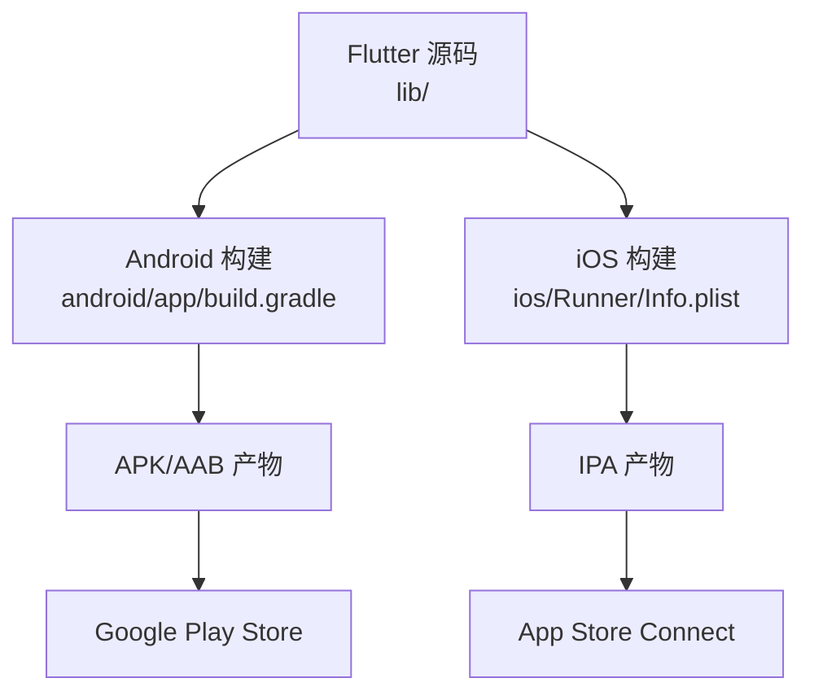
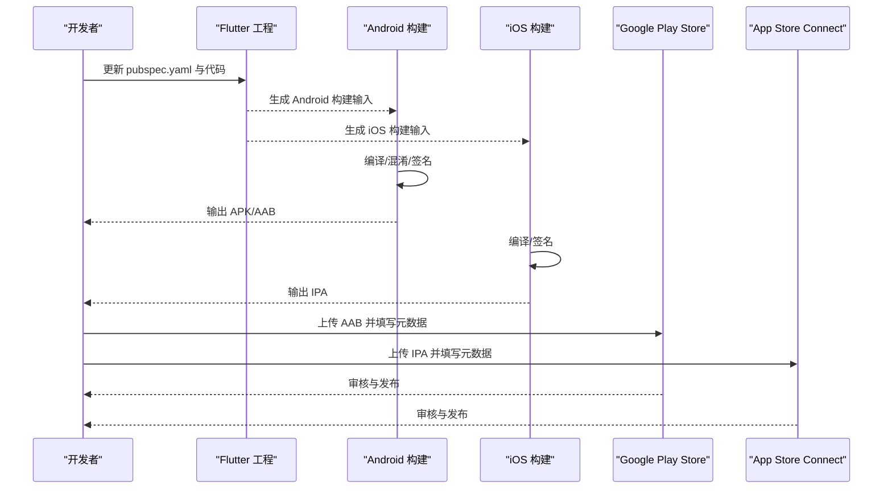
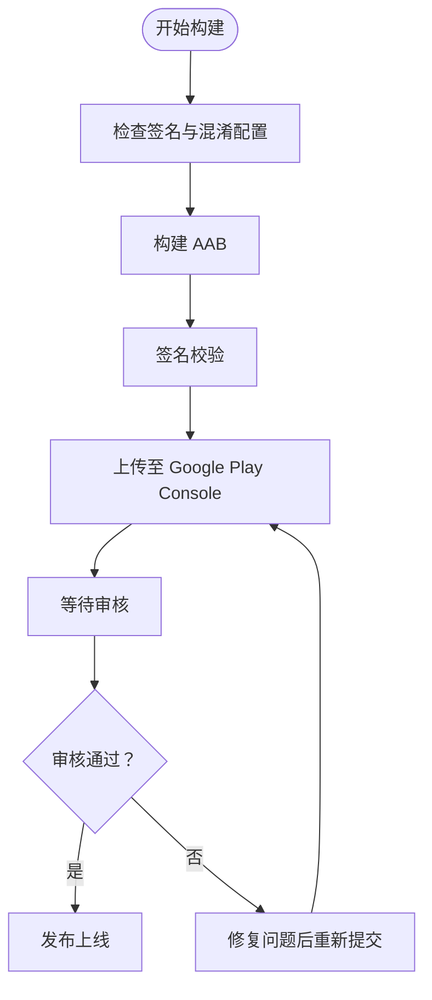
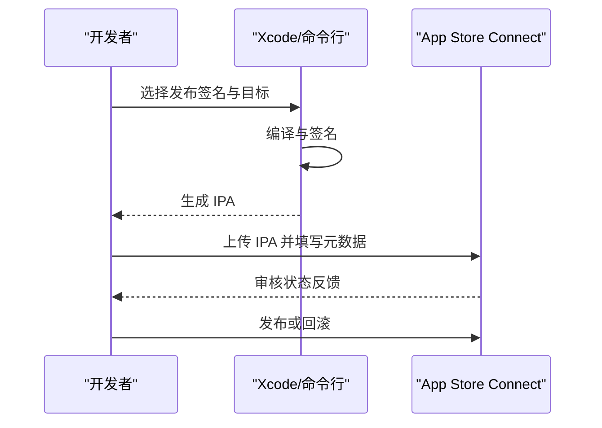
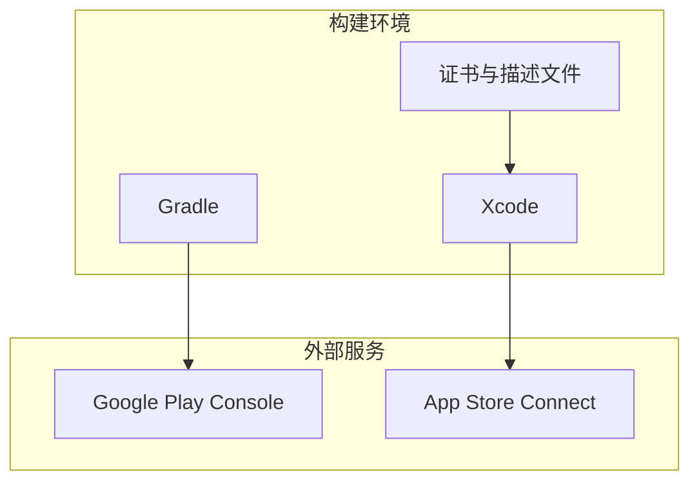

# 应用商店发布

<cite>
**本文引用的文件**   
- [android/app/build.gradle](file://android/app/build.gradle)
- [android/proguard-rules.pro](file://android/proguard-rules.pro)
- [android/gradle.properties](file://android/gradle.properties)
- [android/local.properties](file://android/local.properties)
- [ios/Runner/Info.plist](file://ios/Runner/Info.plist)
- [ios/Runner/AppDelegate.swift](file://ios/Runner/AppDelegate.swift)
- [pubspec.yaml](file://pubspec.yaml)
- [Makefile](file://Makefile)
</cite>

## 目录
1. [简介](#简介)
2. [项目结构](#项目结构)
3. [核心组件](#核心组件)
4. [架构总览](#架构总览)
5. [详细组件分析](#详细组件分析)
6. [依赖分析](#依赖分析)
7. [性能考虑](#性能考虑)
8. [故障排查指南](#故障排查指南)
9. [结论](#结论)
10. [附录：发布检查清单与元数据管理](#附录发布检查清单与元数据管理)

## 简介
本指南面向 Varnamalaplus 项目的发布工程师与维护者，聚焦 Android 与 iOS 双端在应用商店上架的完整流程。内容涵盖：
- Android APK/AAB 构建、签名、混淆与 Google Play Store 上架要求
- iOS App 打包、App Store Connect 配置与审核要求
- 应用签名、混淆配置与安全审查准备
- 应用元数据管理、版本控制与发布检查清单

本指南基于仓库中的 Android Gradle 配置、ProGuard 规则、iOS Info.plist 与 Flutter 工程元数据进行说明，确保读者可据此完成从本地构建到商店发布的端到端流程。

## 项目结构
Varnamalaplus 为 Flutter 多平台项目，关键发布相关目录与文件如下：
- android/app/build.gradle：Android 应用构建脚本（签名、渠道、产物输出）
- android/proguard-rules.pro：Android 代码混淆与资源压缩规则
- android/gradle.properties：Gradle 全局属性（如签名路径、密钥库信息占位等）
- android/local.properties：本地环境配置（SDK/NDK 路径等）
- ios/Runner/Info.plist：iOS 应用元信息与权限声明
- ios/Runner/AppDelegate.swift：iOS 启动入口与插件注册
- pubspec.yaml：Flutter 应用元数据（名称、描述、版本、图标等）
- Makefile：常用命令封装（便于统一构建与发布流程）

图表来源
- [android/app/build.gradle](file://android/app/build.gradle)
- [ios/Runner/Info.plist](file://ios/Runner/Info.plist)

章节来源
- [android/app/build.gradle](file://android/app/build.gradle)
- [android/proguard-rules.pro](file://android/proguard-rules.pro)
- [android/gradle.properties](file://android/gradle.properties)
- [android/local.properties](file://android/local.properties)
- [ios/Runner/Info.plist](file://ios/Runner/Info.plist)
- [ios/Runner/AppDelegate.swift](file://ios/Runner/AppDelegate.swift)
- [pubspec.yaml](file://pubspec.yaml)
- [Makefile](file://Makefile)

## 核心组件
- Android 构建与签名
  - 使用 Gradle 构建 APK 或 AAB，推荐优先使用 AAB 以适配 Google Play 的分发优化
  - 通过 keystore 进行签名；签名信息可通过 gradle.properties 或命令行参数注入
  - 启用 ProGuard/R8 混淆与资源压缩，提升安全性并减小包体
- iOS 构建与签名
  - 通过 Xcode 或命令行工具生成 IPA，需配置开发者证书与描述文件
  - Info.plist 中声明必要权限与应用元数据
  - 使用 App Store Connect 进行版本管理与分发
- Flutter 元数据与版本
  - pubspec.yaml 定义应用名称、描述、版本号、图标等
  - 建议将版本与构建号分离，便于自动化流水线处理

章节来源
- [android/app/build.gradle](file://android/app/build.gradle)
- [android/proguard-rules.pro](file://android/proguard-rules.pro)
- [android/gradle.properties](file://android/gradle.properties)
- [ios/Runner/Info.plist](file://ios/Runner/Info.plist)
- [pubspec.yaml](file://pubspec.yaml)

## 架构总览
下图展示从源码到商店发布的整体流程，包括 Android 与 iOS 两条分支以及公共的 Flutter 元数据层。

图表来源
- [android/app/build.gradle](file://android/app/build.gradle)
- [ios/Runner/Info.plist](file://ios/Runner/Info.plist)
- [pubspec.yaml](file://pubspec.yaml)

## 详细组件分析

### Android 构建与发布（APK/AAB）
- 构建目标
  - 推荐使用 AAB 作为上架产物，以获得更好的分发与体积优化
  - 调试阶段可使用 APK 进行快速验证
- 签名配置
  - 使用 keystore 对产物进行签名
  - 签名信息可通过 gradle.properties 或环境变量注入，避免硬编码
- 混淆与优化
  - 启用 R8/ProGuard 进行代码混淆与资源压缩
  - 自定义 proguard-rules.pro 排除第三方库反射需求
- 权限与清单
  - 在 AndroidManifest 中声明所需权限（网络、存储、麦克风等）
  - 遵循最小权限原则，仅申请功能必需权限
- 构建命令
  - 使用 Gradle 任务生成签名后的 AAB/APK
  - 可在 CI 中通过命令行传入签名参数，实现无交互构建

图表来源
- [android/app/build.gradle](file://android/app/build.gradle)
- [android/proguard-rules.pro](file://android/proguard-rules.pro)
- [android/gradle.properties](file://android/gradle.properties)

章节来源
- [android/app/build.gradle](file://android/app/build.gradle)
- [android/proguard-rules.pro](file://android/proguard-rules.pro)
- [android/gradle.properties](file://android/gradle.properties)
- [android/local.properties](file://android/local.properties)

### iOS 构建与发布（IPA）
- 构建目标
  - 使用 Xcode 或命令行工具生成 IPA
  - 确保开发者证书与描述文件有效且匹配
- 签名配置
  - 配置签名团队、证书与描述文件
  - 区分开发、测试与发布签名
- 元数据与权限
  - 在 Info.plist 中设置应用名称、图标、隐私权限等
  - 根据功能声明必要的权限（相机、相册、麦克风等）
- 上传与审核
  - 通过 Xcode 或 Transporter 上传 IPA 至 App Store Connect
  - 填写应用元数据并提交审核

图表来源
- [ios/Runner/Info.plist](file://ios/Runner/Info.plist)
- [ios/Runner/AppDelegate.swift](file://ios/Runner/AppDelegate.swift)

章节来源
- [ios/Runner/Info.plist](file://ios/Runner/Info.plist)
- [ios/Runner/AppDelegate.swift](file://ios/Runner/AppDelegate.swift)

### 应用签名、混淆与安全审查
- 应用签名
  - Android：keystore 安全保管，CI 中使用加密变量注入
  - iOS：证书与描述文件定期轮换，避免过期导致构建失败
- 混淆配置
  - Android：启用 R8/ProGuard，针对第三方库添加保留规则
  - iOS：开启 Strip 与符号剥离，减少调试信息泄露
- 安全审查准备
  - 移除敏感日志与调试开关
  - 清理未使用的权限与资源
  - 进行静态扫描与依赖漏洞检查

章节来源
- [android/proguard-rules.pro](file://android/proguard-rules.pro)
- [android/gradle.properties](file://android/gradle.properties)
- [ios/Runner/Info.plist](file://ios/Runner/Info.plist)

### 应用元数据管理与版本控制
- Flutter 元数据
  - pubspec.yaml 中维护应用名称、描述、版本、图标等
  - 建议将版本与构建号分离，便于自动化流水线递增
- 平台元数据
  - Android：在 build.gradle 中设置 applicationId、versionCode、versionName
  - iOS：在 Info.plist 中设置 CFBundleShortVersionString、CFBundleVersion
- 版本策略
  - 语义化版本（主.次.修订）
  - 构建号独立递增，用于内部追踪与回滚

章节来源
- [pubspec.yaml](file://pubspec.yaml)
- [android/app/build.gradle](file://android/app/build.gradle)
- [ios/Runner/Info.plist](file://ios/Runner/Info.plist)

## 依赖分析
- 构建依赖
  - Android：Gradle、Android SDK/NDK、签名工具
  - iOS：Xcode、命令行工具、开发者账号与证书
- 外部服务
  - Google Play Console：AAB 上传、版本管理、发布策略
  - App Store Connect：IPA 上传、版本管理、审核流程
- 工具链集成
  - 可通过 Makefile 统一封装构建与发布命令，便于团队协作与 CI/CD

图表来源
- [android/app/build.gradle](file://android/app/build.gradle)
- [ios/Runner/Info.plist](file://ios/Runner/Info.plist)
- [Makefile](file://Makefile)

章节来源
- [android/app/build.gradle](file://android/app/build.gradle)
- [ios/Runner/Info.plist](file://ios/Runner/Info.plist)
- [Makefile](file://Makefile)

## 性能考虑
- Android
  - 启用 R8/ProGuard 减少包体与提高启动速度
  - 按需加载资源，避免大体积图片与音频直接打包
- iOS
  - 开启 Strip 与符号剥离，减少二进制大小
  - 合理划分模块，避免主包过大影响下载与安装
- 通用
  - 使用增量构建与缓存加速 CI 流水线
  - 监控崩溃与性能指标，持续优化用户体验

[本节为通用指导，不直接分析具体文件]

## 故障排查指南
- Android 构建失败
  - 检查 keystore 路径与密码是否正确
  - 确认 Gradle 版本与 Android SDK 兼容
  - 查看混淆规则是否误删必要类
- iOS 构建失败
  - 确认证书与描述文件有效且匹配
  - 检查 Info.plist 权限声明与实际使用一致
  - 清理 DerivedData 与缓存后重试
- 上传失败
  - 核对应用 ID、版本号与签名一致性
  - 检查网络连接与服务端状态
  - 查看控制台错误日志定位问题

章节来源
- [android/app/build.gradle](file://android/app/build.gradle)
- [android/proguard-rules.pro](file://android/proguard-rules.pro)
- [android/gradle.properties](file://android/gradle.properties)
- [ios/Runner/Info.plist](file://ios/Runner/Info.plist)

## 结论
通过本指南，您可以完成 Varnamalaplus 项目在 Android 与 iOS 平台的构建、签名、混淆与上架流程。建议结合 CI/CD 实现自动化构建与发布，确保版本一致性与可追溯性。同时，持续关注安全与性能优化，提升应用质量与用户体验。

[本节为总结性内容，不直接分析具体文件]

## 附录：发布检查清单与元数据管理
- 发布前检查
  - 版本号与构建号正确递增
  - 签名有效且与平台要求一致
  - 权限声明最小化且与实际使用一致
  - 混淆与资源压缩已启用
  - 敏感信息与调试开关已清理
- 元数据管理
  - Flutter：pubspec.yaml 中的应用名称、描述、图标
  - Android：applicationId、versionCode、versionName
  - iOS：CFBundleShortVersionString、CFBundleVersion、权限键值
- 发布步骤
  - Android：构建 AAB → 上传至 Google Play Console → 填写元数据 → 提交审核
  - iOS：构建 IPA → 上传至 App Store Connect → 填写元数据 → 提交审核
- 回滚与热修复
  - 保留历史版本与构建产物
  - 制定热修复流程与紧急发布预案

章节来源
- [pubspec.yaml](file://pubspec.yaml)
- [android/app/build.gradle](file://android/app/build.gradle)
- [ios/Runner/Info.plist](file://ios/Runner/Info.plist)
- [Makefile](file://Makefile)