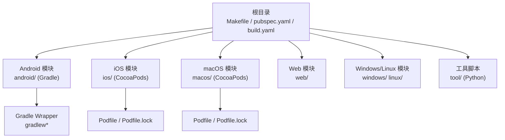
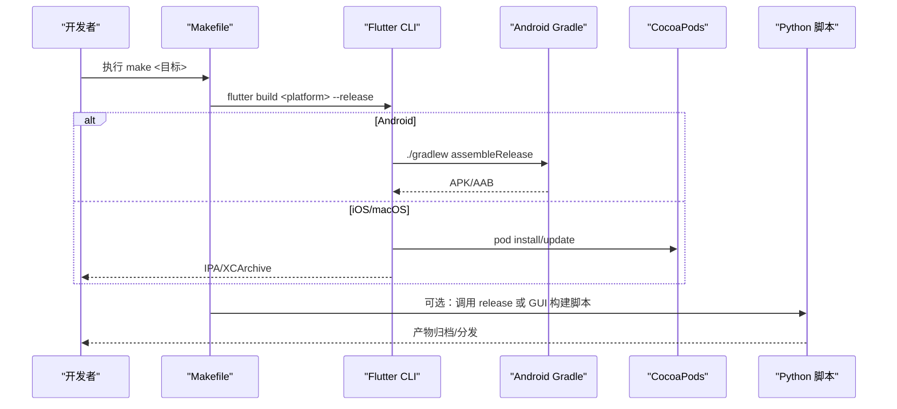
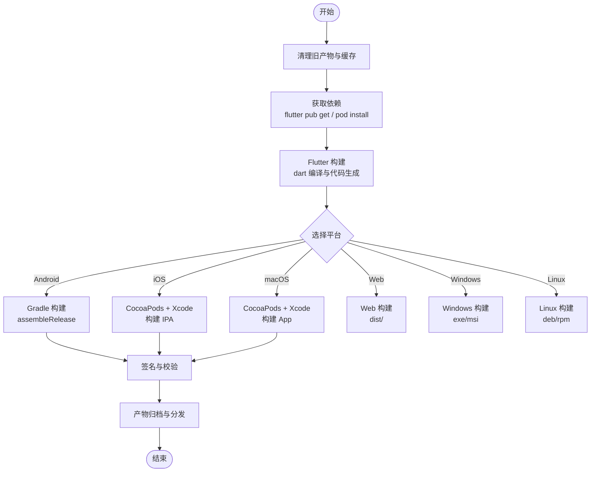

# 构建配置

<cite>
**本文引用的文件**   
- [Makefile](file://Makefile)
- [pubspec.yaml](file://pubspec.yaml)
- [build.yaml](file://build.yaml)
- [android/build.gradle](file://android/build.gradle)
- [android/app/build.gradle](file://android/app/build.gradle)
- [android/gradle.properties](file://android/gradle.properties)
- [android/settings.gradle](file://android/settings.gradle)
- [ios/Podfile](file://ios/Podfile)
- [macos/Podfile](file://macos/Podfile)
- [tool/build_release.py](file://tool/build_release.py)
- [tool/gui/build_gui.py](file://tool/gui/build_gui.py)
</cite>

## 目录
1. [简介](#简介)
2. [项目结构](#项目结构)
3. [核心组件](#核心组件)
4. [架构总览](#架构总览)
5. [详细组件分析](#详细组件分析)
6. [依赖分析](#依赖分析)
7. [性能考虑](#性能考虑)
8. [故障排查指南](#故障排查指南)
9. [结论](#结论)
10. [附录](#附录)

## 简介
本文件面向 Varnamalaplus Flutter 项目的构建系统，系统性说明 Android Gradle、iOS/macOS CocoaPods、Flutter/Dart 构建与打包流程，以及 Makefile 命令、工具脚本的使用方式。文档同时给出跨平台构建参数、优化选项、签名设置建议，并提供缓存策略与增量构建配置，帮助开发者快速搭建本地与 CI 环境并提升构建效率。

## 项目结构
Varnamalaplus 采用标准 Flutter 多端工程结构：
- 根目录包含 Flutter 应用配置（pubspec.yaml、build.yaml）、顶层 Makefile 与工具脚本（tool/）。
- android/ 为 Android 原生模块，使用 Gradle 构建；ios/ 和 macos/ 为 iOS/macOS 原生模块，使用 CocoaPods 管理依赖。
- tool/ 下包含发布构建脚本与 GUI 构建脚本，用于自动化打包与产物处理。

图表来源
- [Makefile](file://Makefile)
- [pubspec.yaml](file://pubspec.yaml)
- [android/build.gradle](file://android/build.gradle)
- [android/app/build.gradle](file://android/app/build.gradle)
- [android/gradle.properties](file://android/gradle.properties)
- [android/settings.gradle](file://android/settings.gradle)
- [ios/Podfile](file://ios/Podfile)
- [macos/Podfile](file://macos/Podfile)

章节来源
- [Makefile](file://Makefile)
- [pubspec.yaml](file://pubspec.yaml)
- [build.yaml](file://build.yaml)

## 核心组件
- Flutter/Dart 构建入口与资源声明：通过 pubspec.yaml 定义应用元数据、依赖、资产与生成代码规则；build.yaml 控制代码生成与构建行为。
- Android 构建：Gradle 负责编译、链接、签名与产物输出；可通过 gradle.properties 与 app/build.gradle 调整构建参数与优化开关。
- iOS/macOS 构建：CocoaPods 管理第三方库；Podfile 指定目标平台、依赖版本与构建配置。
- 构建编排：Makefile 提供统一命令入口，封装 flutter、gradle、pod 等子命令；tool/ 下的 Python 脚本实现更复杂的发布流水线。

章节来源
- [pubspec.yaml](file://pubspec.yaml)
- [build.yaml](file://build.yaml)
- [android/build.gradle](file://android/build.gradle)
- [android/app/build.gradle](file://android/app/build.gradle)
- [android/gradle.properties](file://android/gradle.properties)
- [android/settings.gradle](file://android/settings.gradle)
- [ios/Podfile](file://ios/Podfile)
- [macos/Podfile](file://macos/Podfile)
- [Makefile](file://Makefile)
- [tool/build_release.py](file://tool/build_release.py)
- [tool/gui/build_gui.py](file://tool/gui/build_gui.py)

## 架构总览
下图展示从 Makefile 到各平台构建系统的调用关系与产物流向。

图表来源
- [Makefile](file://Makefile)
- [android/build.gradle](file://android/build.gradle)
- [android/app/build.gradle](file://android/app/build.gradle)
- [ios/Podfile](file://ios/Podfile)
- [macos/Podfile](file://macos/Podfile)
- [tool/build_release.py](file://tool/build_release.py)
- [tool/gui/build_gui.py](file://tool/gui/build_gui.py)

## 详细组件分析

### Flutter/Dart 构建配置
- pubspec.yaml：声明应用名称、版本、依赖、assets、生成代码插件与自定义构建目标。
- build.yaml：控制代码生成器（如 json_serializable、freezed、protobuf 等）的行为，包括生成路径、注解处理与调试信息。

常用构建命令（由 Makefile 封装）：
- 清理与获取依赖：make clean, make deps
- 运行与调试：make run/debug
- 构建产物：make build-android, make build-ios, make build-macos, make build-web, make build-windows, make build-linux
- 测试与分析：make test, make analyze

章节来源
- [pubspec.yaml](file://pubspec.yaml)
- [build.yaml](file://build.yaml)
- [Makefile](file://Makefile)

### Android 构建系统（Gradle）
关键文件与作用：
- android/build.gradle：项目级 Gradle 配置，定义仓库源、插件版本、全局变量。
- android/app/build.gradle：应用级构建脚本，定义 compileSdk/targetSdk/minSdk、签名配置、构建变体、ProGuard/R8 规则、资源过滤与产物命名。
- android/gradle.properties：全局 Gradle 属性，如 JVM 内存、并行构建、AndroidX 开关、NDK 路径等。
- android/settings.gradle：模块声明与仓库解析配置。

构建参数与优化要点：
- 构建变体：debug/release，可启用 shrinkResources、minifyEnabled、shrinkMode 等以减小体积。
- 签名：在 app/build.gradle 中配置 signingConfigs，结合环境变量注入 keystore 信息。
- 性能：开启 Gradle 守护进程、并行构建、按需配置依赖版本，避免重复下载。

章节来源
- [android/build.gradle](file://android/build.gradle)
- [android/app/build.gradle](file://android/app/build.gradle)
- [android/gradle.properties](file://android/gradle.properties)
- [android/settings.gradle](file://android/settings.gradle)

### iOS/macOS 构建系统（CocoaPods）
关键文件与作用：
- ios/Podfile：定义目标平台、依赖库、构建配置（Debug/Release）、Post-install 钩子与导出配置。
- macos/Podfile：同 iOS，但针对 macOS 平台与 Runner 目标。

常见配置项：
- platform 与 deployment_target：限定最低系统版本。
- target 与 pod 依赖：按目标区分依赖与构建选项。
- config 与 xcconfig：通过 Pods.xcconfig 注入编译器标志、宏定义与签名信息。
- post_install：自动修复依赖或应用额外构建步骤（如修改框架搜索路径）。

章节来源
- [ios/Podfile](file://ios/Podfile)
- [macos/Podfile](file://macos/Podfile)

### Makefile 构建编排
Makefile 提供统一的命令入口，封装 flutter、gradle、pod 等子命令，支持：
- 清理与初始化：clean、deps、setup
- 运行与调试：run、debug
- 构建与打包：build-android、build-ios、build-macos、build-web、build-windows、build-linux
- 测试与分析：test、analyze、lint
- 自定义目标：可按需扩展平台或任务

使用建议：
- 将敏感配置（签名、密钥）通过环境变量传入，避免硬编码。
- 在 CI 中复用 Makefile 目标，保证本地与远程构建一致。

章节来源
- [Makefile](file://Makefile)

### 工具脚本与自定义构建流程
- tool/build_release.py：用于发布构建的自动化脚本，可能包含版本管理、签名、产物归档与上传逻辑。
- tool/gui/build_gui.py：GUI 工具的构建脚本，可能涉及 PyInstaller 或其他打包工具的配置。

使用场景：
- 在 Makefile 中调用这些脚本完成复杂流水线（例如先构建 Flutter 产物，再打包 GUI 工具，最后合并产物）。
- 在 CI 中直接调用脚本，减少人工干预。

章节来源
- [tool/build_release.py](file://tool/build_release.py)
- [tool/gui/build_gui.py](file://tool/gui/build_gui.py)

## 依赖分析
下图展示构建阶段的主要依赖关系与调用顺序。

图表来源
- [Makefile](file://Makefile)
- [android/build.gradle](file://android/build.gradle)
- [android/app/build.gradle](file://android/app/build.gradle)
- [ios/Podfile](file://ios/Podfile)
- [macos/Podfile](file://macos/Podfile)

章节来源
- [Makefile](file://Makefile)
- [android/build.gradle](file://android/build.gradle)
- [android/app/build.gradle](file://android/app/build.gradle)
- [ios/Podfile](file://ios/Podfile)
- [macos/Podfile](file://macos/Podfile)

## 性能考虑
- 增量构建与缓存
  - Flutter：利用 .dart_tool 与 pub cache；CI 中缓存 pub 与构建缓存目录。
  - Android：启用 Gradle 守护进程、并行构建、配置 Gradle 缓存目录；合理使用构建变体以减少不必要的重编译。
  - iOS/macOS：缓存 Pods 目录与 DerivedData；避免频繁 pod update。
- 构建优化
  - 关闭不必要的日志与调试符号（release 模式）。
  - 使用 R8/ProGuard 进行代码压缩与混淆。
  - 合理拆分资源与按需加载，减少首包体积。
- 并发与资源限制
  - 根据机器 CPU/内存调整 Gradle 线程数与 JVM 堆大小。
  - 在 CI 中限制并行任务数量，避免资源争用。

[本节为通用指导，不直接分析具体文件]

## 故障排查指南
常见问题与定位方法：
- 依赖冲突
  - Android：检查 gradle dependencies 与冲突库版本；必要时强制统一版本。
  - iOS：查看 pod install 输出与 Podfile.lock 一致性；必要时清理 Pods 与重新安装。
- 签名失败
  - Android：确认 signingConfigs 与 keystore 路径、密码正确；检查签名算法与证书有效期。
  - iOS/macOS：确认 Provisioning Profile 与 Bundle ID 匹配；检查钥匙串权限。
- 构建缓慢
  - 检查网络代理与镜像配置；确保缓存目录有效；减少不必要的依赖。
- 产物异常
  - 清理缓存后重试；检查构建变体与资源过滤是否误删必要文件。

章节来源
- [android/build.gradle](file://android/build.gradle)
- [android/app/build.gradle](file://android/app/build.gradle)
- [android/gradle.properties](file://android/gradle.properties)
- [ios/Podfile](file://ios/Podfile)
- [macos/Podfile](file://macos/Podfile)
- [Makefile](file://Makefile)

## 结论
Varnamalaplus 的构建体系以 Flutter 为核心，结合 Android Gradle 与 iOS/macOS CocoaPods，通过 Makefile 与 Python 脚本实现统一编排与自动化发布。遵循本文的配置与优化建议，可在本地与 CI 环境中获得稳定高效的构建体验。建议在团队内统一构建参数与缓存策略，持续监控构建时长与产物质量。

[本节为总结性内容，不直接分析具体文件]

## 附录
- 常用命令速查（基于 Makefile）
  - 清理与依赖：make clean, make deps
  - 运行与调试：make run, make debug
  - 构建产物：make build-android, make build-ios, make build-macos, make build-web, make build-windows, make build-linux
  - 测试与分析：make test, make analyze
- 环境变量建议
  - ANDROID_KEYSTORE_PATH、ANDROID_KEYSTORE_PASSWORD、ANDROID_KEY_ALIAS、ANDROID_KEY_PASSWORD
  - IOS_PROVISIONING_PROFILE、IOS_CERTIFICATE_PATH
  - GRADLE_OPTS、JAVA_HOME、PODS_CACHE_DIR

[本节为补充信息，不直接分析具体文件]