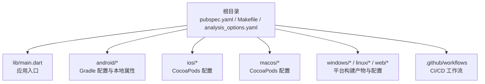
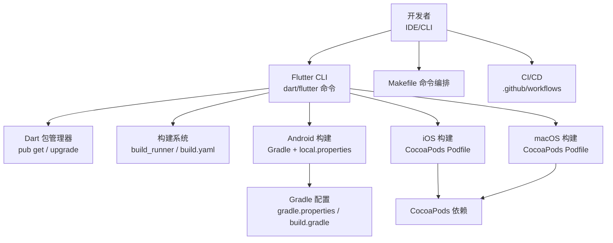
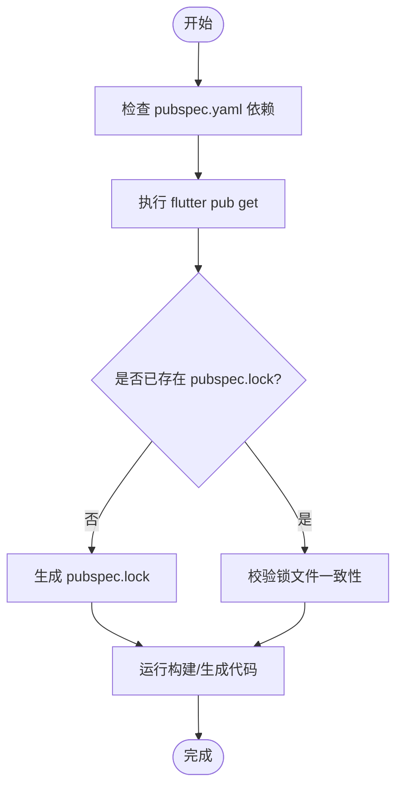
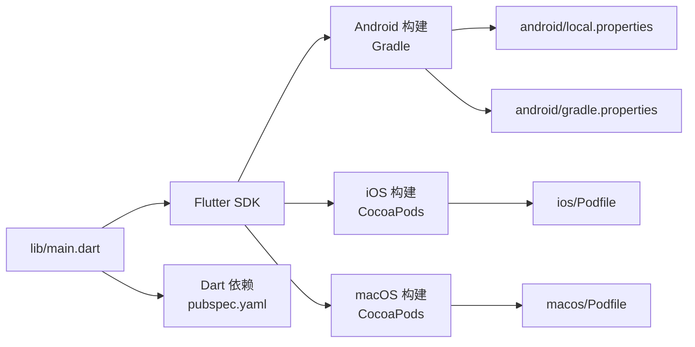

# 环境管理

<cite>
**本文引用的文件**   
- [README.md](file://README.md)
- [pubspec.yaml](file://pubspec.yaml)
- [Makefile](file://Makefile)
- [analysis_options.yaml](file://analysis_options.yaml)
- [devtools_options.yaml](file://devtools_options.yaml)
- [build.yaml](file://build.yaml)
- [android/local.properties](file://android/local.properties)
- [android/gradle.properties](file://android/gradle.properties)
- [android/build.gradle](file://android/build.gradle)
- [android/app/build.gradle](file://android/app/build.gradle)
- [ios/Podfile](file://ios/Podfile)
- [macos/Podfile](file://macos/Podfile)
- [lib/main.dart](file://lib/main.dart)
- [.github/workflows](file://.github/workflows)
</cite>

## 目录
1. [简介](#简介)
2. [项目结构](#项目结构)
3. [核心组件](#核心组件)
4. [架构总览](#架构总览)
5. [详细组件分析](#详细组件分析)
6. [依赖分析](#依赖分析)
7. [性能考虑](#性能考虑)
8. [故障排查指南](#故障排查指南)
9. [结论](#结论)
10. [附录](#附录)

## 简介
本文件面向 Varnamalaplus 项目的开发者与维护者，聚焦“开发环境管理”。内容涵盖：
- Flutter SDK 安装与版本控制
- 依赖管理与构建系统（Dart/Flutter、Android Gradle、iOS/macOS CocoaPods）
- 多环境配置与环境变量管理
- 密钥与敏感信息存储策略
- 开发工具链与 IDE 设置
- 项目初始化流程、环境隔离与多版本管理
- 常见问题排查与最佳实践

目标是让新加入的开发者在本地快速搭建一致、可复现的开发环境，并在团队协作中保持环境一致性。

## 项目结构
Varnamalaplus 是一个跨平台 Flutter 应用，包含 Android、iOS、macOS、Windows、Linux、Web 等目标平台。根目录中的配置文件与脚本决定了依赖解析、代码分析与构建行为；各平台目录包含各自的构建配置与原生依赖管理。

图表来源
- [pubspec.yaml:1-200](file://pubspec.yaml#L1-L200)
- [Makefile:1-200](file://Makefile#L1-L200)
- [android/local.properties:1-20](file://android/local.properties#L1-L20)
- [android/gradle.properties:1-20](file://android/gradle.properties#L1-L20)
- [ios/Podfile:1-200](file://ios/Podfile#L1-L200)
- [macos/Podfile:1-200](file://macos/Podfile#L1-L200)
- [lib/main.dart:1-100](file://lib/main.dart#L1-L100)

章节来源
- [README.md:1-200](file://README.md#L1-L200)
- [pubspec.yaml:1-200](file://pubspec.yaml#L1-L200)
- [Makefile:1-200](file://Makefile#L1-L200)

## 核心组件
本节从环境管理的角度梳理关键组件及其职责：
- 应用入口与运行时初始化：lib/main.dart
- Dart/Flutter 依赖与构建：pubspec.yaml、build.yaml、analysis_options.yaml、devtools_options.yaml
- Android 构建与本地路径：android/local.properties、android/gradle.properties、android/build.gradle、android/app/build.gradle
- iOS/macOS 原生依赖：ios/Podfile、macos/Podfile
- 命令编排与自动化：Makefile
- CI/CD 流水线：.github/workflows

章节来源
- [lib/main.dart:1-100](file://lib/main.dart#L1-L100)
- [pubspec.yaml:1-200](file://pubspec.yaml#L1-L200)
- [build.yaml:1-200](file://build.yaml#L1-L200)
- [analysis_options.yaml:1-200](file://analysis_options.yaml#L1-L200)
- [devtools_options.yaml:1-200](file://devtools_options.yaml#L1-L200)
- [android/local.properties:1-20](file://android/local.properties#L1-L20)
- [android/gradle.properties:1-20](file://android/gradle.properties#L1-L20)
- [android/build.gradle:1-200](file://android/build.gradle#L1-L200)
- [android/app/build.gradle:1-200](file://android/app/build.gradle#L1-L200)
- [ios/Podfile:1-200](file://ios/Podfile#L1-L200)
- [macos/Podfile:1-200](file://macos/Podfile#L1-L200)
- [Makefile:1-200](file://Makefile#L1-L200)
- [.github/workflows:1-200](file://.github/workflows#L1-L200)

## 架构总览
下图展示开发环境与构建系统的整体交互关系：开发者通过 IDE 或命令行触发构建，Flutter/Dart 层解析 pubspec 依赖并调用平台构建器；Android 使用 Gradle，iOS/macOS 使用 CocoaPods；环境变量与本地属性在各层之间传递。

图表来源
- [pubspec.yaml:1-200](file://pubspec.yaml#L1-L200)
- [build.yaml:1-200](file://build.yaml#L1-L200)
- [android/local.properties:1-20](file://android/local.properties#L1-L20)
- [android/gradle.properties:1-20](file://android/gradle.properties#L1-L20)
- [android/build.gradle:1-200](file://android/build.gradle#L1-L200)
- [android/app/build.gradle:1-200](file://android/app/build.gradle#L1-L200)
- [ios/Podfile:1-200](file://ios/Podfile#L1-L200)
- [macos/Podfile:1-200](file://macos/Podfile#L1-L200)
- [Makefile:1-200](file://Makefile#L1-L200)
- [.github/workflows:1-200](file://.github/workflows#L1-L200)

## 详细组件分析

### Flutter SDK 安装与版本控制
- 推荐通过官方渠道安装 Flutter SDK，并使用稳定通道（stable）。
- 在项目中使用 flutter --version 确认版本，确保团队一致。
- 若需锁定版本，可在团队约定中记录具体版本号，或在 CI 中显式指定。

章节来源
- [README.md:1-200](file://README.md#L1-L200)

### 依赖管理与版本锁定
- Dart/Flutter 依赖由 pubspec.yaml 声明，使用 flutter pub get 拉取。
- 依赖锁定文件为 pubspec.lock，提交到版本库以保证可复现构建。
- 更新依赖时优先使用 flutter pub upgrade，避免破坏性变更。
- 构建生成代码与资源可通过 build.yaml 与相关工具链配置。

图表来源
- [pubspec.yaml:1-200](file://pubspec.yaml#L1-L200)
- [build.yaml:1-200](file://build.yaml#L1-L200)

章节来源
- [pubspec.yaml:1-200](file://pubspec.yaml#L1-L200)
- [build.yaml:1-200](file://build.yaml#L1-L200)

### Android 构建与本地路径
- android/local.properties 用于指定 Android SDK、NDK、Flutter 路径等本地环境。
- android/gradle.properties 可配置 Gradle 参数（如内存、并行构建）。
- android/build.gradle 与 android/app/build.gradle 定义 Android 构建规则与插件版本。
- 建议将 local.properties 加入 .gitignore，避免泄露本地路径。

章节来源
- [android/local.properties:1-20](file://android/local.properties#L1-L20)
- [android/gradle.properties:1-20](file://android/gradle.properties#L1-L20)
- [android/build.gradle:1-200](file://android/build.gradle#L1-L200)
- [android/app/build.gradle:1-200](file://android/app/build.gradle#L1-L200)

### iOS/macOS 原生依赖
- ios/Podfile 与 macos/Podfile 管理 CocoaPods 依赖与仓库源。
- 首次构建前需执行 pod install，确保依赖一致。
- 建议在 CI 中缓存 Pods 目录以加速构建。

章节来源
- [ios/Podfile:1-200](file://ios/Podfile#L1-L200)
- [macos/Podfile:1-200](file://macos/Podfile#L1-L200)

### 代码分析与调试工具
- analysis_options.yaml 统一静态分析与 lint 规则。
- devtools_options.yaml 配置 Flutter DevTools 的行为。
- 建议在团队内共享这些配置，保证一致的代码质量门槛。

章节来源
- [analysis_options.yaml:1-200](file://analysis_options.yaml#L1-L200)
- [devtools_options.yaml:1-200](file://devtools_options.yaml#L1-L200)

### 命令编排与自动化
- Makefile 提供常用命令封装（如获取依赖、构建、测试、清理），便于跨平台一致操作。
- 建议在 README 中列出常用 make 命令，降低上手成本。

章节来源
- [Makefile:1-200](file://Makefile#L1-L200)

### CI/CD 流水线
- .github/workflows 定义持续集成任务（如拉取依赖、构建、测试）。
- 建议在 CI 中固定 Flutter 与 Dart SDK 版本，确保构建稳定性。

章节来源
- [.github/workflows:1-200](file://.github/workflows#L1-L200)

## 依赖分析
下图展示主要依赖关系与耦合点：应用入口依赖 Flutter 框架与业务模块；构建系统依赖 Dart/Gradle/CocoaPods；环境变量与本地属性在各层间传递。

图表来源
- [lib/main.dart:1-100](file://lib/main.dart#L1-L100)
- [pubspec.yaml:1-200](file://pubspec.yaml#L1-L200)
- [android/local.properties:1-20](file://android/local.properties#L1-L20)
- [android/gradle.properties:1-20](file://android/gradle.properties#L1-L20)
- [ios/Podfile:1-200](file://ios/Podfile#L1-L200)
- [macos/Podfile:1-200](file://macos/Podfile#L1-L200)

章节来源
- [pubspec.yaml:1-200](file://pubspec.yaml#L1-L200)
- [android/local.properties:1-20](file://android/local.properties#L1-L20)
- [android/gradle.properties:1-20](file://android/gradle.properties#L1-L20)
- [ios/Podfile:1-200](file://ios/Podfile#L1-L200)
- [macos/Podfile:1-200](file://macos/Podfile#L1-L200)

## 性能考虑
- 依赖管理：使用 flutter pub cache 缓存依赖，减少重复下载；在 CI 中缓存 pub 与 Pods 目录。
- 构建优化：合理配置 Gradle 并行与内存；按需启用代码生成；避免不必要的资源打包。
- 分析工具：启用 analysis_options 的严格规则，提前发现潜在问题，降低后期修复成本。
- 冷启动优化：减少主线程阻塞逻辑，延迟加载非关键资源。

[本节为通用指导，不直接分析具体文件]

## 故障排查指南
- Flutter 版本不一致
  - 现象：构建失败或行为差异
  - 处理：统一使用 stable 通道，并在 CI 中固定版本
- 依赖冲突
  - 现象：pub get 失败或运行时异常
  - 处理：检查 pubspec.yaml 版本约束，必要时升级或降级；查看 pubspec.lock 是否被意外修改
- Android 构建错误
  - 现象：Gradle 报错、找不到 SDK
  - 处理：核对 android/local.properties 路径；检查 gradle.properties 参数；清理构建缓存后重试
- iOS/macOS 构建错误
  - 现象：pod install 失败或链接错误
  - 处理：更新 CocoaPods；清理 Pods 目录并重新安装；检查 Podfile 源与版本
- 环境变量缺失
  - 现象：运行时读取不到配置
  - 处理：确认环境变量注入位置（IDE、终端、CI）；避免将敏感值写入代码

章节来源
- [android/local.properties:1-20](file://android/local.properties#L1-L20)
- [android/gradle.properties:1-20](file://android/gradle.properties#L1-L20)
- [pubspec.yaml:1-200](file://pubspec.yaml#L1-L200)
- [ios/Podfile:1-200](file://ios/Podfile#L1-L200)
- [macos/Podfile:1-200](file://macos/Podfile#L1-L200)

## 结论
通过统一的 Flutter SDK 版本、严格的依赖锁定、清晰的本地属性与构建配置、以及自动化的命令与 CI 流水线，Varnamalaplus 能够在多平台上实现稳定、可复现的开发与构建体验。建议团队遵循本文规范，持续维护环境一致性，提升协作效率与交付质量。

[本节为总结性内容，不直接分析具体文件]

## 附录

### 开发环境初始化流程（建议）
- 安装 Flutter SDK 并切换到稳定通道
- 克隆仓库，进入项目根目录
- 执行依赖获取：flutter pub get
- 安装 Android 依赖：进入 android 目录执行必要命令（如 gradlew 相关）
- 安装 iOS/macOS 依赖：执行 pod install
- 运行应用：flutter run（选择目标设备）

章节来源
- [Makefile:1-200](file://Makefile#L1-L200)
- [pubspec.yaml:1-200](file://pubspec.yaml#L1-L200)
- [android/local.properties:1-20](file://android/local.properties#L1-L20)
- [ios/Podfile:1-200](file://ios/Podfile#L1-L200)
- [macos/Podfile:1-200](file://macos/Podfile#L1-L200)

### 多版本与环境隔离建议
- 使用 flutter channel 切换不同通道（stable/beta/dev）
- 在 CI 中固定 SDK 版本，避免漂移
- 使用环境变量区分开发/测试/生产配置，避免硬编码
- 敏感信息（密钥、令牌）应通过安全方式注入（如 CI/CD 密钥管理、本地密钥环），不要提交到版本库

章节来源
- [.github/workflows:1-200](file://.github/workflows#L1-L200)