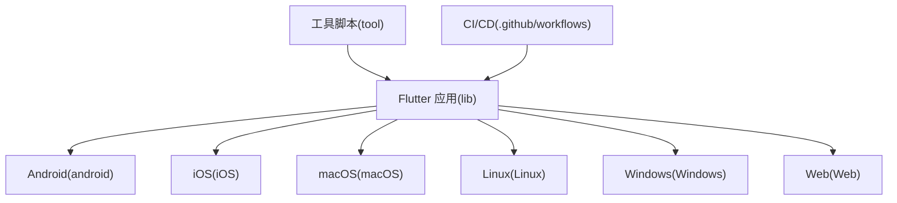
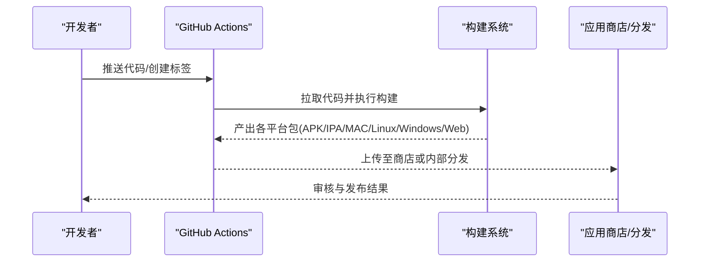
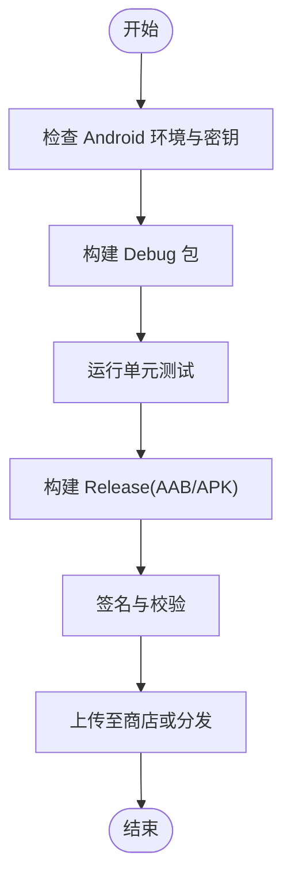
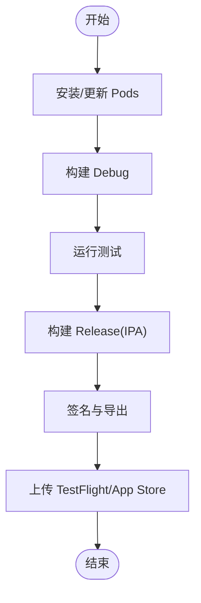
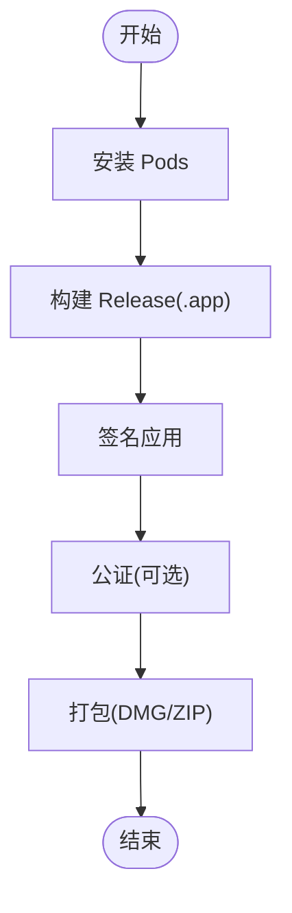
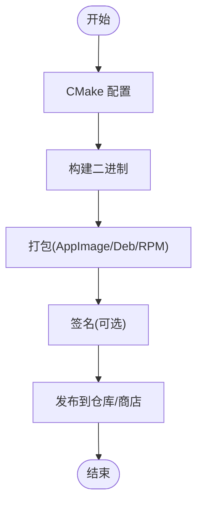
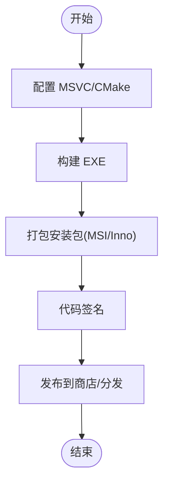
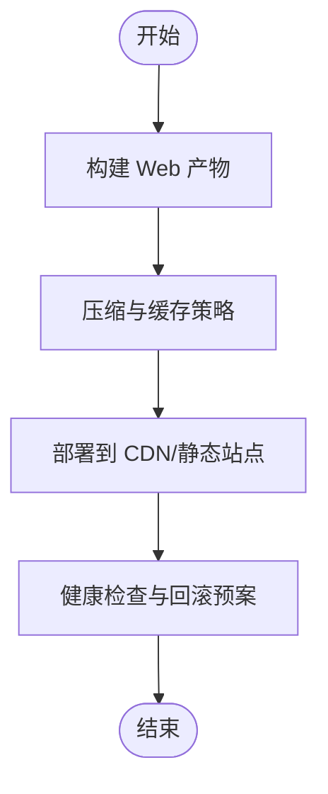
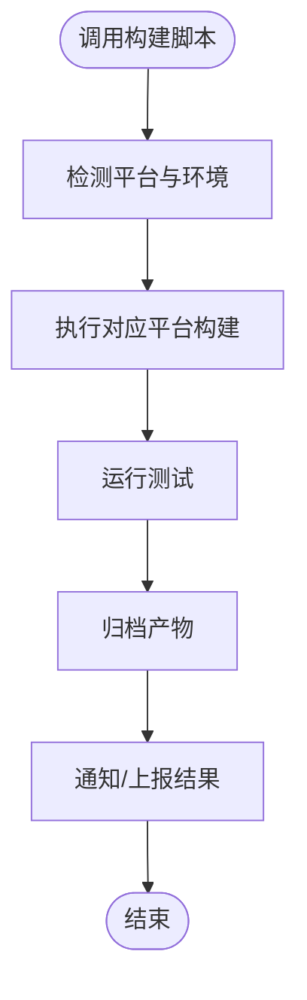
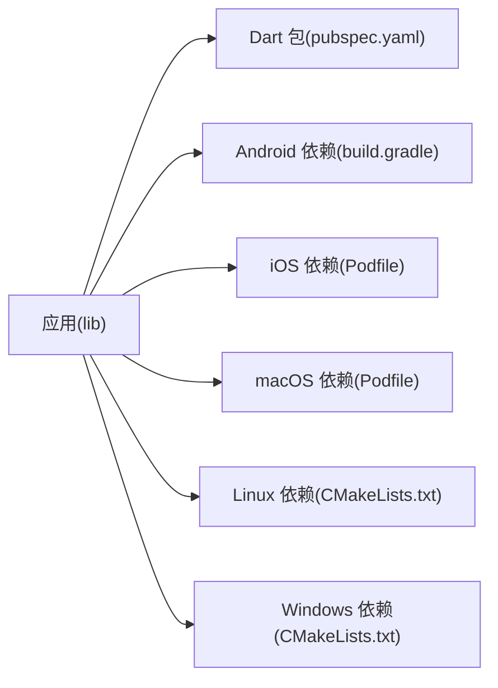

# 部署指南

<cite>
**本文引用的文件**   
- [README.md](file://README.md)
- [pubspec.yaml](file://pubspec.yaml)
- [Makefile](file://Makefile)
- [android/build.gradle](file://android/build.gradle)
- [android/app/build.gradle](file://android/app/build.gradle)
- [android/gradle.properties](file://android/gradle.properties)
- [android/local.properties](file://android/local.properties)
- [ios/Podfile](file://ios/Podfile)
- [macos/Podfile](file://macos/Podfile)
- [linux/CMakeLists.txt](file://linux/CMakeLists.txt)
- [windows/CMakeLists.txt](file://windows/CMakeLists.txt)
- [tool/build_release.py](file://tool/build_release.py)
- [tool/gui/build_gui.py](file://tool/gui/build_gui.py)
- [tool/course_cli.py](file://tool/course_cli.py)
- [.github/workflows](file://.github/workflows)
</cite>

## 目录
1. [简介](#简介)
2. [项目结构](#项目结构)
3. [核心组件](#核心组件)
4. [架构总览](#架构总览)
5. [详细组件分析](#详细组件分析)
6. [依赖分析](#依赖分析)
7. [性能考虑](#性能考虑)
8. [故障排查指南](#故障排查指南)
9. [结论](#结论)
10. [附录](#附录)

## 简介
本指南面向 Varnamalaplus 项目的构建、签名与发布，覆盖 Android、iOS、macOS、Linux、Windows 与 Web 平台。内容包含：
- 各平台构建配置与产物说明
- 签名设置与证书管理
- CI/CD 流水线与自动化测试
- 应用商店上架要求、权限与安全审查准备
- 环境配置管理、密钥存储与版本控制策略
- 故障排查、性能监控与日志收集方案

本项目为 Flutter 多端应用，使用 Gradle（Android）、Xcode/ CocoaPods（iOS/macOS）、CMake（Linux/Windows）进行构建；提供 Python 工具脚本辅助发布与课程处理；通过 GitHub Actions 组织 CI/CD。

## 项目结构
仓库采用 Flutter 标准多平台布局，关键目录与职责如下：
- lib：Flutter 应用源码（业务逻辑、视图、数据层等）
- android：Android 工程与 Gradle 构建配置
- ios/macos：iOS/macOS 原生工程与 Pod 依赖
- linux/windows：桌面端 CMake 工程
- web：Web 前端资源
- tool：Python 工具集（构建、课程处理、音频生成等）
- .github/workflows：CI/CD 工作流定义
- assets：静态资源（图片、声音、课程数据）
- test：单元测试、集成测试与黄金测试



图表来源
- [README.md:1-200](file://README.md#L1-L200)
- [pubspec.yaml:1-200](file://pubspec.yaml#L1-L200)

章节来源
- [README.md:1-200](file://README.md#L1-L200)
- [pubspec.yaml:1-200](file://pubspec.yaml#L1-L200)

## 核心组件
- 构建系统
  - Android：Gradle + Kotlin/Java，产物为 APK/AAB
  - iOS/macOS：Xcode + CocoaPods，产物为 IPA/MAC 包
  - Linux/Windows：CMake + Flutter 引擎，产物为 AppImage/Deb/RPM 或 MSI/EXE
  - Web：Flutter Web 构建器，产物为静态站点
- 工具链
  - Python 脚本：统一构建入口、课程校验、音频处理等
  - Makefile：常用命令封装
- 测试
  - Dart 单测与集成测试，Golden 截图对比
  - Python 脚本测试（工具正确性）

章节来源
- [Makefile:1-200](file://Makefile#L1-L200)
- [tool/build_release.py:1-200](file://tool/build_release.py#L1-L200)
- [tool/gui/build_gui.py:1-200](file://tool/gui/build_gui.py#L1-L200)
- [tool/course_cli.py:1-200](file://tool/course_cli.py#L1-L200)

## 架构总览
下图展示从代码到各平台产物的整体流程，以及 CI/CD 的触发点与产物归档。



图表来源
- [.github/workflows:1-200](file://.github/workflows#L1-L200)
- [tool/build_release.py:1-200](file://tool/build_release.py#L1-L200)

## 详细组件分析

### Android 构建与发布
- 构建配置要点
  - 顶层与 app 模块的 Gradle 配置，包括编译 SDK、目标 SDK、构建类型与签名配置
  - ProGuard/R8 混淆规则
  - 本地属性与 Gradle 属性（如缓存、并行、签名路径）
- 产物
  - debug：APK
  - release：AAB（推荐上架 Google Play），可选 APK
- 签名
  - 使用 keystore 与 key alias/password 完成签名
  - 建议将敏感信息放入环境变量或密钥管理服务
- 上架准备
  - 清单权限最小化声明
  - 隐私政策与数据安全说明
  - 图标、启动画面与应用描述



图表来源
- [android/build.gradle:1-200](file://android/build.gradle#L1-L200)
- [android/app/build.gradle:1-200](file://android/app/build.gradle#L1-L200)
- [android/gradle.properties:1-200](file://android/gradle.properties#L1-L200)
- [android/local.properties:1-200](file://android/local.properties#L1-L200)

章节来源
- [android/build.gradle:1-200](file://android/build.gradle#L1-L200)
- [android/app/build.gradle:1-200](file://android/app/build.gradle#L1-L200)
- [android/gradle.properties:1-200](file://android/gradle.properties#L1-L200)
- [android/local.properties:1-200](file://android/local.properties#L1-L200)

### iOS 构建与发布
- 构建配置要点
  - Podfile 依赖管理与版本锁定
  - Xcode 工程配置（Bundle ID、版本号、签名团队）
- 产物
  - Debug：模拟器/真机调试
  - Release：IPA（App Store 或 TestFlight）
- 签名与证书
  - 开发证书、分发证书与 Provisioning Profile
  - 建议使用 Xcode 自动签名或命令行参数传入
- 上架准备
  - Info.plist 权限声明
  - 隐私清单与数据使用说明
  - 元数据（名称、描述、截图、关键词）



图表来源
- [ios/Podfile:1-200](file://ios/Podfile#L1-L200)

章节来源
- [ios/Podfile:1-200](file://ios/Podfile#L1-L200)

### macOS 构建与发布
- 构建配置要点
  - Podfile 依赖管理
  - Xcode 工程与 Entitlements 配置
- 产物
  - Debug：可执行程序
  - Release：.app 包，可打包为 DMG/ZIP
- 签名与公证
  - 开发者证书签名
  - 使用 notarytool 进行公证（Gatekeeper）
- 上架准备
  - Mac App Store 元数据与合规项



图表来源
- [macos/Podfile:1-200](file://macos/Podfile#L1-L200)

章节来源
- [macos/Podfile:1-200](file://macos/Podfile#L1-L200)

### Linux 构建与发布
- 构建配置要点
  - CMake 配置与依赖管理
  - Flutter 引擎与插件适配
- 产物
  - AppImage、Deb、RPM（视发行版而定）
- 签名与验证
  - 可选：对二进制进行签名与完整性校验
- 上架准备
  - 软件源/商店元数据与依赖声明



图表来源
- [linux/CMakeLists.txt:1-200](file://linux/CMakeLists.txt#L1-L200)

章节来源
- [linux/CMakeLists.txt:1-200](file://linux/CMakeLists.txt#L1-L200)

### Windows 构建与发布
- 构建配置要点
  - CMake 与 MSVC 工具链
  - Flutter Windows 后端配置
- 产物
  - EXE、MSI、Inno Setup 安装包
- 签名与验证
  - 使用代码签名证书对可执行文件与安装包签名
- 上架准备
  - Microsoft Store 元数据与合规项



图表来源
- [windows/CMakeLists.txt:1-200](file://windows/CMakeLists.txt#L1-L200)

章节来源
- [windows/CMakeLists.txt:1-200](file://windows/CMakeLists.txt#L1-L200)

### Web 构建与发布
- 构建配置要点
  - Flutter Web 构建参数与优化选项
  - 静态资源托管（CDN/对象存储）
- 产物
  - 静态站点（HTML/JS/CSS/资源）
- 发布
  - 推送到 CDN 或静态站点服务
  - 启用 HTTPS 与缓存策略



章节来源
- [web/index.html:1-200](file://web/index.html#L1-L200)
- [web/manifest.json:1-200](file://web/manifest.json#L1-L200)

### 工具与脚本
- build_release.py：统一构建入口，支持多平台构建与产物归档
- gui/build_gui.py：GUI 工具构建脚本
- course_cli.py：课程数据处理与校验
- Makefile：常用命令封装（构建、测试、清理等）



图表来源
- [tool/build_release.py:1-200](file://tool/build_release.py#L1-L200)
- [tool/gui/build_gui.py:1-200](file://tool/gui/build_gui.py#L1-L200)
- [tool/course_cli.py:1-200](file://tool/course_cli.py#L1-L200)
- [Makefile:1-200](file://Makefile#L1-L200)

章节来源
- [tool/build_release.py:1-200](file://tool/build_release.py#L1-L200)
- [tool/gui/build_gui.py:1-200](file://tool/gui/build_gui.py#L1-L200)
- [tool/course_cli.py:1-200](file://tool/course_cli.py#L1-L200)
- [Makefile:1-200](file://Makefile#L1-L200)

### CI/CD 流水线
- 触发条件
  - 推送分支、创建标签、合并 PR
- 阶段
  - 环境准备（Flutter/Dart、Android/iOS/桌面工具链）
  - 依赖安装（pub get、Pods、CMake 依赖）
  - 构建（多平台并行）
  - 测试（Dart 单测/集成/Golden、Python 脚本测试）
  - 签名与归档（Keystore、证书、Provisioning）
  - 发布（上传商店/TestFlight/仓库/制品库）
- 产物与缓存
  - 缓存依赖与构建中间产物，加速流水线
  - 产物持久化与版本标记

```mermaid
sequenceDiagram
participant GH as "GitHub"
participant WA as "Actions Runner"
participant FL as "Flutter/Dart"
participant AND as "Android 工具链"
participant IOS as "iOS 工具链"
participant DESK as "桌面工具链"
participant ART as "制品库"
GH->>WA : 触发工作流
WA->>FL : 初始化 Flutter/Dart
WA->>AND : 安装 Android SDK/签名
WA->>IOS : 安装 CocoaPods/证书
WA->>DESK : 安装 CMake/编译器
WA->>FL : 运行测试
WA->>FL : 构建多平台产物
WA->>ART : 上传制品与报告
```

图表来源
- [.github/workflows:1-200](file://.github/workflows#L1-L200)

章节来源
- [.github/workflows:1-200](file://.github/workflows#L1-L200)

## 依赖分析
- 外部依赖
  - Flutter/Dart 生态插件与第三方库
  - Android Gradle 插件与 SDK
  - iOS/macOS CocoaPods 依赖
  - Linux/Windows CMake 与系统库
- 依赖管理
  - pubspec.yaml 管理 Dart 依赖
  - Podfile 管理 iOS/macOS 依赖
  - Gradle 管理 Android 依赖
  - CMake 管理桌面端依赖
- 版本策略
  - 固定主要版本，锁定次要/补丁版本
  - 定期安全扫描与漏洞修复



图表来源
- [pubspec.yaml:1-200](file://pubspec.yaml#L1-L200)
- [android/build.gradle:1-200](file://android/build.gradle#L1-L200)
- [ios/Podfile:1-200](file://ios/Podfile#L1-L200)
- [macos/Podfile:1-200](file://macos/Podfile#L1-L200)
- [linux/CMakeLists.txt:1-200](file://linux/CMakeLists.txt#L1-L200)
- [windows/CMakeLists.txt:1-200](file://windows/CMakeLists.txt#L1-L200)

章节来源
- [pubspec.yaml:1-200](file://pubspec.yaml#L1-L200)
- [android/build.gradle:1-200](file://android/build.gradle#L1-L200)
- [ios/Podfile:1-200](file://ios/Podfile#L1-L200)
- [macos/Podfile:1-200](file://macos/Podfile#L1-L200)
- [linux/CMakeLists.txt:1-200](file://linux/CMakeLists.txt#L1-L200)
- [windows/CMakeLists.txt:1-200](file://windows/CMakeLists.txt#L1-L200)

## 性能考虑
- 构建性能
  - 启用 Gradle 并行与守护进程
  - 缓存 Pods 与 CMake 依赖
  - 增量构建与分层构建
- 运行时性能
  - 资源压缩与按需加载
  - 网络请求缓存与重试策略
  - 内存与 CPU 使用监控
- 发布优化
  - 代码混淆与资源裁剪
  - Web 静态资源缓存与 CDN 加速

[本节为通用指导，不直接分析具体文件]

## 故障排查指南
- 常见问题
  - 构建失败：检查 SDK/工具链版本、依赖冲突、签名配置
  - 测试失败：定位单测/集成测试用例，查看日志与断言
  - 上架被拒：核对权限声明、隐私政策、元数据与合规项
- 日志与诊断
  - 构建日志：保留完整输出与错误堆栈
  - 运行时日志：集中采集与分级输出
  - 崩溃分析：符号化与堆栈还原
- 回滚与恢复
  - 制品版本化管理与快速回滚
  - 灰度发布与金丝雀策略

章节来源
- [tool/build_release.py:1-200](file://tool/build_release.py#L1-L200)
- [Makefile:1-200](file://Makefile#L1-L200)

## 结论
通过统一的构建脚本与 CI/CD 流水线，Varnamalaplus 可在多平台高效构建、测试与发布。遵循最小权限与合规要求，结合完善的日志与监控，可保障应用质量与用户体验。建议在发布前进行安全扫描与性能基准测试，确保稳定可靠。

[本节为总结，不直接分析具体文件]

## 附录
- 环境准备清单
  - Flutter/Dart 版本与渠道
  - Android SDK/NDK、签名文件
  - iOS/macOS 证书与 Provisioning
  - Linux/Windows 编译器与 CMake
- 密钥与凭据管理
  - 使用环境变量或密钥管理服务
  - 禁止在仓库中提交敏感信息
- 版本控制策略
  - 语义化版本与标签规范
  - 分支保护与代码审查

[本节为补充信息，不直接分析具体文件]