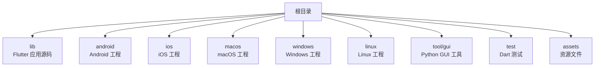
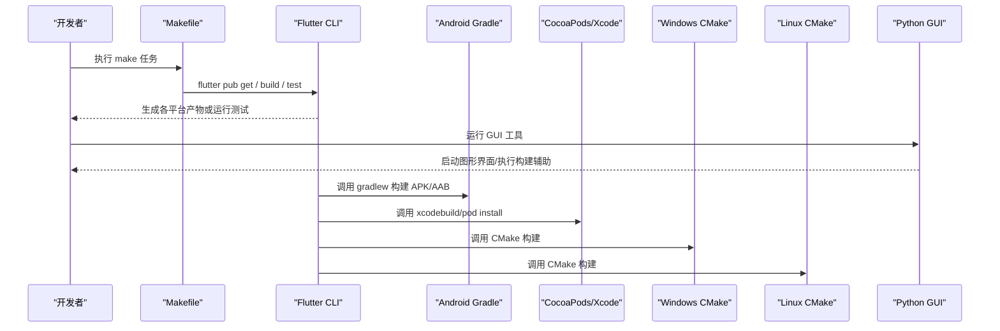
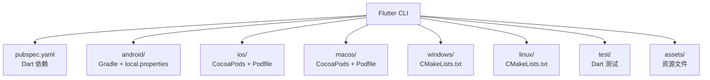

# 开发环境搭建

<cite>
**本文引用的文件**   
- [README.md](file://README.md)
- [pubspec.yaml](file://pubspec.yaml)
- [analysis_options.yaml](file://analysis_options.yaml)
- [Makefile](file://Makefile)
- [tool/gui/pyproject.toml](file://tool/gui/pyproject.toml)
- [tool/gui/build_gui.py](file://tool/gui/build_gui.py)
- [tool/gui/run_gui_tests.py](file://tool/gui/run_gui_tests.py)
- [android/gradle.properties](file://android/gradle.properties)
- [android/local.properties](file://android/local.properties)
- [ios/Podfile](file://ios/Podfile)
- [macos/Podfile](file://macos/Podfile)
- [linux/CMakeLists.txt](file://linux/CMakeLists.txt)
- [windows/flutter/CMakeLists.txt](file://windows/flutter/CMakeLists.txt)
</cite>

## 目录
1. [简介](#简介)
2. [项目结构](#项目结构)
3. [核心组件](#核心组件)
4. [架构总览](#架构总览)
5. [详细组件分析](#详细组件分析)
6. [依赖分析](#依赖分析)
7. [性能考虑](#性能考虑)
8. [故障排除指南](#故障排除指南)
9. [结论](#结论)
10. [附录](#附录)

## 简介
本指南面向首次参与 Varnamalaplus 项目的开发者，目标是帮助你在 Windows、macOS、Linux 上快速搭建可用的 Flutter 开发与 GUI 工具环境。内容涵盖：
- Flutter SDK、IDE（VS Code / Android Studio）安装与配置
- 各平台特定依赖（Android、iOS/macOS、Windows、Linux）
- Python 环境与 GUI 工具依赖安装
- 代码格式化、静态分析、测试运行等开发工作流
- 常见问题排查与解决方案

## 项目结构
Varnamalaplus 是一个跨平台 Flutter 应用，包含多端目标（Android、iOS、macOS、Windows、Linux），并附带 Python 编写的 GUI 工具与构建脚本。关键目录说明：
- lib：Flutter 应用源码入口与业务模块
- android/ios/macos/windows/linux：各平台原生工程与构建配置
- tool/gui：Python GUI 工具的源码、依赖声明与打包脚本
- test：Dart 单元测试、集成测试与黄金测试
- assets：课程资源、图片与音频素材
- docs：文档与设计决策记录

[本节为概念性概览，不直接分析具体文件]

## 核心组件
- Flutter 应用：以 Dart 编写，通过 pubspec.yaml 管理依赖与资源
- 平台工程：Android Gradle、iOS/macOS CocoaPods、Windows/Linux CMake
- Python GUI 工具：基于 pyproject.toml 管理依赖，提供构建与测试脚本
- 构建与任务：Makefile 统一常用命令（如获取依赖、运行测试、构建产物）

**章节来源**
- [pubspec.yaml](file://pubspec.yaml)
- [Makefile](file://Makefile)
- [tool/gui/pyproject.toml](file://tool/gui/pyproject.toml)

## 架构总览
下图展示了从命令行到各平台构建产物的整体流程，以及 GUI 工具在其中的作用。

**图表来源**
- [Makefile](file://Makefile)
- [android/gradle.properties](file://android/gradle.properties)
- [ios/Podfile](file://ios/Podfile)
- [macos/Podfile](file://macos/Podfile)
- [linux/CMakeLists.txt](file://linux/CMakeLists.txt)
- [windows/flutter/CMakeLists.txt](file://windows/flutter/CMakeLists.txt)

## 详细组件分析

### Flutter 开发环境（通用）
- 安装 Flutter SDK 并加入系统 PATH
- 使用 IDE 插件（VS Code 或 Android Studio）启用 Flutter/Dart 支持
- 在项目根目录执行依赖获取与设备检查

建议步骤：
- 安装 Flutter SDK，验证 flutter doctor 输出无错误
- 打开 VS Code/Android Studio，安装 Flutter 与 Dart 扩展
- 在项目根目录执行依赖获取与热重载调试

**章节来源**
- [pubspec.yaml](file://pubspec.yaml)
- [Makefile](file://Makefile)

### Android 平台配置
- 需要 Android SDK、JDK、Gradle 与模拟器或真机
- local.properties 指向 Android SDK 路径；gradle.properties 可配置内存与仓库镜像

建议步骤：
- 安装 JDK 与 Android SDK，确保环境变量正确
- 在 android/local.properties 中设置 sdk.dir（若未自动生成）
- 使用 flutter build apk/aab 或 flutter run 选择 Android 设备

**章节来源**
- [android/local.properties](file://android/local.properties)
- [android/gradle.properties](file://android/gradle.properties)

### iOS/macOS 平台配置
- 需要 Xcode、Command Line Tools、CocoaPods
- Podfile 定义 iOS/macOS 原生依赖

建议步骤：
- 安装 Xcode 与 Command Line Tools，接受许可协议
- 安装 CocoaPods，进入 ios/ 与 macos/ 目录执行 pod install
- 使用 flutter build ios/macos 或 flutter run 选择模拟器/真机

**章节来源**
- [ios/Podfile](file://ios/Podfile)
- [macos/Podfile](file://macos/Podfile)

### Windows 平台配置
- 需要 Visual Studio 2019+（含 C++ 桌面开发）、CMake、Windows SDK
- windows/flutter/CMakeLists.txt 由 Flutter 生成，用于构建 Windows 目标

建议步骤：
- 安装 Visual Studio 并勾选“使用 C++ 的桌面开发”
- 安装 CMake 并确保在 PATH 中
- 使用 flutter build windows 或 flutter run 选择 Windows 设备

**章节来源**
- [windows/flutter/CMakeLists.txt](file://windows/flutter/CMakeLists.txt)

### Linux 平台配置
- 需要 GCC/G++、CMake、Qt 相关库、X11/Wayland 依赖
- linux/CMakeLists.txt 定义 Linux 构建规则

建议步骤：
- 安装构建工具链与 Qt 依赖（按发行版包管理器安装）
- 使用 flutter build linux 或 flutter run 选择 Linux 设备

**章节来源**
- [linux/CMakeLists.txt](file://linux/CMakeLists.txt)

### Python GUI 工具环境
- GUI 工具位于 tool/gui，使用 pyproject.toml 声明依赖
- 提供 build_gui.py 与 run_gui_tests.py 脚本用于构建与测试

建议步骤：
- 安装 Python 3.x，建议使用虚拟环境（venv 或 conda）
- 进入 tool/gui，使用 pip 安装依赖（依据 pyproject.toml）
- 运行构建脚本与测试脚本验证环境

**章节来源**
- [tool/gui/pyproject.toml](file://tool/gui/pyproject.toml)
- [tool/gui/build_gui.py](file://tool/gui/build_gui.py)
- [tool/gui/run_gui_tests.py](file://tool/gui/run_gui_tests.py)

### 代码质量与静态分析
- analysis_options.yaml 定义 Dart 分析规则
- 可通过 IDE 或命令行运行分析器与格式化

建议步骤：
- 在 IDE 中启用 Dart 分析与自动格式化
- 使用命令行运行分析器与格式化校验

**章节来源**
- [analysis_options.yaml](file://analysis_options.yaml)

### 测试运行
- Dart 测试位于 test 目录，包含单元、集成与黄金测试
- 可使用 flutter test 或 IDE 运行测试

建议步骤：
- 使用 flutter test 运行全部测试
- 针对子目录或单个测试文件进行选择性运行

**章节来源**
- [Makefile](file://Makefile)

## 依赖分析
下图展示 Flutter 与各平台构建系统的依赖关系。

**图表来源**
- [pubspec.yaml](file://pubspec.yaml)
- [android/local.properties](file://android/local.properties)
- [ios/Podfile](file://ios/Podfile)
- [macos/Podfile](file://macos/Podfile)
- [linux/CMakeLists.txt](file://linux/CMakeLists.txt)
- [windows/flutter/CMakeLists.txt](file://windows/flutter/CMakeLists.txt)

**章节来源**
- [pubspec.yaml](file://pubspec.yaml)
- [android/local.properties](file://android/local.properties)
- [ios/Podfile](file://ios/Podfile)
- [macos/Podfile](file://macos/Podfile)
- [linux/CMakeLists.txt](file://linux/CMakeLists.txt)
- [windows/flutter/CMakeLists.txt](file://windows/flutter/CMakeLists.txt)

## 性能考虑
- 首次构建会下载大量依赖，建议在稳定网络环境下执行
- 合理配置 Gradle 内存与缓存，避免构建卡顿
- 使用增量构建与热重载提升开发效率
- 对大型资源（音频、图片）进行压缩与按需加载

[本节为通用指导，不直接分析具体文件]

## 故障排除指南
- Flutter 设备不可用
  - 检查 flutter doctor 输出，逐项修复缺失项
  - 确认 Android SDK、Xcode、CMake 等工具已安装且版本兼容
- Android 构建失败
  - 检查 local.properties 中的 sdk.dir 是否正确
  - 清理缓存后重试：删除 .gradle 与 build 目录
- iOS/macOS 构建失败
  - 重新执行 pod install，确保 CocoaPods 版本与 Xcode 兼容
  - 检查签名与证书配置（发布时）
- Windows/Linux 构建失败
  - 确认 C++ 工具链与 CMake 已安装且在 PATH 中
  - 清理 CMake 缓存并重新生成
- Python GUI 工具无法运行
  - 确认 Python 版本与依赖匹配
  - 使用虚拟环境隔离依赖，重新安装 pyproject.toml 中声明的包
  - 检查构建脚本权限与路径

**章节来源**
- [Makefile](file://Makefile)
- [tool/gui/build_gui.py](file://tool/gui/build_gui.py)
- [tool/gui/run_gui_tests.py](file://tool/gui/run_gui_tests.py)

## 结论
通过以上步骤，你可以在主流操作系统上完成 Varnamalaplus 的开发环境搭建，包括 Flutter 应用与 Python GUI 工具。建议新开发者优先保证 flutter doctor 全绿，再逐步完善各平台构建能力。遇到问题时，结合本指南的故障排除部分定位与解决。

[本节为总结性内容，不直接分析具体文件]

## 附录
- 常用命令参考（根据 Makefile 提供的任务）
  - 获取依赖：flutter pub get
  - 运行测试：flutter test
  - 构建 Android：flutter build apk/aab
  - 构建 iOS：flutter build ios
  - 构建 macOS：flutter build macos
  - 构建 Windows：flutter build windows
  - 构建 Linux：flutter build linux
  - 运行 GUI 工具：进入 tool/gui 执行构建与测试脚本

**章节来源**
- [Makefile](file://Makefile)
- [tool/gui/build_gui.py](file://tool/gui/build_gui.py)
- [tool/gui/run_gui_tests.py](file://tool/gui/run_gui_tests.py)