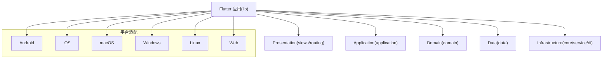
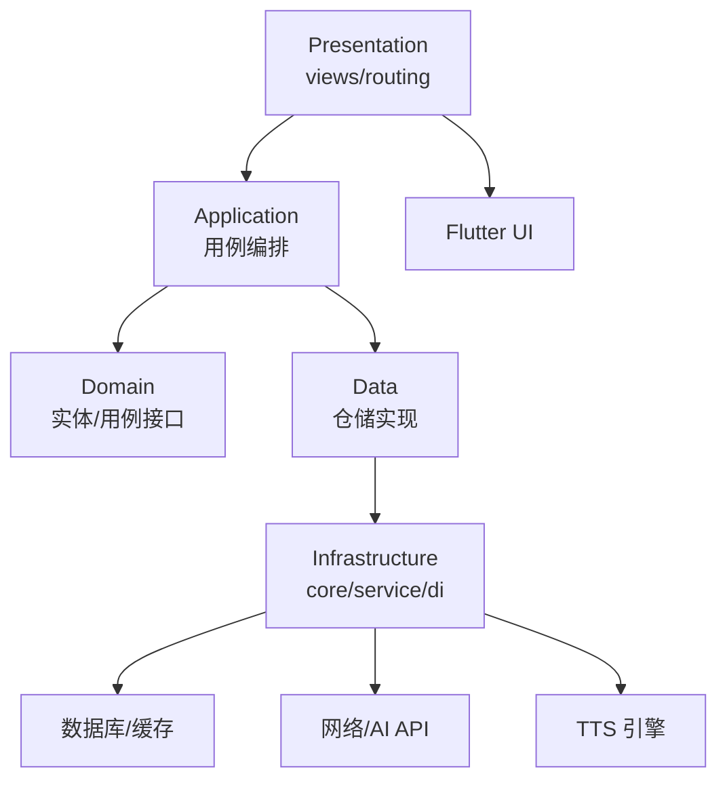
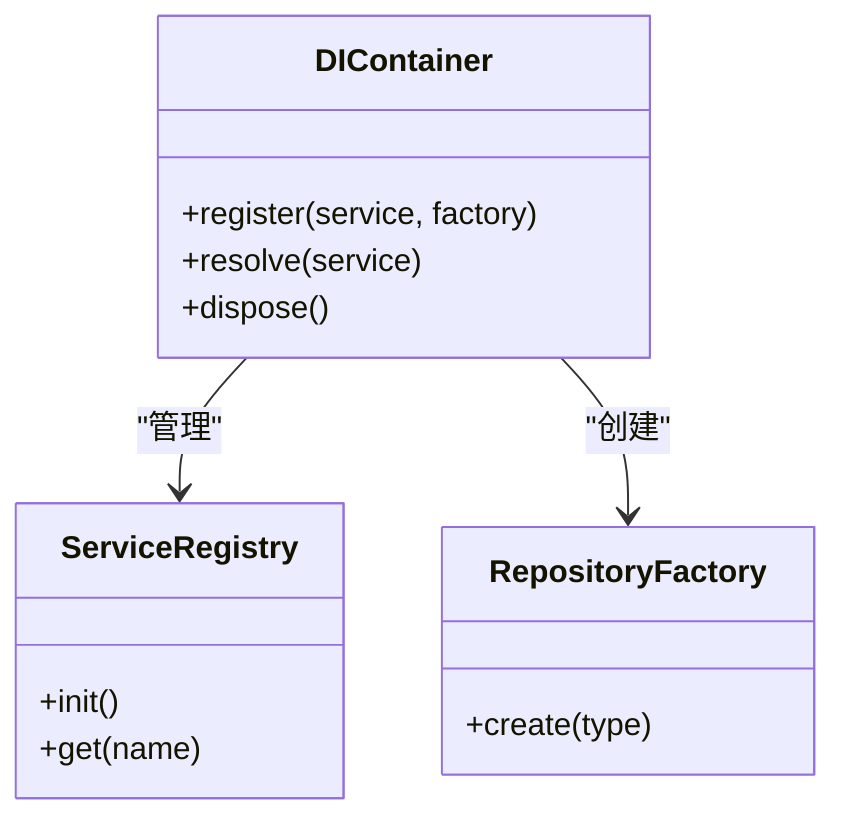
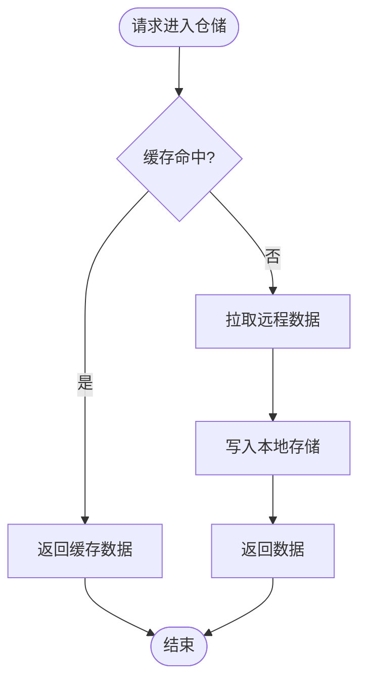
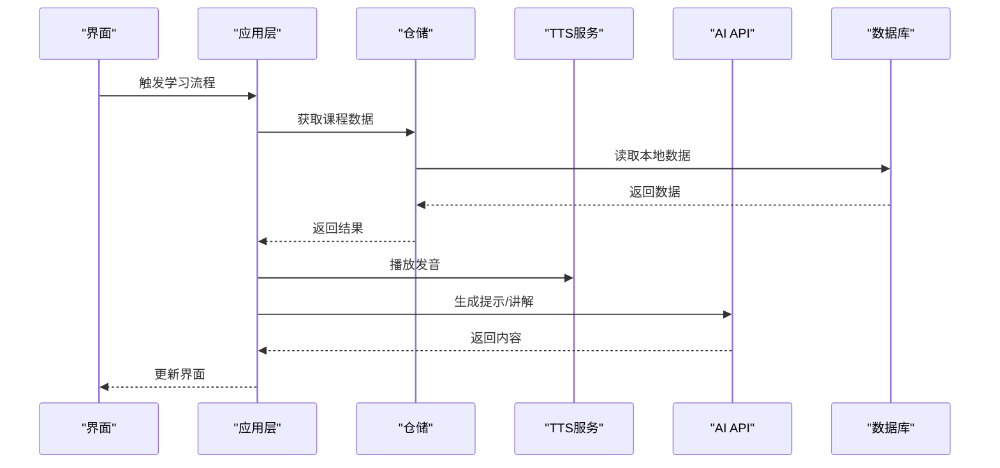
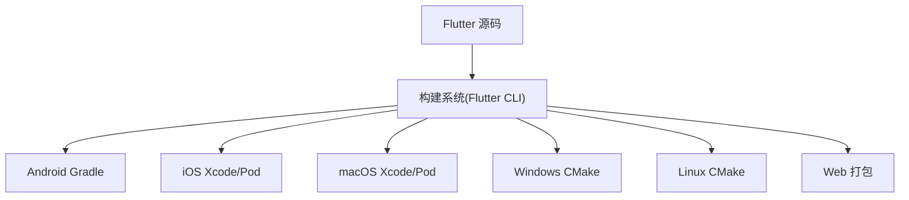
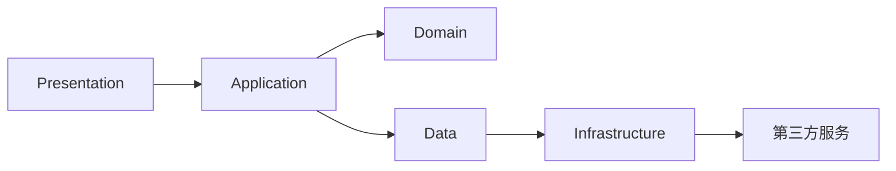

# 技术架构概览

<cite>
**本文引用的文件**   
- [pubspec.yaml](file://pubspec.yaml)
- [main.dart](file://lib/main.dart)
- [Makefile](file://Makefile)
- [README.md](file://README.md)
- [analysis_options.yaml](file://analysis_options.yaml)
- [build.yaml](file://build.yaml)
- [.github/workflows/ci.yml](file://.github/workflows/ci.yml)
- [android/app/build.gradle](file://android/app/build.gradle)
- [ios/Runner/Info.plist](file://ios/Runner/Info.plist)
- [macos/Runner/Info.plist](file://macos/Runner/Info.plist)
- [linux/CMakeLists.txt](file://linux/CMakeLists.txt)
- [windows/CMakeLists.txt](file://windows/CMakeLists.txt)
- [web/index.html](file://web/index.html)
</cite>

## 目录
1. [简介](#简介)
2. [项目结构](#项目结构)
3. [核心组件](#核心组件)
4. [架构总览](#架构总览)
5. [详细组件分析](#详细组件分析)
6. [依赖分析](#依赖分析)
7. [性能考虑](#性能考虑)
8. [故障排查指南](#故障排查指南)
9. [结论](#结论)
10. [附录](#附录)

## 简介
本技术架构概览面向 Varnamalaplus 项目的跨平台 Flutter 应用，覆盖 Android、iOS、Web、Windows、macOS、Linux 等多端统一构建与运行。文档聚焦以下方面：
- 分层架构与模块化设计（presentation、domain、data、infrastructure）
- 依赖注入模式与核心服务集成（TTS、AI API、数据库等）
- 构建工具链与 CI/CD 流程
- 代码质量与性能优化策略
- 技术选型理由与关键架构决策说明

## 项目结构
Varnamalaplus 采用 Flutter 标准工程布局，结合领域驱动的分层组织方式：
- lib：应用主源码，按功能域与层次划分（application、core、courses、data、di、domain、routing、service、views）
- android/ios/macos/windows/linux/web：各平台原生配置与入口
- assets：课程资源、图片、音频等静态资源
- test：单元测试、集成测试、黄金快照测试等
- tool：Python 工具链，用于内容生成、导出、GUI 辅助等
- docs：设计与决策文档
- .github/workflows：CI/CD 流水线定义
- 根级配置文件：pubspec.yaml、analysis_options.yaml、build.yaml、Makefile

图表来源
- [main.dart:1-200](file://lib/main.dart#L1-L200)
- [pubspec.yaml:1-200](file://pubspec.yaml#L1-L200)

章节来源
- [README.md:1-200](file://README.md#L1-L200)
- [pubspec.yaml:1-200](file://pubspec.yaml#L1-L200)

## 核心组件
- 应用入口与初始化：main.dart 负责启动 Flutter 引擎、注册全局依赖、初始化路由与主题、加载必要服务。
- 依赖注入：di 模块集中管理服务生命周期与实例解析，确保 Presentation 与 Domain/Data 解耦。
- 业务领域：domain 定义实体、值对象与用例接口；data 实现仓储与数据源抽象；application 编排用例与状态管理。
- 基础设施：core 提供通用能力（日志、网络、加密、国际化），service 封装第三方服务（TTS、AI API、数据库）。
- 平台适配：各平台原生入口与权限配置，保证跨端一致体验。

章节来源
- [main.dart:1-200](file://lib/main.dart#L1-L200)
- [pubspec.yaml:1-200](file://pubspec.yaml#L1-L200)

## 架构总览
整体采用“分层 + 模块化”的架构：
- Presentation：UI 视图与路由，仅依赖 application 暴露的用例接口
- Application：用例编排、状态管理、事件处理
- Domain：纯业务逻辑与契约，不依赖外部框架
- Data：仓储实现、本地/远程数据源
- Infrastructure：第三方服务、系统能力、平台差异封装

图表来源
- [main.dart:1-200](file://lib/main.dart#L1-L200)
- [pubspec.yaml:1-200](file://pubspec.yaml#L1-L200)

## 详细组件分析

### 依赖注入与模块装配
- 职责：集中注册服务、仓储、用例与全局配置；提供单例或作用域实例；支持替换与测试桩。
- 关键点：
  - 在应用启动时完成装配，避免循环依赖
  - 通过接口抽象隔离具体实现，便于多环境切换
  - 为测试提供可插拔的 Fake/Mock 实现

图表来源
- [pubspec.yaml:1-200](file://pubspec.yaml#L1-L200)
- [main.dart:1-200](file://lib/main.dart#L1-L200)

章节来源
- [pubspec.yaml:1-200](file://pubspec.yaml#L1-L200)
- [main.dart:1-200](file://lib/main.dart#L1-L200)

### 数据层与持久化
- 职责：封装本地存储（SQLite/Hive/Isar 等）、远程同步、缓存策略与迁移。
- 关键点：
  - 仓储接口由 domain 定义，data 层实现
  - 读写分离与事务边界清晰
  - 离线优先，冲突解决策略明确

图表来源
- [pubspec.yaml:1-200](file://pubspec.yaml#L1-L200)
- [main.dart:1-200](file://lib/main.dart#L1-L200)

章节来源
- [pubspec.yaml:1-200](file://pubspec.yaml#L1-L200)
- [main.dart:1-200](file://lib/main.dart#L1-L200)

### 第三方服务集成（TTS、AI API、数据库）
- TTS：封装平台语音合成，支持多引擎回退与音质选择
- AI API：统一 HTTP 客户端、重试与鉴权，错误码映射到领域异常
- 数据库：版本化迁移、索引优化、查询缓存

图表来源
- [pubspec.yaml:1-200](file://pubspec.yaml#L1-L200)
- [main.dart:1-200](file://lib/main.dart#L1-L200)

章节来源
- [pubspec.yaml:1-200](file://pubspec.yaml#L1-L200)
- [main.dart:1-200](file://lib/main.dart#L1-L200)

### 构建工具链与平台配置
- Flutter/Dart：跨平台 UI 与逻辑
- Android：Gradle 构建，ProGuard/R8 混淆
- iOS/macOS：Xcode 工程，Pod 依赖管理
- Windows/Linux：CMake 构建脚本
- Web：index.html 与 manifest.json 配置

图表来源
- [android/app/build.gradle:1-200](file://android/app/build.gradle#L1-L200)
- [ios/Runner/Info.plist:1-200](file://ios/Runner/Info.plist#L1-L200)
- [macos/Runner/Info.plist:1-200](file://macos/Runner/Info.plist#L1-L200)
- [linux/CMakeLists.txt:1-200](file://linux/CMakeLists.txt#L1-L200)
- [windows/CMakeLists.txt:1-200](file://windows/CMakeLists.txt#L1-L200)
- [web/index.html:1-200](file://web/index.html#L1-L200)

章节来源
- [android/app/build.gradle:1-200](file://android/app/build.gradle#L1-L200)
- [ios/Runner/Info.plist:1-200](file://ios/Runner/Info.plist#L1-L200)
- [macos/Runner/Info.plist:1-200](file://macos/Runner/Info.plist#L1-L200)
- [linux/CMakeLists.txt:1-200](file://linux/CMakeLists.txt#L1-L200)
- [windows/CMakeLists.txt:1-200](file://windows/CMakeLists.txt#L1-L200)
- [web/index.html:1-200](file://web/index.html#L1-L200)

## 依赖分析
- 直接依赖：Flutter SDK、Dart 生态库（网络、序列化、状态管理、数据库、TTS、AI 客户端等）
- 间接依赖：平台原生插件与系统能力
- 耦合点：
  - presentation 与 application 通过用例接口解耦
  - data 与 domain 通过仓储接口解耦
  - infrastructure 对第三方服务的抽象封装

图表来源
- [pubspec.yaml:1-200](file://pubspec.yaml#L1-L200)
- [main.dart:1-200](file://lib/main.dart#L1-L200)

章节来源
- [pubspec.yaml:1-200](file://pubspec.yaml#L1-L200)
- [main.dart:1-200](file://lib/main.dart#L1-L200)

## 性能考虑
- 渲染优化：减少 rebuild、使用 const 构造、懒加载与分页
- 内存管理：及时释放资源、避免长生命周期引用
- I/O 优化：批量写入、异步任务调度、缓存策略
- 网络优化：连接复用、压缩、超时与重试策略
- 构建优化：增量编译、并行构建、产物缓存

[本节为通用指导，不直接分析具体文件]

## 故障排查指南
- 常见问题定位：
  - 启动失败：检查 main.dart 初始化顺序与依赖装配
  - 平台权限：核对 Info.plist 与 AndroidManifest 配置
  - 网络错误：查看 AI API 响应码与重试策略
  - 数据异常：检查数据库迁移与缓存一致性
- 调试建议：
  - 启用详细日志与埋点
  - 使用 DevTools 分析性能与内存
  - 编写端到端测试覆盖关键路径

章节来源
- [main.dart:1-200](file://lib/main.dart#L1-L200)
- [analysis_options.yaml:1-200](file://analysis_options.yaml#L1-L200)

## 结论
Varnamalaplus 以 Flutter 为核心，采用分层与模块化架构，结合依赖注入与清晰的职责边界，实现了跨平台一致性与可维护性。通过完善的构建工具链与 CI/CD 流程，保障交付质量与效率。未来可在性能监控、自动化测试覆盖率与多端差异化优化方面持续演进。

[本节为总结性内容，不直接分析具体文件]

## 附录
- 构建命令与脚本：参考 Makefile 与平台构建配置
- 代码规范与静态检查：analysis_options.yaml 与 linter 规则
- 构建产物与发布：build.yaml 与平台打包脚本

章节来源
- [Makefile:1-200](file://Makefile#L1-L200)
- [analysis_options.yaml:1-200](file://analysis_options.yaml#L1-L200)
- [build.yaml:1-200](file://build.yaml#L1-L200)