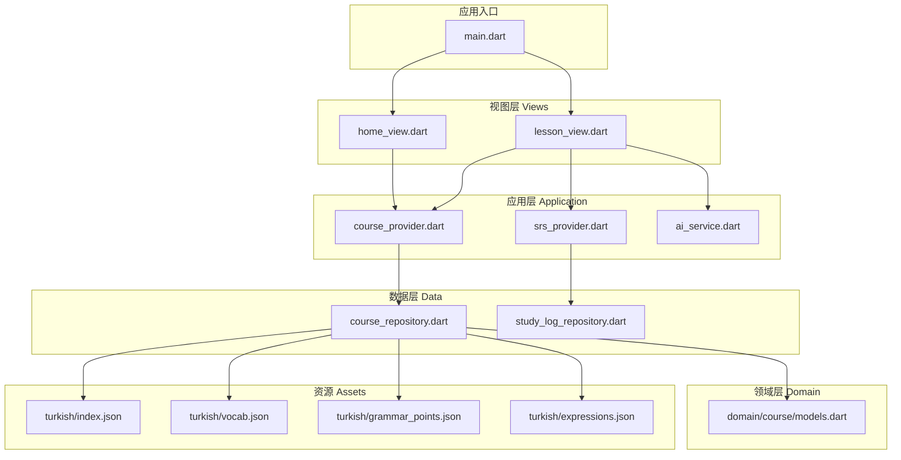
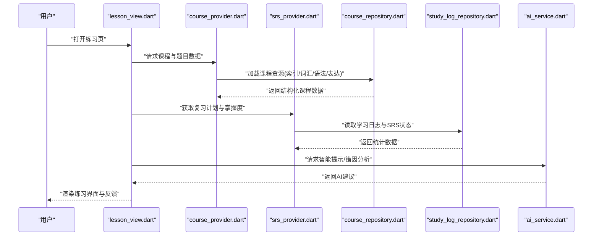
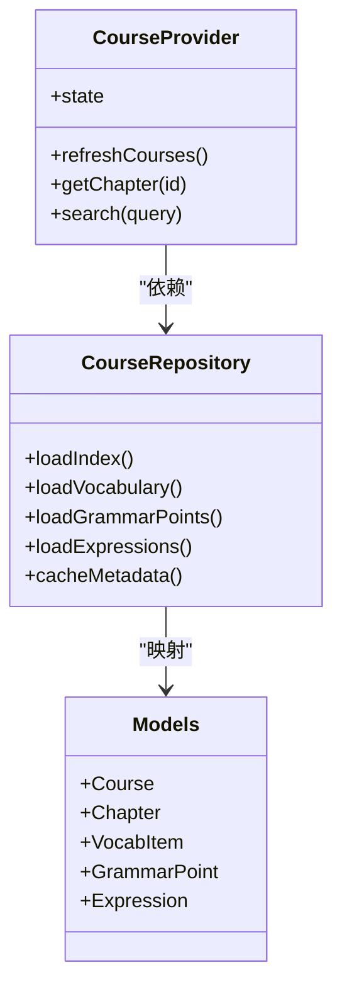
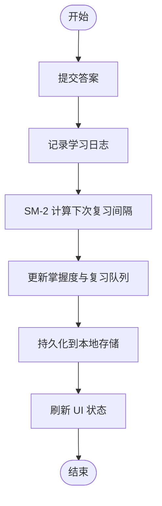
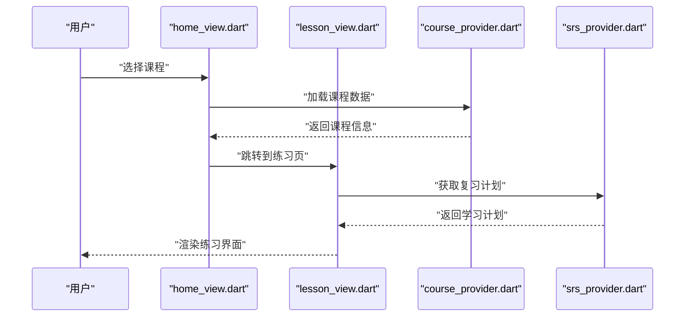
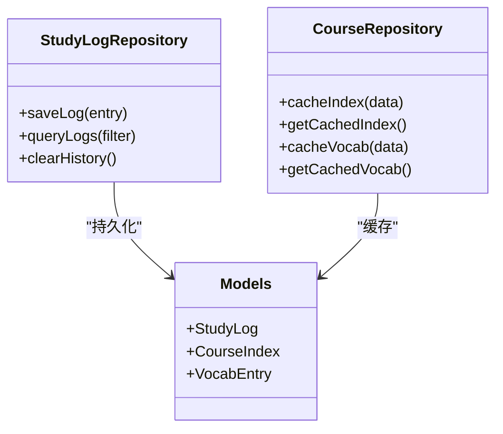
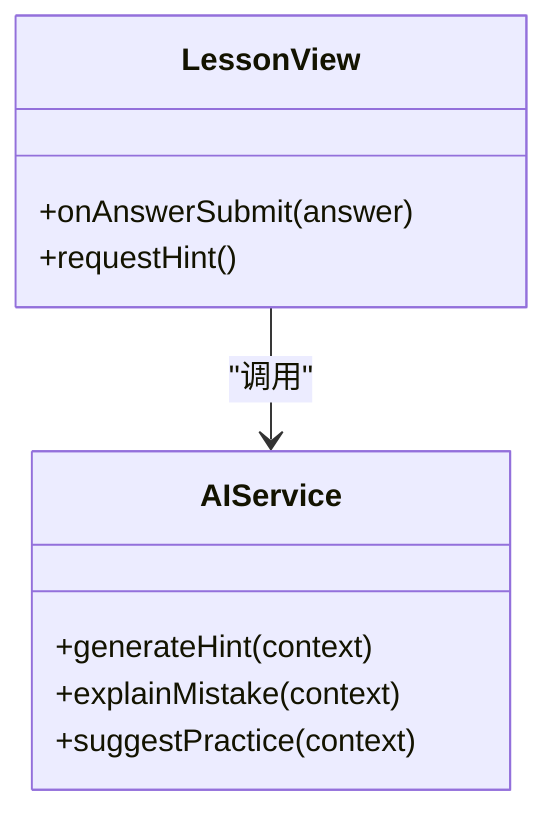
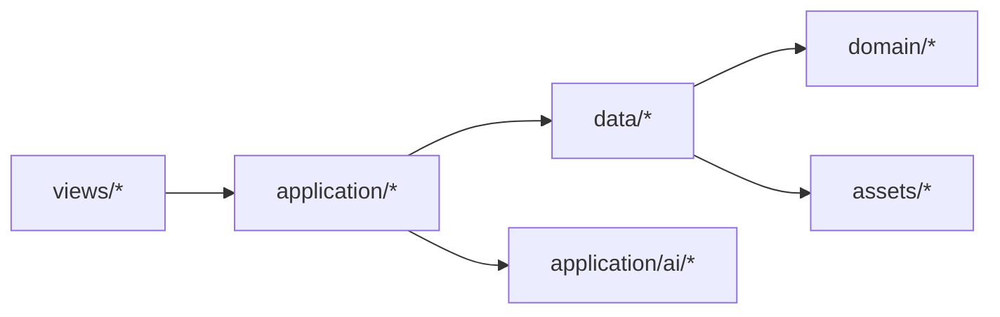

# 核心功能模块

<cite>
**本文引用的文件**   
- [lib/main.dart](file://lib/main.dart)
- [lib/application/ai/ai_service.dart](file://lib/application/ai/ai_service.dart)
- [lib/application/course_provider.dart](file://lib/application/course_provider.dart)
- [lib/application/srs_provider.dart](file://lib/application/srs_provider.dart)
- [lib/data/course_repository.dart](file://lib/data/course_repository.dart)
- [lib/data/study_log_repository.dart](file://lib/data/study_log_repository.dart)
- [lib/domain/course/models.dart](file://lib/domain/course/models.dart)
- [lib/views/home/home_view.dart](file://lib/views/home/home_view.dart)
- [lib/views/lesson/lesson_view.dart](file://lib/views/lesson/lesson_view.dart)
- [assets/courses/turkish/index.json](file://assets/courses/turkish/index.json)
- [assets/courses/turkish/vocab.json](file://assets/courses/turkish/vocab.json)
- [assets/courses/turkish/grammar_points.json](file://assets/courses/turkish/grammar_points.json)
- [assets/courses/turkish/expressions.json](file://assets/courses/turkish/expressions.json)
- [test/application/lesson_viewmodel_flow_test.dart](file://test/application/lesson_viewmodel_flow_test.dart)
- [test/data/course_repository_test.dart](file://test/data/course_repository_test.dart)
- [test/core/sm2_test.dart](file://test/core/sm2_test.dart)
</cite>

## 目录
1. [简介](#简介)
2. [项目结构](#项目结构)
3. [核心组件](#核心组件)
4. [架构总览](#架构总览)
5. [详细组件分析](#详细组件分析)
6. [依赖关系分析](#依赖关系分析)
7. [性能考量](#性能考量)
8. [故障排查指南](#故障排查指南)
9. [结论](#结论)
10. [附录](#附录)

## 简介
本文件面向 Varnamalaplus 项目的开发者与协作者，系统化梳理课程管理系统、学习引擎、UI 组件库、数据持久化、AI 功能集成等核心模块的职责边界、交互关系与数据流向。文档同时给出关键类与接口设计要点、扩展点与配置项说明，并提供架构图与依赖图，帮助团队在模块化设计下高效协作与迭代。

## 项目结构
Varnamalaplus 采用 Flutter 多端应用结构，核心代码位于 lib 目录，按职责分层组织：
- application：业务编排与状态管理（Provider/ViewModel）
- domain：领域模型与规则
- data：数据访问与仓储（本地数据库、资源加载）
- views：用户界面与交互
- service：外部服务（如 TTS、网络）
- di：依赖注入与装配
- core：通用工具与算法（如间隔重复 SM-2）

图表来源
- [lib/main.dart](file://lib/main.dart)
- [lib/views/home/home_view.dart](file://lib/views/home/home_view.dart)
- [lib/views/lesson/lesson_view.dart](file://lib/views/lesson/lesson_view.dart)
- [lib/application/course_provider.dart](file://lib/application/course_provider.dart)
- [lib/application/srs_provider.dart](file://lib/application/srs_provider.dart)
- [lib/application/ai/ai_service.dart](file://lib/application/ai/ai_service.dart)
- [lib/data/course_repository.dart](file://lib/data/course_repository.dart)
- [lib/data/study_log_repository.dart](file://lib/data/study_log_repository.dart)
- [lib/domain/course/models.dart](file://lib/domain/course/models.dart)
- [assets/courses/turkish/index.json](file://assets/courses/turkish/index.json)
- [assets/courses/turkish/vocab.json](file://assets/courses/turkish/vocab.json)
- [assets/courses/turkish/grammar_points.json](file://assets/courses/turkish/grammar_points.json)
- [assets/courses/turkish/expressions.json](file://assets/courses/turkish/expressions.json)

章节来源
- [lib/main.dart](file://lib/main.dart)

## 核心组件
- 课程管理系统
  - 职责：加载与解析课程资源（索引、词汇、语法、表达），提供课程列表、章节导航、内容检索能力。
  - 关键实现：课程仓储（course_repository）、课程 Provider（course_provider）、领域模型（models）。
- 学习引擎
  - 职责：基于间隔重复（SM-2）的学习计划生成、复习调度、掌握度统计与弱项识别。
  - 关键实现：SRS Provider（srs_provider）、学习日志仓储（study_log_repository）、SM-2 算法（core）。
- UI 组件库
  - 职责：首页、课程详情、练习页等页面组件，响应 Provider 状态变化并驱动交互。
  - 关键实现：home_view、lesson_view 等视图组件。
- 数据持久化
  - 职责：本地存储学习进度、错题记录、SRS 状态；缓存课程资源元数据。
  - 关键实现：study_log_repository、course_repository 的本地读写与缓存策略。
- AI 功能集成
  - 职责：为练习与讲解提供智能提示、错因分析与个性化建议。
  - 关键实现：ai_service 作为统一接入点，屏蔽具体 AI 后端差异。

章节来源
- [lib/application/course_provider.dart](file://lib/application/course_provider.dart)
- [lib/application/srs_provider.dart](file://lib/application/srs_provider.dart)
- [lib/data/course_repository.dart](file://lib/data/course_repository.dart)
- [lib/data/study_log_repository.dart](file://lib/data/study_log_repository.dart)
- [lib/domain/course/models.dart](file://lib/domain/course/models.dart)
- [lib/views/home/home_view.dart](file://lib/views/home/home_view.dart)
- [lib/views/lesson/lesson_view.dart](file://lib/views/lesson/lesson_view.dart)
- [lib/application/ai/ai_service.dart](file://lib/application/ai/ai_service.dart)

## 架构总览
系统遵循“视图层 → 应用层 → 数据层 → 领域层”的分层架构，结合 Provider 进行状态管理与事件分发。课程资源以 JSON 形式存放于 assets，由仓储层统一加载与解析；学习引擎通过 SRS Provider 协调复习任务，并将结果持久化至本地存储；AI 服务作为可选增强能力，按需调用。

图表来源
- [lib/views/lesson/lesson_view.dart](file://lib/views/lesson/lesson_view.dart)
- [lib/application/course_provider.dart](file://lib/application/course_provider.dart)
- [lib/application/srs_provider.dart](file://lib/application/srs_provider.dart)
- [lib/data/course_repository.dart](file://lib/data/course_repository.dart)
- [lib/data/study_log_repository.dart](file://lib/data/study_log_repository.dart)
- [lib/application/ai/ai_service.dart](file://lib/application/ai/ai_service.dart)

## 详细组件分析

### 课程管理系统
- 职责边界
  - 负责课程资源的发现、解析与缓存；对外暴露课程列表、章节、词条、语法点与表达的查询接口。
- 关键类与接口
  - CourseRepository：课程数据仓储，封装资源加载、解析与缓存逻辑。
  - CourseProvider：应用层状态管理，聚合课程数据并向上游视图提供可订阅的状态流。
  - Domain Models：定义课程、章节、词条、语法点等实体结构与校验规则。
- 数据流向
  - assets 中的 index.json、vocab.json、grammar_points.json、expressions.json 被 CourseRepository 读取并转换为领域模型，再由 CourseProvider 暴露给 UI。
- 扩展点
  - 新增课程语言或资源格式时，扩展 CourseRepository 的解析器与映射逻辑。
  - 通过 Provider 的事件总线扩展课程切换、搜索与筛选能力。

图表来源
- [lib/data/course_repository.dart](file://lib/data/course_repository.dart)
- [lib/application/course_provider.dart](file://lib/application/course_provider.dart)
- [lib/domain/course/models.dart](file://lib/domain/course/models.dart)
- [assets/courses/turkish/index.json](file://assets/courses/turkish/index.json)
- [assets/courses/turkish/vocab.json](file://assets/courses/turkish/vocab.json)
- [assets/courses/turkish/grammar_points.json](file://assets/courses/turkish/grammar_points.json)
- [assets/courses/turkish/expressions.json](file://assets/courses/turkish/expressions.json)

章节来源
- [lib/data/course_repository.dart](file://lib/data/course_repository.dart)
- [lib/application/course_provider.dart](file://lib/application/course_provider.dart)
- [lib/domain/course/models.dart](file://lib/domain/course/models.dart)
- [assets/courses/turkish/index.json](file://assets/courses/turkish/index.json)
- [assets/courses/turkish/vocab.json](file://assets/courses/turkish/vocab.json)
- [assets/courses/turkish/grammar_points.json](file://assets/courses/turkish/grammar_points.json)
- [assets/courses/turkish/expressions.json](file://assets/courses/turkish/expressions.json)

### 学习引擎（SRS）
- 职责边界
  - 基于 SM-2 算法计算复习间隔，维护学习日志与掌握度统计，支持弱项识别与复习队列生成。
- 关键类与接口
  - SRSProvider：学习状态与复习计划的提供者，封装 SM-2 计算与状态更新。
  - StudyLogRepository：学习日志的持久化仓储，记录答题正确率、时间戳与上下文。
  - Core SM-2：间隔重复算法实现，决定下次复习时间与难度调整。
- 处理流程
  - 用户作答后，SRSProvider 调用 StudyLogRepository 写入日志，并根据 SM-2 更新下次复习时间；同时聚合统计用于 UI 展示。
- 扩展点
  - 替换或增强 SM-2 算法（如引入遗忘曲线参数调优）。
  - 增加新的学习指标（如专注时长、错误类型分布）。

图表来源
- [lib/application/srs_provider.dart](file://lib/application/srs_provider.dart)
- [lib/data/study_log_repository.dart](file://lib/data/study_log_repository.dart)
- [test/core/sm2_test.dart](file://test/core/sm2_test.dart)

章节来源
- [lib/application/srs_provider.dart](file://lib/application/srs_provider.dart)
- [lib/data/study_log_repository.dart](file://lib/data/study_log_repository.dart)
- [test/core/sm2_test.dart](file://test/core/sm2_test.dart)

### UI 组件库
- 职责边界
  - 提供首页、课程详情页、练习页等界面组件，订阅 Provider 状态变化，响应用户操作并触发应用层方法。
- 关键组件
  - HomeView：课程入口与概览。
  - LessonView：练习流程与反馈展示。
- 交互模式
  - 通过 Provider 订阅课程与学习状态，使用事件回调驱动数据刷新与路由跳转。

图表来源
- [lib/views/home/home_view.dart](file://lib/views/home/home_view.dart)
- [lib/views/lesson/lesson_view.dart](file://lib/views/lesson/lesson_view.dart)
- [lib/application/course_provider.dart](file://lib/application/course_provider.dart)
- [lib/application/srs_provider.dart](file://lib/application/srs_provider.dart)

章节来源
- [lib/views/home/home_view.dart](file://lib/views/home/home_view.dart)
- [lib/views/lesson/lesson_view.dart](file://lib/views/lesson/lesson_view.dart)

### 数据持久化
- 职责边界
  - 统一管理学习日志、SRS 状态与课程元数据的本地存储；提供读写、缓存与一致性保障。
- 关键仓储
  - StudyLogRepository：学习行为与结果的持久化。
  - CourseRepository：课程资源的本地缓存与快速检索。
- 数据模型
  - 领域模型（Domain Models）定义数据结构与约束，仓储层负责序列化与反序列化。

图表来源
- [lib/data/study_log_repository.dart](file://lib/data/study_log_repository.dart)
- [lib/data/course_repository.dart](file://lib/data/course_repository.dart)
- [lib/domain/course/models.dart](file://lib/domain/course/models.dart)

章节来源
- [lib/data/study_log_repository.dart](file://lib/data/study_log_repository.dart)
- [lib/data/course_repository.dart](file://lib/data/course_repository.dart)
- [lib/domain/course/models.dart](file://lib/domain/course/models.dart)

### AI 功能集成
- 职责边界
  - 为练习与讲解提供智能提示、错因分析与个性化建议；屏蔽具体 AI 后端差异，提供统一接口。
- 关键服务
  - AIService：AI 能力接入点，支持提示生成、解释输出与反馈建议。
- 集成方式
  - 在 LessonView 中按需调用 AIService，将上下文（题目、历史错误、用户水平）传入并接收建议。

图表来源
- [lib/application/ai/ai_service.dart](file://lib/application/ai/ai_service.dart)
- [lib/views/lesson/lesson_view.dart](file://lib/views/lesson/lesson_view.dart)

章节来源
- [lib/application/ai/ai_service.dart](file://lib/application/ai/ai_service.dart)
- [lib/views/lesson/lesson_view.dart](file://lib/views/lesson/lesson_view.dart)

## 依赖关系分析
- 耦合与内聚
  - 视图层仅依赖应用层 Provider，不直接访问数据仓储，降低耦合度。
  - 应用层通过仓储抽象访问数据，领域模型保持高内聚。
- 外部依赖
  - 资源加载依赖 assets JSON；AI 服务可能依赖网络或本地模型。
- 循环依赖
  - 通过 Provider 与仓储接口避免循环引用。

图表来源
- [lib/views/home/home_view.dart](file://lib/views/home/home_view.dart)
- [lib/views/lesson/lesson_view.dart](file://lib/views/lesson/lesson_view.dart)
- [lib/application/course_provider.dart](file://lib/application/course_provider.dart)
- [lib/application/srs_provider.dart](file://lib/application/srs_provider.dart)
- [lib/data/course_repository.dart](file://lib/data/course_repository.dart)
- [lib/data/study_log_repository.dart](file://lib/data/study_log_repository.dart)
- [lib/domain/course/models.dart](file://lib/domain/course/models.dart)
- [lib/application/ai/ai_service.dart](file://lib/application/ai/ai_service.dart)

章节来源
- [lib/application/course_provider.dart](file://lib/application/course_provider.dart)
- [lib/application/srs_provider.dart](file://lib/application/srs_provider.dart)
- [lib/data/course_repository.dart](file://lib/data/course_repository.dart)
- [lib/data/study_log_repository.dart](file://lib/data/study_log_repository.dart)
- [lib/domain/course/models.dart](file://lib/domain/course/models.dart)
- [lib/application/ai/ai_service.dart](file://lib/application/ai/ai_service.dart)

## 性能考量
- 资源加载与缓存
  - 课程资源首次加载后进行本地缓存，减少重复 I/O；对大文本（词汇表、语法点）采用分页与懒加载。
- 学习引擎优化
  - SM-2 计算轻量，但批量更新时需合并写操作，避免频繁磁盘 I/O。
- UI 渲染
  - 使用 Provider 的细粒度订阅，避免整树重建；对长列表使用虚拟化渲染。
- AI 调用
  - 异步调用并设置超时与重试策略；对热点提示进行本地缓存。

[本节为通用指导，无需特定文件来源]

## 故障排查指南
- 常见问题定位
  - 课程资源加载失败：检查 assets 路径与 JSON 结构是否符合模型定义。
  - 学习日志未持久化：确认仓储写入路径与权限；查看测试用例覆盖情况。
  - AI 服务不可用：检查网络连通性与 API Key；降级为无 AI 模式。
- 调试建议
  - 使用单元测试验证仓储与算法（如 SM-2）；使用集成测试验证端到端流程。
  - 在 Provider 中添加日志打印，追踪状态变更与事件流。

章节来源
- [test/data/course_repository_test.dart](file://test/data/course_repository_test.dart)
- [test/application/lesson_viewmodel_flow_test.dart](file://test/application/lesson_viewmodel_flow_test.dart)
- [test/core/sm2_test.dart](file://test/core/sm2_test.dart)

## 结论
Varnamalaplus 通过清晰的分层架构与模块化设计，实现了课程管理、学习引擎、UI 组件、数据持久化与 AI 集成的解耦与协作。Provider 与仓储抽象使得扩展与维护更加便捷，SM-2 算法与本地缓存保障了学习体验与性能。团队协作应遵循“视图不直连数据、应用层编排、领域模型稳定”的原则，确保长期演进的可维护性。

[本节为总结性内容，无需特定文件来源]

## 附录
- 配置选项
  - 课程资源路径：assets/courses/{language}/index.json 等。
  - AI 服务开关与端点：在 AIService 中集中配置。
  - SRS 参数：复习间隔、难度阈值等可在 SRSProvider 中调整。
- 最佳实践
  - 新增课程语言时，优先扩展仓储解析器与领域模型映射。
  - 对 AI 能力进行降级与容错处理，保证主流程稳定性。
  - 使用测试驱动开发，覆盖仓储、算法与视图流程。

[本节为补充信息，无需特定文件来源]