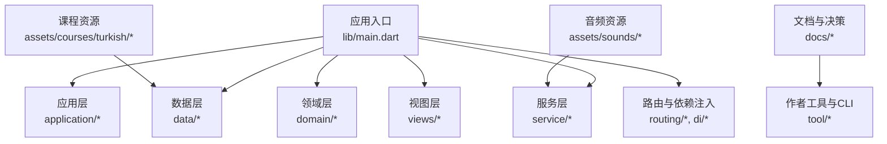
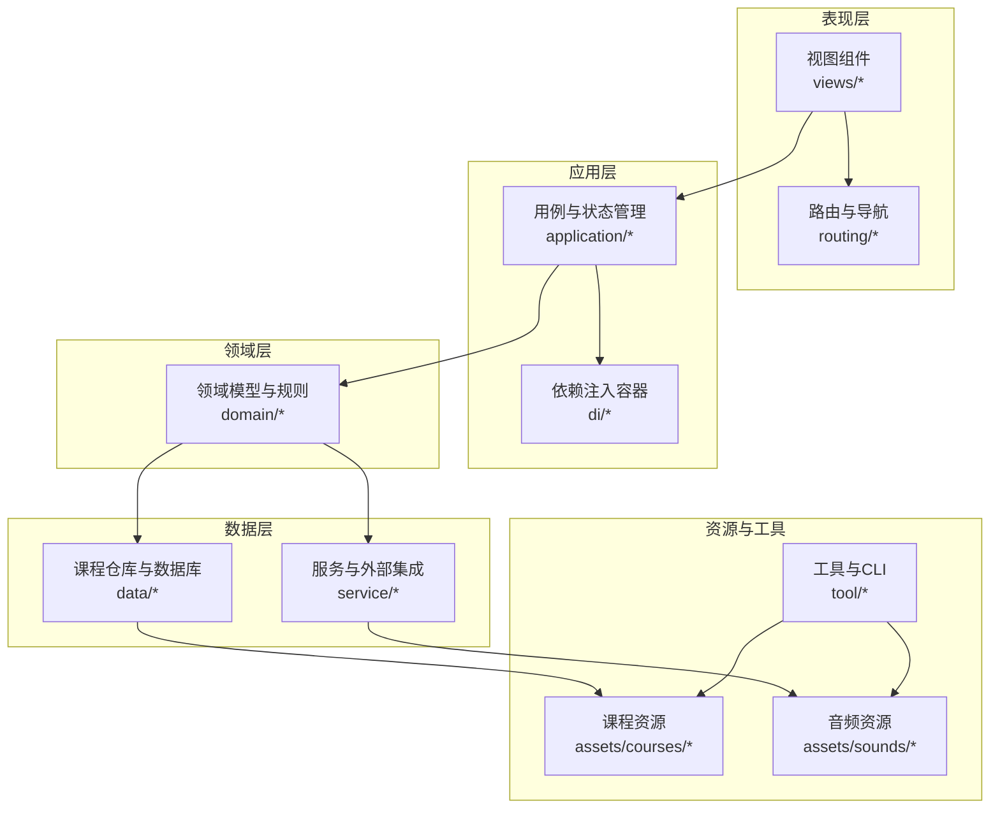
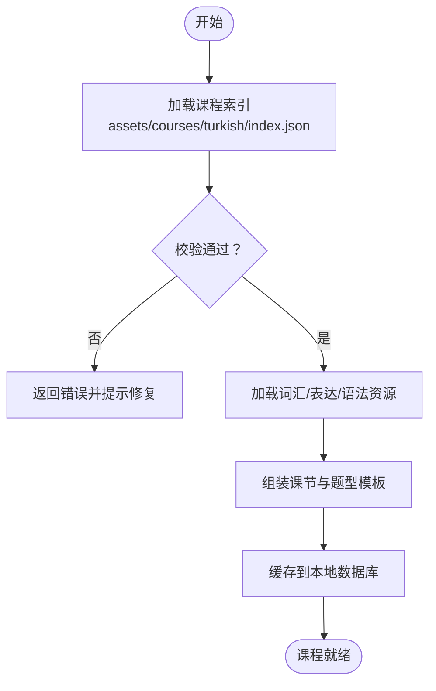
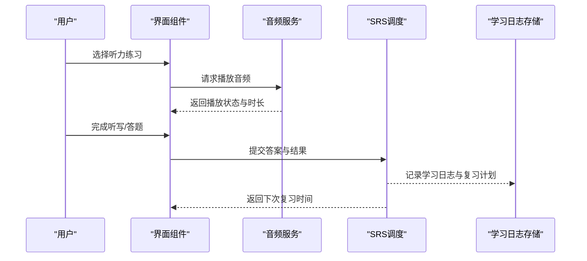
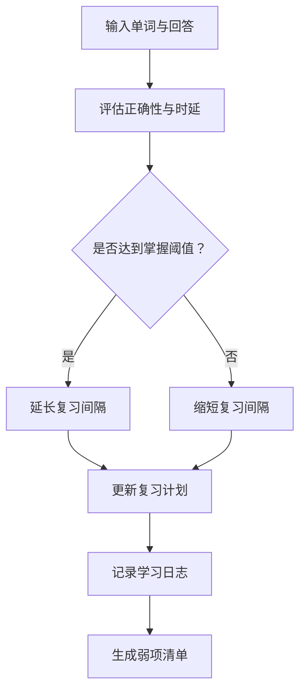
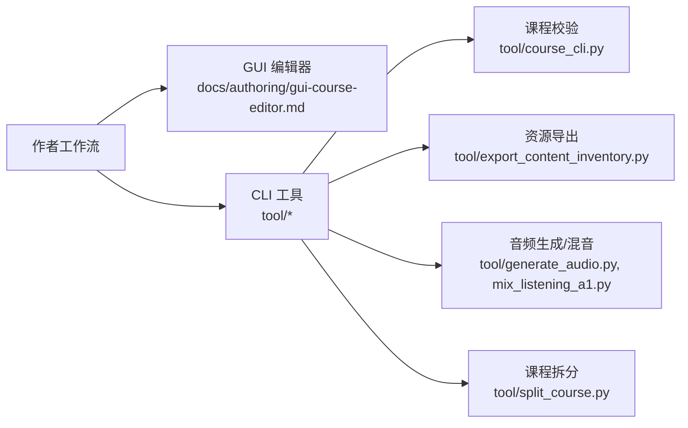
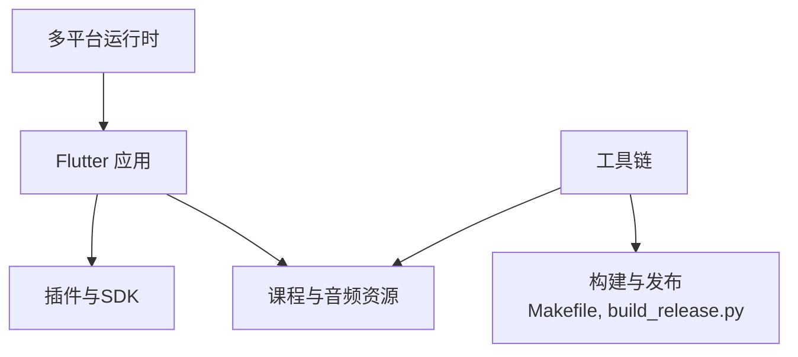

# 项目介绍与特性

<cite>
**本文引用的文件**   
- [README.md](file://README.md)
- [pubspec.yaml](file://pubspec.yaml)
- [main.dart](file://lib/main.dart)
- [index.json](file://assets/courses/turkish/index.json)
- [vocab.json](file://assets/courses/turkish/vocab.json)
- [expressions.json](file://assets/courses/turkish/expressions.json)
- [grammar_points.json](file://assets/courses/turkish/grammar_points.json)
- [course_layout.md](file://docs/authoring/course-layout.md)
- [listening-show-format.md](file://docs/authoring/listening-show-format.md)
- [gui-course-editor.md](file://docs/authoring/gui-course-editor.md)
- [lesson-type-templates.md](file://docs/authoring/lesson-type-templates.md)
- [project-framework-analysis.md](file://docs/analysis/project-framework-analysis.md)
- [0021-git-resource-library-architecture.md](file://docs/decisions/0021-git-resource-library-architecture.md)
- [0022-git-auth-and-credential-store.md](file://docs/decisions/0022-git-auth-and-credential-store.md)
- [0023-git-branch-and-conflict-resolution.md](file://docs/decisions/0023-git-branch-and-conflict-resolution.md)
- [0024-team-collaboration-enhancements.md](file://docs/decisions/0024-team-collaboration-enhancements.md)
- [0025-textbook-git-integration.md](file://docs/decisions/0025-textbook-git-integration.md)
- [0026-local-resource-editor-enhancements.md](file://docs/decisions/0026-local-resource-editor-enhancements.md)
- [anli_import_design.md](file://docs/anki-import-design.md)
- [audio-recording-guidelines.md](file://docs/audio-recording-guidelines.md)
- [content_inventory_current.md](file://docs/content_inventory_current.md)
- [Makefile](file://Makefile)
- [build_release.py](file://tool/build_release.py)
- [course_cli.py](file://tool/course_cli.py)
- [export_content_inventory.py](file://tool/export_content_inventory.py)
- [generate_audio.py](file://tool/generate_audio.py)
- [mix_listening_a1.py](file://tool/mix_listening_a1.py)
- [split_course.py](file://tool/split_course.py)
</cite>

## 目录
1. [简介](#简介)
2. [项目结构](#项目结构)
3. [核心组件](#核心组件)
4. [架构总览](#架构总览)
5. [详细组件分析](#详细组件分析)
6. [依赖关系分析](#依赖关系分析)
7. [性能考量](#性能考量)
8. [故障排查指南](#故障排查指南)
9. [结论](#结论)
10. [附录](#附录)

## 简介
Varnamalaplus 是一款面向多语言学习者的跨平台应用，当前重点提供土耳其语学习路径。项目以“用户体验优先、跨平台支持、AI 辅助学习”为核心理念，围绕听力训练、词汇掌握与语法理解构建完整的学习闭环。目标用户包括：
- 语言学习者：系统化课程、听力练习、间隔重复复习、学习统计与成就体系
- 教师与内容创作者：可视化课程编辑器、模板化课型、音频录制规范、资源版本管理与协作流程
- 教育机构与自学者：可复用的课程资产库、离线可用、数据驱动的学习反馈

核心价值主张：
- 以真实语料驱动的听力训练，结合 AI 提示与自适应复习，提升学习效率
- 统一的课程数据结构与工具链，降低内容创作与维护成本
- 跨平台（移动端、桌面端、Web）一致体验，随时随地学习

## 项目结构
仓库采用 Flutter 多端工程组织，核心代码位于 lib 目录；课程资源集中在 assets/courses；文档与决策记录在 docs；工具脚本在 tool；各平台原生入口分别位于 android、ios、linux、macos、windows、web。

图表来源 
- [main.dart:1-200](file://lib/main.dart#L1-L200)
- [pubspec.yaml:1-200](file://pubspec.yaml#L1-L200)
- [index.json:1-200](file://assets/courses/turkish/index.json#L1-L200)

章节来源
- [README.md:1-200](file://README.md#L1-L200)
- [pubspec.yaml:1-200](file://pubspec.yaml#L1-L200)
- [project-framework-analysis.md:1-200](file://docs/analysis/project-framework-analysis.md#L1-L200)

## 核心组件
- 课程加载与解析：基于 JSON 的课程索引与词汇、表达、语法点定义，统一由课程加载器装配为可学习的课节
- 听力训练系统：按级别组织音频素材，支持播放控制、跟读与听写模式，结合 SRS 进行错词强化
- 词汇掌握机制：基于间隔重复算法（如 SM-2）的复习调度，配合学习统计与弱项定位
- AI 辅助学习：根据题目类型与错误模式生成提示与讲解，增强理解与迁移能力
- 学习统计与成就：记录学习行为、正确率、连续打卡等，形成可视化反馈与激励

章节来源
- [course_layout.md:1-200](file://docs/authoring/course-layout.md#L1-L200)
- [listening-show-format.md:1-200](file://docs/authoring/listening-show-format.md#L1-L200)
- [lesson-type-templates.md:1-200](file://docs/authoring/lesson-type-templates.md#L1-L200)
- [content_inventory_current.md:1-200](file://docs/content_inventory_current.md#L1-L200)

## 架构总览
应用遵循分层架构与依赖注入，UI 层通过 ViewModel/Provider 调用 Service 与 Repository，数据层负责持久化与缓存，课程资源以声明式 JSON 管理，工具链负责内容生产与发布。

图表来源 
- [project-framework-analysis.md:1-200](file://docs/analysis/project-framework-analysis.md#L1-L200)
- [0021-git-resource-library-architecture.md:1-200](file://docs/decisions/0021-git-resource-library-architecture.md#L1-L200)

## 详细组件分析

### 课程与资源管理
- 课程索引与结构：通过 index.json 描述课程元数据、章节与课节顺序；vocab.json、expressions.json、grammar_points.json 分别承载词汇、表达与语法点
- 课程布局与模板：docs/authoring 下的文档定义了课节布局、题型模板与展示格式，确保内容与呈现解耦
- 资源版本与协作：docs/decisions 系列记录了 Git 资源库架构、分支策略、冲突解决与本地编辑器增强，保障多人协作与可追溯性

图表来源 
- [index.json:1-200](file://assets/courses/turkish/index.json#L1-L200)
- [vocab.json:1-200](file://assets/courses/turkish/vocab.json#L1-L200)
- [expressions.json:1-200](file://assets/courses/turkish/expressions.json#L1-L200)
- [grammar_points.json:1-200](file://assets/courses/turkish/grammar_points.json#L1-L200)
- [course_layout.md:1-200](file://docs/authoring/course-layout.md#L1-L200)
- [lesson-type-templates.md:1-200](file://docs/authoring/lesson-type-templates.md#L1-L200)

章节来源
- [0021-git-resource-library-architecture.md:1-200](file://docs/decisions/0021-git-resource-library-architecture.md#L1-L200)
- [0023-git-branch-and-conflict-resolution.md:1-200](file://docs/decisions/0023-git-branch-and-conflict-resolution.md#L1-L200)
- [0024-team-collaboration-enhancements.md:1-200](file://docs/decisions/0024-team-collaboration-enhancements.md#L1-L200)
- [0026-local-resource-editor-enhancements.md:1-200](file://docs/decisions/0026-local-resource-editor-enhancements.md#L1-L200)

### 听力训练系统
- 音频组织：按级别与主题组织在 assets/sounds/turkish/listening，支持播放、暂停、循环与进度控制
- 题型与交互：依据 listening-show-format 定义的展示格式，实现听写、选择、填空等互动形式
- 复习与强化：结合 SRS 对错误音频片段或关键词进行定向复习，提升听力辨识与记忆

图表来源 
- [listening-show-format.md:1-200](file://docs/authoring/listening-show-format.md#L1-L200)
- [audio-recording-guidelines.md:1-200](file://docs/audio-recording-guidelines.md#L1-L200)

章节来源
- [listening-show-format.md:1-200](file://docs/authoring/listening-show-format.md#L1-L200)
- [audio-recording-guidelines.md:1-200](file://docs/audio-recording-guidelines.md#L1-L200)

### 词汇掌握机制（SRS）
- 间隔重复：基于 SM-2 算法，根据用户回答正确性与遗忘曲线安排复习间隔
- 弱项定位：统计错误率与响应时间，识别薄弱词汇并推送专项练习
- 学习统计：聚合正确率、复习次数、连续天数等指标，形成可视化报告

图表来源 
- [project-framework-analysis.md:1-200](file://docs/analysis/project-framework-analysis.md#L1-L200)

章节来源
- [project-framework-analysis.md:1-200](file://docs/analysis/project-framework-analysis.md#L1-L200)

### 作者工具与内容生产
- GUI 课程编辑器：提供可视化编辑界面，支持课节拖拽、题型配置与预览
- CLI 工具链：课程验证、资源导出、音频生成与混音、课程拆分等自动化脚本
- 教材与资源导入：支持 Anki 导入设计与文本教材 Git 集成，降低内容迁移成本

图表来源 
- [gui-course-editor.md:1-200](file://docs/authoring/gui-course-editor.md#L1-L200)
- [course_cli.py:1-200](file://tool/course_cli.py#L1-L200)
- [export_content_inventory.py:1-200](file://tool/export_content_inventory.py#L1-L200)
- [generate_audio.py:1-200](file://tool/generate_audio.py#L1-L200)
- [mix_listening_a1.py:1-200](file://tool/mix_listening_a1.py#L1-L200)
- [split_course.py:1-200](file://tool/split_course.py#L1-L200)

章节来源
- [gui-course-editor.md:1-200](file://docs/authoring/gui-course-editor.md#L1-L200)
- [anli_import_design.md:1-200](file://docs/anki-import-design.md#L1-L200)
- [0025-textbook-git-integration.md:1-200](file://docs/decisions/0025-textbook-git-integration.md#L1-L200)

## 依赖关系分析
- 应用依赖：Flutter 框架与插件、音频播放、本地存储、网络与 TTS 服务
- 课程依赖：JSON 资源结构与模板约束，需通过校验工具保证一致性
- 工具链依赖：Python 环境与第三方库用于音频处理与资源导出
- 平台依赖：Android/iOS/Linux/macOS/Windows/Web 各自原生适配与权限配置

图表来源 
- [pubspec.yaml:1-200](file://pubspec.yaml#L1-L200)
- [Makefile:1-200](file://Makefile#L1-L200)
- [build_release.py:1-200](file://tool/build_release.py#L1-L200)

章节来源
- [pubspec.yaml:1-200](file://pubspec.yaml#L1-L200)
- [Makefile:1-200](file://Makefile#L1-L200)
- [build_release.py:1-200](file://tool/build_release.py#L1-L200)

## 性能考量
- 资源加载：课程与音频采用懒加载与缓存策略，减少首屏与切换延迟
- 音频播放：后台线程播放与缓冲优化，避免主线程阻塞
- 数据存储：使用本地数据库与 LRU 缓存，提高查询与复习效率
- 构建与发布：通过 Makefile 与 Python 脚本自动化构建，提升迭代效率

[本节为通用指导，不直接分析具体文件]

## 故障排查指南
- 课程加载失败：检查 index.json 与子资源完整性，运行课程校验工具定位问题
- 音频播放异常：确认音频格式与路径，检查权限与设备媒体服务状态
- SRS 复习异常：核对学习日志与间隔参数，重置弱项清单后重试
- 构建失败：检查依赖版本与环境变量，清理缓存后重新构建

章节来源
- [course_cli.py:1-200](file://tool/course_cli.py#L1-L200)
- [generate_audio.py:1-200](file://tool/generate_audio.py#L1-L200)
- [export_content_inventory.py:1-200](file://tool/export_content_inventory.py#L1-L200)

## 结论
Varnamalaplus 以清晰的架构、丰富的课程资源与强大的工具链，为土耳其语学习提供了端到端的解决方案。其特色在于：
- 听力训练与 SRS 结合的深度学习闭环
- 模板化与可视化的内容创作体验
- 跨平台一致的用户体验与离线可用
建议新用户从入门课程开始，逐步扩展至中级与高级听力材料；内容创作者可借助 GUI 编辑器与 CLI 工具快速产出高质量课程。

[本节为总结性内容，不直接分析具体文件]

## 附录
- 功能特性列表
  - 多语言课程（当前聚焦土耳其语）
  - 听力训练与听写模式
  - 词汇掌握与间隔重复复习
  - 语法点学习与例句展示
  - 学习统计与成就体系
  - AI 辅助提示与讲解
  - 跨平台支持（移动/桌面/Web）
  - 可视化课程编辑器与 CLI 工具链
- 竞争优势分析
  - 结构化课程资源与严格校验，质量可控
  - 听力与复习一体化，学习路径清晰
  - 工具链完善，降低内容维护成本
  - 开源与协作友好，便于社区贡献与二次开发

[本节为补充信息，不直接分析具体文件]