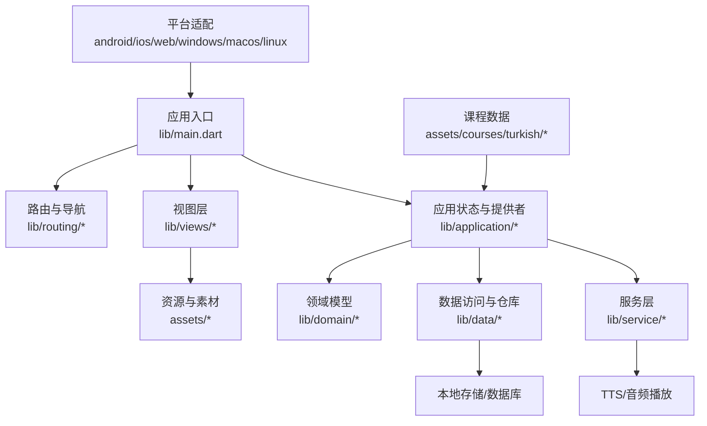
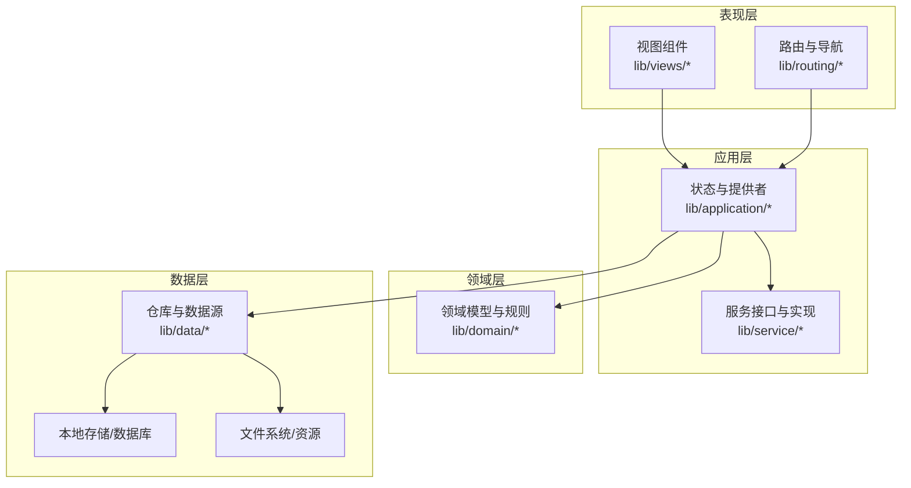
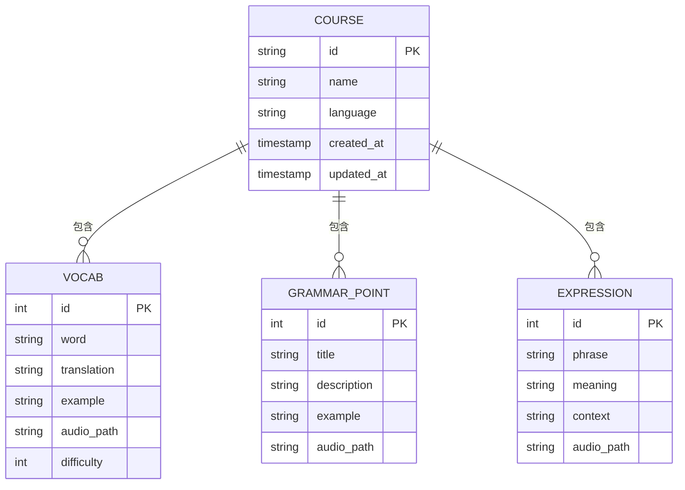
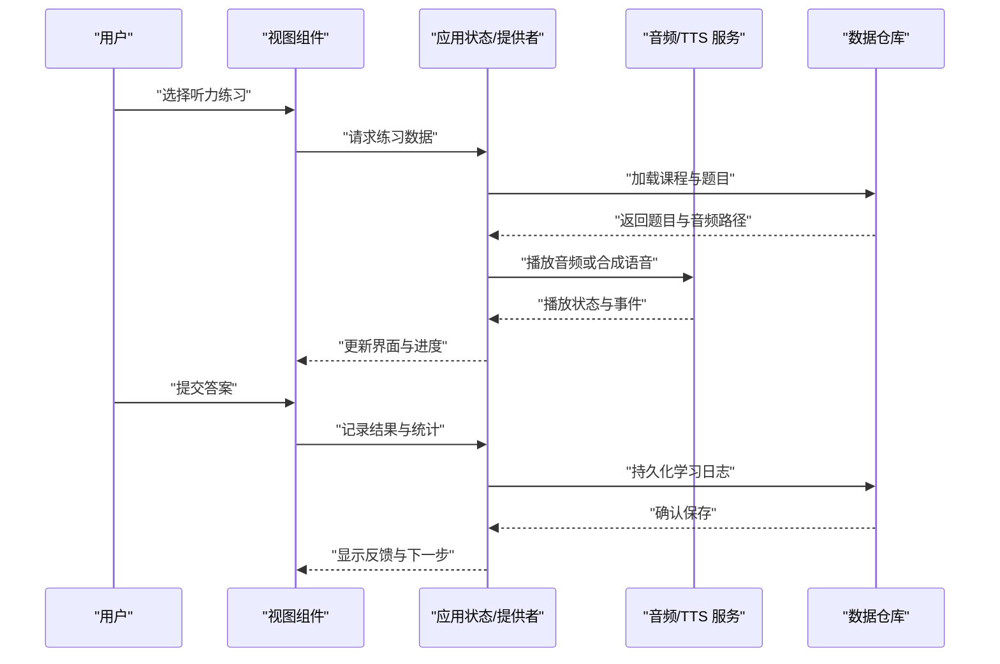
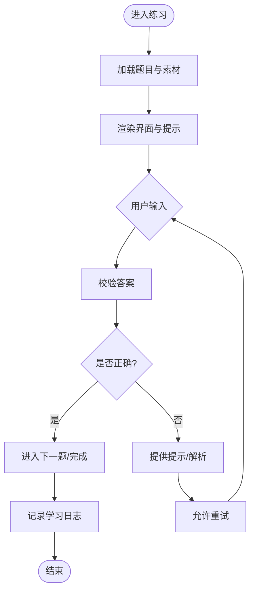
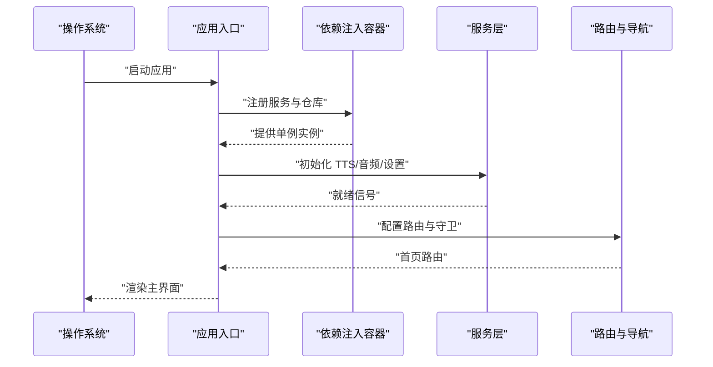
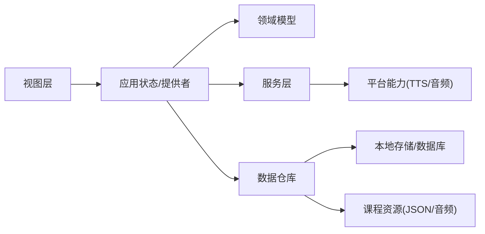

# 项目概览

<cite>
**本文引用的文件**   
- [README.md](file://README.md)
- [pubspec.yaml](file://pubspec.yaml)
- [main.dart](file://lib/main.dart)
- [project-framework-analysis.md](file://docs/analysis/project-framework-analysis.md)
- [course-layout.md](file://docs/authoring/course-layout.md)
- [listening-show-format.md](file://docs/authoring/listening-show-format.md)
- [index.json](file://assets/courses/turkish/index.json)
- [vocab.json](file://assets/courses/turkish/vocab.json)
- [grammar_points.json](file://assets/courses/turkish/grammar_points.json)
- [expressions.json](file://assets/courses/turkish/expressions.json)
</cite>

## 目录
1. [简介](#简介)
2. [项目结构](#项目结构)
3. [核心组件](#核心组件)
4. [架构总览](#架构总览)
5. [详细组件分析](#详细组件分析)
6. [依赖分析](#依赖分析)
7. [性能考虑](#性能考虑)
8. [故障排查指南](#故障排查指南)
9. [结论](#结论)
10. [附录](#附录)

## 简介
Varnamalaplus 是一个基于 Flutter 的跨平台多语言学习应用，当前重点支持土耳其语课程。其核心目标是通过“课程学习 + 听力训练 + 词汇掌握”的一体化体验，帮助用户系统性地提升目标语言能力。应用覆盖 Android、iOS、Web、Windows、macOS、Linux 等主流平台，提供一致的交互与学习体验。

设计理念强调：
- 以课程为中心：将语法点、词汇、表达与练习结构化组织，形成循序渐进的学习路径。
- 数据驱动内容：通过 JSON 资源描述课程结构与素材，便于作者维护与扩展。
- 可移植与可扩展：Flutter 统一代码库，配合清晰的分层架构与模块化设计，降低多端维护成本。

目标用户群体包括：
- 初学者到中级学习者，希望系统化学习土耳其语。
- 需要听力专项训练与词汇巩固的用户。
- 教师或内容创作者，希望通过工具快速构建与发布课程。

典型使用场景：
- 每日课程学习（阅读、语法、词汇）
- 听力理解训练（听音辨义、跟读、复述）
- 词汇复习与记忆强化（间隔重复、错词回顾）

[本节为概念性概述，不直接分析具体文件]

## 项目结构
项目采用 Flutter 标准工程结构，结合领域驱动的模块划分，主要目录职责如下：
- lib：应用主体代码，包含入口、路由、视图、业务逻辑、数据层、依赖注入与服务。
- assets：课程与媒体资源，如土耳其语课程的索引、词汇、语法点、表达与音频素材。
- android/ios/web/windows/macos/linux：各平台原生配置与适配。
- docs：项目文档，含框架分析、作者指南、课程布局规范、听力展示格式等。
- tool：内容生产与工具链脚本，用于生成音频、导出清单、校验课程等。
- test：单元测试、集成测试与黄金测试，保障功能稳定性与 UI 一致性。

图表来源
- [main.dart](file://lib/main.dart)
- [project-framework-analysis.md](file://docs/analysis/project-framework-analysis.md)

章节来源
- [README.md](file://README.md)
- [pubspec.yaml](file://pubspec.yaml)
- [project-framework-analysis.md](file://docs/analysis/project-framework-analysis.md)

## 核心组件
- 应用入口与初始化：负责启动应用、加载全局配置、注册依赖与服务。
- 路由与导航：管理页面跳转与课程进入流程，确保在不同平台上的导航一致性。
- 视图层：按功能域组织界面组件，如课程列表、课堂练习、听力训练、设置等。
- 应用状态与提供者：集中管理学习进度、SRS 复习队列、统计与成就等状态。
- 领域模型：定义课程、课程节、练习类型、词汇、语法点等核心实体。
- 数据访问与仓库：封装课程资源的读取、缓存与持久化，保证离线可用。
- 服务层：提供 TTS、音频播放、网络请求、设备能力等通用服务。
- 资源与素材：课程 JSON 描述与媒体文件（音频、图片），支撑内容与交互。

章节来源
- [project-framework-analysis.md](file://docs/analysis/project-framework-analysis.md)
- [course-layout.md](file://docs/authoring/course-layout.md)
- [listening-show-format.md](file://docs/authoring/listening-show-format.md)

## 架构总览
应用遵循分层架构与依赖倒置原则，UI 层仅依赖应用状态与提供者，业务逻辑集中在 application 与 domain 层，数据访问通过 repository 抽象屏蔽底层实现细节。服务层解耦第三方能力（如 TTS、音频）。

图表来源
- [project-framework-analysis.md](file://docs/analysis/project-framework-analysis.md)

章节来源
- [project-framework-analysis.md](file://docs/analysis/project-framework-analysis.md)

## 详细组件分析

### 课程与内容模型
课程数据由一组 JSON 文件构成，描述课程索引、词汇、语法点与表达，便于作者维护与版本控制。

图表来源
- [index.json](file://assets/courses/turkish/index.json)
- [vocab.json](file://assets/courses/turkish/vocab.json)
- [grammar_points.json](file://assets/courses/turkish/grammar_points.json)
- [expressions.json](file://assets/courses/turkish/expressions.json)

章节来源
- [course-layout.md](file://docs/authoring/course-layout.md)
- [index.json](file://assets/courses/turkish/index.json)
- [vocab.json](file://assets/courses/turkish/vocab.json)
- [grammar_points.json](file://assets/courses/turkish/grammar_points.json)
- [expressions.json](file://assets/courses/turkish/expressions.json)

### 听力训练流程
听力训练围绕“播放音频 → 理解任务 → 反馈与记录”展开，结合 TTS 与本地音频资源，支持不同难度与题型。

图表来源
- [listening-show-format.md](file://docs/authoring/listening-show-format.md)

章节来源
- [listening-show-format.md](file://docs/authoring/listening-show-format.md)

### 课堂练习流程（示例）
课堂练习涵盖词汇拼写、语法填空、匹配题等，流程包括题目渲染、输入校验、即时反馈与错误收集。

图表来源
- [course-layout.md](file://docs/authoring/course-layout.md)

章节来源
- [course-layout.md](file://docs/authoring/course-layout.md)

### 应用入口与初始化
应用入口负责初始化全局依赖、主题、路由与必要服务，确保在多平台上的一致行为。

图表来源
- [main.dart](file://lib/main.dart)

章节来源
- [main.dart](file://lib/main.dart)

## 依赖分析
- 内部依赖：视图依赖应用状态与提供者；应用层依赖领域模型与服务；数据层通过仓库抽象屏蔽存储细节。
- 外部依赖：Flutter 生态插件（音频、TTS、存储、网络等），由各平台原生能力提供。
- 资源依赖：课程 JSON 与媒体文件作为静态资源被数据层加载与缓存。

图表来源
- [project-framework-analysis.md](file://docs/analysis/project-framework-analysis.md)

章节来源
- [pubspec.yaml](file://pubspec.yaml)
- [project-framework-analysis.md](file://docs/analysis/project-framework-analysis.md)

## 性能考虑
- 资源加载与缓存：对课程 JSON 与音频进行懒加载与缓存，减少首屏与切换延迟。
- 音频播放优化：复用播放器实例，避免频繁创建销毁；合理压缩音频体积。
- 状态管理：使用不可变状态与增量更新，避免不必要的重绘。
- 内存管理：及时释放大对象与监听器，防止内存泄漏。
- 跨平台差异：针对 Web 与桌面端优化资源路径与权限处理。

[本节为通用指导，不直接分析具体文件]

## 故障排查指南
- 课程资源缺失或损坏：检查 assets/courses/turkish 下的 JSON 与音频文件完整性，确保路径一致。
- TTS 不可用：验证平台 TTS 引擎可用性，回退到本地音频播放。
- 音频播放失败：检查权限与媒体路径，确认文件格式与编码兼容。
- 路由异常：检查路由配置与守卫逻辑，确保页面参数正确传递。
- 数据持久化问题：确认数据库版本迁移与读写权限。

章节来源
- [project-framework-analysis.md](file://docs/analysis/project-framework-analysis.md)

## 结论
Varnamalaplus 以 Flutter 为基础，构建了跨平台的土耳其语学习应用。通过清晰的分层架构、数据驱动的课程内容与完善的工具链，项目在可维护性、可扩展性与用户体验方面具备良好基础。未来可在更多语言课程、AI 辅助学习与社交化学习方面持续演进。

[本节为总结性内容，不直接分析具体文件]

## 附录
- 作者指南与模板：参考 docs/authoring 下的课程布局与听力展示格式，确保内容规范与一致性。
- 工具链脚本：tool 目录下提供音频生成、课程校验与导出清单等脚本，提升内容生产效率。
- 测试策略：test 目录覆盖单元、集成与黄金测试，保障功能与 UI 稳定性。

[本节为补充信息，不直接分析具体文件]