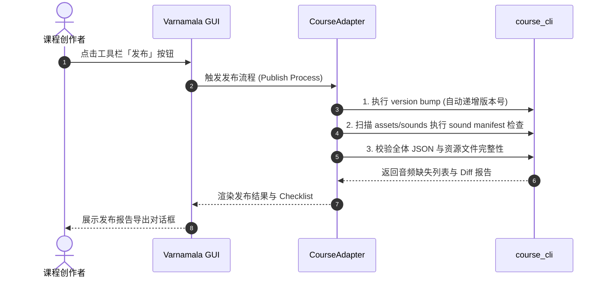

# Varnamala Course Editor GUI (语言课程图形编辑器)

`Varnamala GUI` 是基于 **PySide6** 开发的高效、本地化二语习得（SLA）课程编辑器。它是底层 CLI 工具 [`tool/course_cli.py`](../course_cli.py) 的图形前端，结合严格的结构校验与 AI 辅助能力，为课程创作者提供可视化设计、教材智能化提取、资源集中管理、交互审校与一键发布的全流程解决方案。

> 💡 **新手快速入门**：若您是初次使用的课程创作者或教师，无需命令行背景，可参考 [图形界面新手指南](../../docs/authoring/gui-beginner-guide.md)。  
> 🛠️ **开发者与高级用户**：本 README 涵盖安装运行、主界面使用、课程工坊（AI 创作中心）全流程、架构设计、测试与打包指南。

---

## 目录

- [核心功能特性](#核心功能特性)
- [环境要求与安装运行](#环境要求与安装运行)
  - [环境准备](#环境准备)
  - [启动运行](#启动运行)
- [主界面与功能使用指南](#主界面与功能使用指南)
  - [1. 工具栏 (Toolbar)](#1-工具栏-toolbar)
  - [2. 课程树状导航 (Course Tree)](#2-课程树状导航-course-tree)
  - [3. 课时编辑器与可视化蓝图 (Lesson Editor & Blueprint)](#3-课时编辑器与可视化蓝图-lesson-editor--blueprint)
  - [4. 语言资源库管理 (Resource Editor)](#4-语言资源库管理-resource-editor)
  - [5. 课程总览与教师模式 (Overview & Teacher Mode)](#5-课程总览与教师模式-overview--teacher-mode)
  - [6. 设置与偏好管理 (Settings)](#6-设置与偏好管理-settings)
- [课程工坊 (AI 创作中心) 全流程指南](#课程工坊-ai-创作中心-全流程指南)
  - [0. 双轨道项目类型](#0-双轨道项目类型)
  - [1. 阶段一：项目与素材准备 (Material)](#1-阶段一项目与素材准备-material)
  - [2. 阶段二：知识点智能抽取与审校 (Knowledge)](#2-阶段二知识点智能抽取与审校-knowledge)
  - [3. 阶段三：接地式 AI 课程设计 (Grounded Design)](#3-阶段三接地式-ai-课程设计-grounded-design)
  - [4. 阶段四：结构化审校与试做 (Review)](#4-阶段四结构化审校与试做-review)
  - [5. 阶段五：幂等合并导入 (Import)](#5-阶段五幂等合并导入-import)
  - [6. 高级特性 (Genre 标签 / Prompt 库 / 附件支持 / 自动保存断点续作)](#6-高级特性-genre-标签--prompt-库--附件支持--自动保存断点续作)
- [技术架构与四项设计约束](#技术架构与四项设计约束)
  - [模块目录映射](#模块目录映射)
  - [四项核心设计约束](#四项核心设计约束)
- [版本发布与音频校验 (Publishing)](#版本发布与音频校验-publishing)
- [测试套件与打包构建](#测试套件与打包构建)
  - [单元与集成测试](#单元与集成测试)
  - [PyInstaller 独立构建](#pyinstaller-独立构建)
- [附录：二语习得 (SLA) 语言学设计依据](#附录二语习得-sla-语言学设计依据)

---

## 核心功能特性

- 🌳 **三级课程树直观编排**：支持 `Section` (章节) -> `Unit` (单元) -> `Lesson` (课时) 的层级化展示，提供拖拽排序、批量复制/移动、删除与预设套用。
- 🎨 **可视化蓝图与表单引擎**：针对不同课时模板（`intro` / `practice` / `listening` / `reading` / `review` / `mastery`）提供动态属性表单与可视化编排蓝图。
- 🤖 **课程工坊（AI 创作流水线）**：全功能非模态 AI 协同创作窗口，支持解析 PDF/Word/TXT/图片等素材，自动提取词汇/语法点，接地（Grounded）生成结构化课程。
- 📦 **语言资源独立建模**：词汇 (`vocab`)、固定表达 (`expressions`) 与语法点 (`grammar_points`) 集中化表格管理，支持 CSV 导入导出与引用依赖检测。
- 🛡️ **单一校验源与保存回滚**：编辑器本身不另外定义校验规则，完全对接 `course_cli validate & lint`。保存时校验失败将自动恢复内存与磁盘文件，保障课程数据安全。
- 🎓 **教师预览与试做模式**：可切换为教师视图进行课程结构审查，并对编写的课时进行实时交互测试。
- 🚀 **版本控制与发布工作流**：整合版本 Bump、音频 Manifest 挂载检查、Diff 差异比对及发布报告一键生成。

---

## 环境要求与安装运行

### 环境准备

- **Python 版本**：Python 3.11 或更高版本。
- **系统支持**：Windows / macOS / Linux。

安装所需依赖依赖项：

```bash
pip install PySide6 PyPDF2 python-docx
```

> ⚠️ **沙箱开发提示**：若在 TRAE/VS Code 受限沙箱中遇到 `WinError 5` 无法安装 PySide6，请切换至本机系统终端运行 GUI 界面与打包命令。后端核心无 PySide6 依赖，单元测试仍可在沙箱环境中正常执行。

### 启动运行

在项目根目录下执行以下命令：

```bash
python -m tool.gui.src.main
```

启动后可点击工具栏的 **「课程仓库 → 打开课程目录」** 选择本地课程目录（例如：`assets/courses/turkish/`）。

---

## 主界面与功能使用指南

界面布局由顶部工具栏、左侧课程树状导航、右侧详情/编辑器面板以及底部状态栏组成。

```
+-----------------------------------------------------------------------------------+
|  [课程仓库] [保存] [课程工坊] [总览] [资源库] [发布] [教师模式] [设置]            |
+------------------------------------+----------------------------------------------+
| 课程结构树                         | 详情面板                                     |
| ├── Section 1: 基础起步             |  ┌────────────────────────────────────────┐  |
| │   ├── Unit 1: 问候与介绍         |  │ 元数据表单 (名称 / 描述 / 前置依赖)      │  |
| │   │   ├── Lesson 1 (intro)       |  └────────────────────────────────────────┘  |
| │   │   └── Lesson 2 (practice)    |  ┌────────────────────────────────────────┐  |
| │   └── Unit 2: 数字与时间         |  │ Lesson 编辑器 / 题型表单 / 可视化蓝图     │  |
| └── Section 2: 日常生活             |  └────────────────────────────────────────┘  |
+------------------------------------+----------------------------------------------+
| 状态栏: 就绪 | AI 校验防护激活中 | 当前路径: /assets/courses/turkish                |
+-----------------------------------------------------------------------------------+
```

### 1. 工具栏 (Toolbar)

| 按钮 | 功能说明 | 快捷键 / 备注 |
|---|---|---|
| **课程仓库** | 打开新仓库 / 新建课程目录 / 浏览最近使用过的仓库 / 清空打开历史 | 自动记录前 10 个历史路径 |
| **保存** | 将当前修改写盘，自动触发 `course_cli validate` 和 `lint` 校验；校验失败自动回滚 | `Ctrl+S` |
| **课程工坊** | 启动一站式 AI 协同创作窗口（从教材提取、AI 设计、审校到幂等导入） | 非模态窗口，可并行操作 |
| **总览** | 弹出全局课程结构鸟瞰图（展示 Section / Unit / Lesson 统计，点击芯片直达对应节点） | 适合大颗粒度可视化跳转 |
| **资源库** | 开启本地词汇 (`vocab`)、表达 (`expressions`) 与语法点 (`grammar_points`) 编辑表格 | 支持 CSV 一键导出/导入 |
| **发布** | 执行版本 Bump、音效 Manifest 挂载检查、Diff 差异生成与报告导出 | 发布上线准备工具 |
| **教师模式** | 切换为教师审查视角，提供课时结构化呈现与实时交互试做体验 | 快速验证学员交互体验 |
| **设置** | 配置全局主题、字体缩放、AI 接口服务（Base URL / Model / Key）、撤销步数与用量监控 | 全局持久化配置 |

### 2. 课程树状导航 (Course Tree)

左侧树展示 `Section` -> `Unit` -> `Lesson` 的三级包含关系：
- **右键菜单**：
  - **新增**：新增 Section、Unit 或 Lesson（弹出模板选择）。
  - **AI 编辑此节点**：调出快捷 AI 对话框，针对当前节点提出修改要求。
  - **套用预设 (Presets)**：为 Lesson 快捷套用预构筑的互动模式与梯度组合。
  - **批量操作**：支持按住 `Ctrl` 或 `Shift` 选定多个节点进行批量复制、移动或删除。
- **常用快捷键**：
  - `Ctrl+D`：快速克隆当前选中的节点。
  - `Delete`：删除选中节点（附带二次确认提示）。
  - `F2`：快速重命名当前节点名称。
  - `Ctrl+↑` / `Ctrl+↓`：上移或下移当前节点排序。

### 3. 课时编辑器与可视化蓝图 (Lesson Editor & Blueprint)

在树状导航中选中具体 Lesson 后，右侧面板展示其内容编辑器：

1. **元数据区域**：编辑 Lesson 的名称、描述以及同层前置依赖 (`prerequisiteLessonIds`)。
2. **模板类型切换**：可在 `intro` / `practice` / `listening` / `reading` / `review` / `mastery` 之间切换，系统将自动纠正数据规范。
3. **可视化蓝图 (Blueprint Editor)**：针对 `listening`、`reading` 及 `mastery` 等复杂功能课时，界面提供直观的流程蓝图，可拖拽或点击调整听力阶段 (`ListeningPhase`) 或阅读文章 (`ReadingPassage`) 的段落顺序。
4. **12 种互动题型列表与表单**：
   - 动态增删题型卡片，支持拖拽调整顺序。
   - 每种题型根据 Schema 展现专用输入框：词汇下拉关联选择、多选选项定义、填空文本匹配、音频路径挂载等。

### 4. 语言资源库管理 (Resource Editor)

点击工具栏 **「资源库」** 按钮进入全局资源编辑页面：
- **三大资源表**：分别查看与修改 `vocab.json` (词汇)、`expressions.json` (常用表达)、`grammar_points.json` (语法点)。
- **表格列交互**：支持在线新增、删除行以及原地双击编辑。
- **引用检索与安全删除**：在删除特定词汇或语法点时，系统会自动扫描所有 Lesson 中的引用情况，若存在引用将予以警示。
- **CSV 交换**：支持批量导出为 CSV 文件供外部 Excel/Translators 编辑，编辑完成后一键导入覆盖或合并。

### 5. 课程总览与教师模式 (Overview & Teacher Mode)

- **全局总览图**：以可视化网格与统计卡片的形态，列出全课程的词汇覆盖率、语法点分布密度以及各 Section 的题型构成比例。
- **教师试做模式**：点击工具栏 **「教师模式」** 后，可模拟学员在移动端的操作流程，在桌面端直接测试各种互动题型（如单选点击、听音选词、句子重排等），验证答题逻辑与渲染效果。

### 6. 设置与偏好管理 (Settings)

点击 **「设置」** 按钮唤起配置对话框，偏好项自动存储在 `QSettings` 中：
- **外观风格**：支持在深色 (Dark) 与浅色 (Light) 主题间无缝切换；提供 80%–150% 的 UI 字体缩放调整。
- **AI 接口配置**：
  - **供应商预设**：一键填充 DeepSeek、OpenAI、Moonshot、Ollama 等供应商的标准 Base URL 和默认模型。
  - **安全保护**：API Key **仅在当前会话内存中保存**，关闭应用程序后自动销毁，坚决不写入磁盘；Base URL 与 Model 配置持久化保存。
  - **参数微调**：可自定义思考过程 (Reasoning)、请求超时时间 (5–600 秒)、生成温度 (0.0–2.0) 及自动重试轮数 (0–5)。
  - **连接测试**：提供「测试连接」按钮，发送最小 1-token 请求验证配置有效性。
- **用量与成本分析**：实时查看今日与累计的 Token 消耗量、API 请求次数及按模型价格预估的消费金额。
- **编辑器行为**：配置全局撤销上限 (10–500 步) 及窗口关闭时是否有未保存更改的自动处理策略。

---

## 课程工坊 (AI 创作中心) 全流程指南

课程工坊是 Varnamala GUI 的核心 AI 协同创作模块。它是一个**非模态的主窗口**，支持与主界面并排操作，内部提供六阶段标准流水线：**项目 → 素材 → 知识 → 设计 → 审校 → 导入**。

```
+---------------------------------------------------------------------------------------------------+
| 课程工坊 - [教材项目: 土耳其语初级教程]                                                          |
+-------------------+-------------------------------------------------------------------------------+
| 阶段导航           | 阶段三：接地式 AI 课程设计 (Design Stage)                                      |
| [1] 项目准备      | ┌───────────────────────────┐ ┌────────────────────────────────────────────┐ |
| [2] 素材提取      | │ 生成参数控制              │ │ 许愿池与 AI 对话 (支持拖入 PDF/图片/文档) │ |
| [3] 知识点审校    | │ - 目标等级: A1            │ │ User: 请以"机场出关"为主题设计 2 个单元...  │ |
| => [4] 课程设计   | │ - 单元数量: 2             │ │ AI: 已读取素材库，正在从词汇池中选取词汇...│ |
| [5] 结构审校      | │ - 课时/单元: 3            │ └────────────────────────────────────────────┘ |
| [6] 导入课程树    | │ - 启用 [genre] 多模板     │ ┌────────────────────────────────────────────┐ |
|                   | └───────────────────────────┘ │ 实时生成的课程结构草稿 (JSON / 预览图)      │ |
+-------------------+-------------------------------------------------------------------------------+
| 用量消耗: 12,450 tokens (约 $0.02) | 状态: 草稿已自动写盘至 var/textbooks/turkish/project.json   |
+---------------------------------------------------------------------------------------------------+
```

### 0. 双轨道项目类型

课程工坊支持两种独立的创作模式：

| 项目模式 | 建立方式 | 适用场景与流水线 |
|---|---|---|
| **教材项目 (Textbook Project)** | 在项目库点击「从教材新建…」，选择 PDF/Word/TXT/图片 等素材文件并设置语言对 | 基于已有教材自上而下提取知识点，确保 AI 严谨依照教材词汇进行 Grounded 编排。流水线：素材 → 知识 → 设计 → 审校 → 导入。 |
| **空白 AI 项目 (Blank Project)** | 在项目库点击「空白 AI 项目」，仅填写项目名称与目标语言 | 无需先备教材，通过自然语言对话与提示词直接脑暴生成全新课程。开局直达设计阶段。 |

> 💾 **自动保存与无缝续作**：无论处于哪一阶段，所有勾选状态、提取到的知识词条、聊天记录与课程草稿均实时自动保存到 `var/textbooks/{项目名}/project.json` 中。作者可随时关闭工坊窗口，重新开启时将完美恢复到上次中断的阶段。

### 1. 阶段一：项目与素材准备 (Material)

1. 拖入或选取教材文本、PDF、Word 或图像素材。
2. 后端自动解析文档结构，在界面中生成大纲树与内联预览。
3. 勾选需要参与本期课程制作的章节，选择教材解析预设 (Preset) 并设定抽取并发数。

### 2. 阶段二：知识点智能抽取与审校 (Knowledge)

1. 点击 **「提取知识点」**，系统调用 LLM 逐章智能提取词汇 (`vocab`)、固定表达 (`expressions`) 与语法点 (`grammar_points`)。
2. 章节卡片实时反馈提取状态与质量指标（🔴/🟡/🟢 标记）。若单章提取失败，可选择“重试本章”、“仅抽词汇”或“跳过本章”。
3. 在知识审校表格中，作者可直接修改编辑提取出的词汇拼写、释义与语法规则，或使用内置的 **「AI 修复」** 补全缺失项。

### 3. 阶段三：接地式 AI 课程设计 (Grounded Design)

1. **生成参数设定**：设置课程主题、CEFR 等级（A1–C1）、单元数、每单元课时数及默认课时模板。
2. **Grounded 约束编排**：在教材模式下，AI **强制只能从上阶段提取的资源池中选用词汇与语法点**，防止 AI 凭空捏造不符合教学大纲的超纲词汇。
3. **许愿池交互 (Wish-list Chat)**：在右侧对话框中通过自然语言提出具体的编排意图（例如：“第一单元聚焦打招呼，前两课使用 intro 模板，最后一课用 review 模板”）。
4. **流式生成与通俗解释**：点击生成后，JSON 草稿流式写入编辑器，AI 自动在下方附带设计意图与“AI 通俗解释”，协助审查编排逻辑。

### 4. 阶段四：结构化审校与试做 (Review)

1. **结构统计与校验 Chips**：展示生成课程的词汇复现率、各题型数量统计及 `course_cli` 校验标志。
2. **差异比对 (Diff View)**：若当前生成内容与已有的 Section 同名，系统将生成结构级别的 Diff 差异树，直观展示哪些 Unit/Lesson 进行了新增或修改。
3. **AI 一键修复**：遇到校验不通过的问题，可点击「AI 修复」，模型将自动读取错误日志并尝试纠正结构，修缮结果实时写回草稿。

### 5. 阶段五：幂等合并导入 (Import)

确认审校无误后，点击 **「导入到课程」** 将内容注入主课程树：
- **四种导入策略**：
  1. `合并 (Merge)`：同名 Section/Unit 自动合并，相同 ID 节点更新，新节点追加。
  2. `跳过已存在 (Skip Existing)`：仅导入课程树中尚不存在的新节点。
  3. `强制覆盖 (Overwrite)`：清空原有同名 Section 并用本次生成内容替代。
  4. `仅新增 (Add Only)`：不修改现有节点，全部作为全新节点追加。
- **批量冲突解决**：遇到冲突章节，通过合并预览表格统一决策，避免频繁弹窗中断。
- **幂等性保障**：多次执行相同的导入操作不会产生重复的废节点。

### 6. 高级特性

- **`[genre]` 标签多模板批量生成**：在生成参数中开启该开关后，可在提示词或主题中显式插入标签（如 `[intro] 机场词汇 [listening] 报关对话`），AI 将根据标签自动为不同课时分配不同的专业模板。
- **Prompt 模板库与历史记录**：支持将常用的生成 Spec（语言、等级、单元数、提示词）保存为本地模板；历史下拉框可一键回溯过去的请求参数。
- **多模态附件支持**：在设计阶段的聊天框中，可直接拖入或粘贴图片、PDF、Word 附件。系统会自动提取文本或处理图像，将其作为临时 Prompt 上下文一同发送给模型。
- **失败原因自动分析**：生成或校验失败时，提供「AI 分析原因」按钮，调用模型对复杂报错日志进行二次解读，提供人类可读的修复建议。

---

## 技术架构与四项设计约束

### 模块目录映射

```
tool/gui/
├── src/
│   ├── main.py                   # 程序主入口
│   ├── app.py                    # MainWindow、主工具栏与中央窗口布局
│   ├── theme.py                  # 深/浅色主题样式与调色板定义
│   ├── application/              # 应用层逻辑
│   │   ├── commands.py           # QUndoStack 撤销/重做命令集
│   │   ├── settings.py           # 偏好配置模型与持久化保存
│   │   └── section_import_service.py # 章节导入与冲突解决管线
│   ├── backend/                  # 后端服务与 CLI 适配层
│   │   ├── course_adapter.py     # 封装 course_cli，提供 save/validate/lint/发布接口
│   │   ├── lesson_content.py     # Lesson 模板规整与默认生成器
│   │   ├── ai_generator.py        # OpenAI 兼容 API 请求适配器与 Prompt 构造
│   │   ├── ai_presets.py          # LLM 供应商预设与本地计价表
│   │   ├── ai_prompt_library.py    # Prompt 模板库与使用历史
│   │   ├── ai_usage.py            # Token 用量与成本估算统计
│   │   └── attachment_extractor.py# 附件多模态提取 (PDF/Word/TXT/图片)
│   ├── dialogs/                  # 对话框与独立子窗口
│   │   ├── workshop_window.py    # 课程工坊（AI 创作中心，六阶段流水线）
│   │   ├── ai_generator_dialog.py# 树节点 AI 快速编辑对话框
│   │   ├── init_course_dialog.py # 课程仓库初始化向导
│   │   ├── settings_dialog.py    # 应用全局配置面板
│   │   └── ai/                   # 工坊子面板 (Design, Review, Merge)
│   └── widgets/                  # 可复用 UI 组件
│       ├── course_tree.py        # 左侧 3 级课程结构树
│       ├── detail_panel.py       # 右侧属性与内容编辑器容器
│       ├── metadata_form.py      # Section/Unit/Lesson 元数据表单
│       ├── lesson_editor.py      # Lesson 属性与可视化蓝图编辑器
│       ├── interaction_forms.py  # 12 种互动题型动态表单工厂
│       ├── resource_editor.py    # 词汇/表达/语法点表格与 CSV 导入导出
│       └── publish_dialog.py     # 课程发布与报告生成对话框
└── tests/                        # pytest 自动化测试套件
```

### 四项核心设计约束

1. **校验单一来源 (Validation Single Source)**  
   GUI **绝不自行定义二次校验规则**，所有的内容写盘与保存一律调用 `CourseAdapter.save()`，底层执行 `course_cli validate` 与 `course_cli lint`。保证编辑器产生的数据与终端运行及 Flutter 客户端渲染完全一致。
2. **JSON 为唯一真相源 (JSON as Ground Truth)**  
   内存编辑状态在保存时全量写入 JSON 磁盘文件。格式符合版本控制规范（Git Diff 清晰可读），且天然契合自动化脚本处理与移动端解析。
3. **ID 保持强不可变性 (Immutable IDs)**  
   新增节点使用 `short_id` 算法生成唯一 ID，系统不允许对现有节点的 ID 进行重命名。ID 是 `wordId`、`grammarPointId` 等引用关系的唯一锚点，ID 不可变保障了引用的长期稳定性。
4. **保存失败自动回滚 (Atomic Rollback)**  
   写盘保存并触发校验时，若检测到语法错误或结构非法，保存逻辑会自动调用 `_restore_from` 恢复内存数据并写回历史状态，防止坏数据污染磁盘仓库。

---

## 版本发布与音频校验 (Publishing)

当课程内容编辑完成并准备提供给客户端上线时，使用工具栏的 **「发布」** 功能：



1. **版本自动递增 (Version Bump)**：自动更新课程元数据中的版本号。
2. **音频清单检测 (Audio Sound Manifest)**：自动核对题目引用的音频路径在 `assets/sounds` 目录下是否存在，生成音频资源补全清单。
3. **差异与报告导出**：生成详细的 Markdown 版本发布报告，汇总本次发布的变更细节。

---

## 测试套件与打包构建

### 单元与集成测试

GUI 附带了覆盖全面的测试套件（位于 `tool/gui/tests/` 目录）：

```bash
cd tool/gui

# 1. 运行后端逻辑与界面隔离测试 (Headless / Offscreen 模式，无须图形显示服务器)
QT_QPA_PLATFORM=offscreen python -m pytest tests/ --ignore=tests/test_app.py -q

# 2. 运行全量 GUI 界面测试 (需图形环境或启用 offscreen 的 PySide6)
python -m pytest tests/test_app.py -q

# 3. 运行 GUI -> CLI 双向 round-trip 回归集成测试
python test/tool/gui_round_trip_test.py -v

# 4. 运行底层 CLI 单元测试
python -m unittest discover -s test -p "*_cli_test.py"
```

测试基准指标与说明详见 [`tests/BASELINE.md`](./tests/BASELINE.md)。

### PyInstaller 独立构建

项目内置了自动化 PyInstaller 打包脚本，可将 GUI 应用程序打包为独立的单文件可执行程序：

```bash
# 安装 PyInstaller
pip install pyinstaller

# 默认构建 (在 dist/ 目录下生成 varnamala-gui 可执行文件)
python tool/gui/build_gui.py

# 清理构建缓存并重新构建
python tool/gui/build_gui.py --clean

# 构建目录形式 (onedir 模式，适合调试)
python tool/gui/build_gui.py --onedir
```

具体的 PyInstaller 打包配置文件参见 [`varnamala_gui.spec`](./varnamala_gui.spec)。

> 📌 **打包已知说明**：发布阶段的音效清单检测 (`sound-manifest`) 需要访问相对路径 `assets/sounds`。打包后的独立 exe 运行于非仓库根目录时，音效检查可能会提示路径缺失，但核心编辑、保存、校验与发布报告导出功能不受影响。推荐在仓库根目录环境下运行或打包。

---

## 附录：二语习得 (SLA) 语言学设计依据

编辑器的数据结构与交互逻辑围绕二语习得 (Second Language Acquisition, SLA) 的核心规律构建：

1. **6 大模板习得逻辑**：
   - `intro`（新知引入 / 建立形式-意义映射，Nation 框架）、`practice`（受控操练 / 陈述性向程序性知识转化）、`listening`（听力解码 / 音位训练）、`reading`（语篇阅读 / 附带习得）、`review`（螺旋复习 / 抗遗忘）、`mastery`（综合精通 / 自动化产出）。
2. **12 种题型与认知梯度**：
   - **识别层**（低认知负荷，如 `showWord` / `multipleChoice` / `listenAndPick`）
   - **回忆层**（中认知负荷，如 `fillBlank` / `typeTheWord`）
   - **产出层**（高认知负荷，如 `translateSentence` / `reorderSentence`）
   - 遵循**支架式教学** (Scaffolding) 原则，建立课时内的难度阶梯。
3. **听力三段式 (`debut` → `main` → `fin`)**：
   - 对应 Pre-listening / While-listening / Post-listening 听力教学框架，主音频支持叠加场景背景音训练环境噪音中的语音感知能力。
4. **资源独立解耦**：
   - 词汇 (`vocab`)、固定表达 (`expressions`) 与语法点 (`grammar_points`) 独立建模与 ID 引用，实现跨课复用及语法点覆盖度统计。
