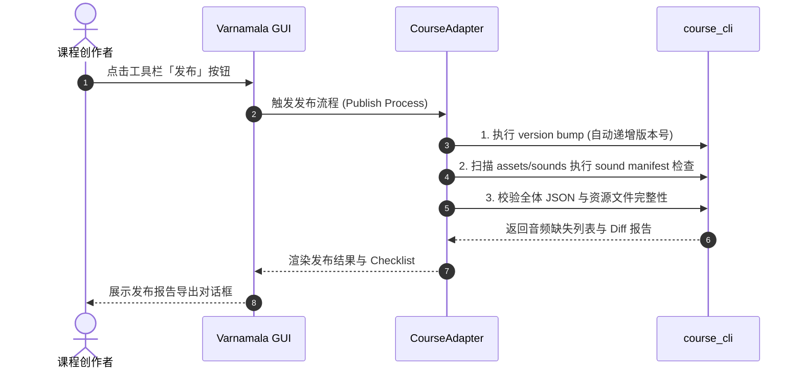

# Varnamala Course Editor GUI (语言课程图形编辑器)

`Varnamala GUI` 是基于 **PySide6** 开发的高效、本地化二语习得（SLA）课程编辑器。它是底层 CLI 工具 [`tool/course_cli.py`](../course_cli.py) 的图形前端，结合严格的结构校验与 AI 辅助能力，为课程创作者提供可视化设计、教材智能化提取、资源集中管理、交互审校与一键发布的全流程解决方案。

> 💡 **新手快速入门**：若您是初次使用的课程创作者或教师，无需命令行背景，可参考 [图形界面新手指南](../../docs/authoring/gui-beginner-guide.md)。  
> 🛠️ **开发者与高级用户**：本 README 涵盖安装运行、主界面使用、课程工坊（AI 创作中心）全流程、架构设计、测试与打包指南。

---

## 目录

- [核心功能特性](#核心功能特性)
- [环境要求与安装运行](#环境要求与安装运行)
  - [环境准备](#环境准备)
  - [启动运行](#启动运行)
- [主界面与功能使用指南](#主界面与功能使用指南)
  - [1. 工具栏 (Toolbar)](#1-工具栏-toolbar)
  - [2. 课程树状导航 (Course Tree)](#2-课程树状导航-course-tree)
  - [3. 课时编辑器与可视化蓝图 (Lesson Editor & Blueprint)](#3-课时编辑器与可视化蓝图-lesson-editor--blueprint)
  - [4. 语言资源库管理 (Resource Editor)](#4-语言资源库管理-resource-editor)
  - [5. 课程总览与教师模式 (Overview & Teacher Mode)](#5-课程总览与教师模式-overview--teacher-mode)
  - [6. 设置与偏好管理 (Settings)](#6-设置与偏好管理-settings)
- [课程工坊 (AI 创作中心) 全流程指南](#课程工坊-ai-创作中心-全流程指南)
  - [0. 双轨道项目类型](#0-双轨道项目类型)
  - [1. 信息架构：项目库 + 创意画布](#1-信息架构项目库--创意画布)
  - [2. 左栏：教材 · 知识 · 气泡池](#2-左栏教材--知识--气泡池)
  - [3. 中栏：AI 轨道 (Orbit)](#3-中栏ai-轨道-orbit)
  - [4. 右栏：结构大纲 · 设计与草稿 · 导入](#4-右栏结构大纲--设计与草稿--导入)
  - [5. 导入与导入后闭环](#5-导入与导入后闭环)
  - [6. 高级特性与快捷键](#6-高级特性与快捷键)
- [技术架构与四项设计约束](#技术架构与四项设计约束)
  - [模块目录映射](#模块目录映射)
  - [四项核心设计约束](#四项核心设计约束)
- [版本发布与音频校验 (Publishing)](#版本发布与音频校验-publishing)
- [测试套件与打包构建](#测试套件与打包构建)
  - [单元与集成测试](#单元与集成测试)
  - [PyInstaller 独立构建](#pyinstaller-独立构建)
- [附录：二语习得 (SLA) 语言学设计依据](#附录二语习得-sla-语言学设计依据)

---

## 核心功能特性

- 🌳 **三级课程树直观编排**：支持 `Section` (章节) -> `Unit` (单元) -> `Lesson` (课时) 的层级化展示，提供拖拽排序、批量复制/移动、删除与预设套用。
- 🎨 **可视化蓝图与表单引擎**：针对不同课时模板（`intro` / `practice` / `listening` / `reading` / `review` / `mastery`）提供动态属性表单与可视化编排蓝图。
- 🤖 **课程工坊（统一创意画布）**：非模态 AI 协同创作窗口；项目库 + 三栏画布（教材/知识/气泡 · AI 轨道 · 大纲/设计/导入），支持教材提取、Grounded 生成、局部重生成与幂等导入。
- 📦 **语言资源独立建模**：词汇 (`vocab`)、固定表达 (`expressions`) 与语法点 (`grammar_points`) 集中化表格管理，支持 CSV 导入导出与引用依赖检测。
- 🛡️ **单一校验源与保存回滚**：编辑器本身不另外定义校验规则，完全对接 `course_cli validate & lint`。保存时校验失败将自动恢复内存与磁盘文件，保障课程数据安全。
- 🎓 **教师预览与试做模式**：可切换为教师视图进行课程结构审查，并对编写的课时进行实时交互测试。
- 🚀 **版本控制与发布工作流**：整合版本 Bump、音频 Manifest 挂载检查、Diff 差异比对及发布报告一键生成。

---

## 环境要求与安装运行

### 环境准备

- **Python 版本**：Python 3.11 或更高版本。
- **系统支持**：Windows / macOS / Linux。

安装所需依赖依赖项：

```bash
pip install PySide6 PyPDF2 python-docx
```

> ⚠️ **沙箱开发提示**：若在 TRAE/VS Code 受限沙箱中遇到 `WinError 5` 无法安装 PySide6，请切换至本机系统终端运行 GUI 界面与打包命令。后端核心无 PySide6 依赖，单元测试仍可在沙箱环境中正常执行。

### 启动运行

在项目根目录下执行以下命令：

```bash
python -m tool.gui.src.main
```

启动后可点击工具栏的 **「课程仓库 → 打开课程目录」** 选择本地课程目录（例如：`assets/courses/turkish/`）。

---

## 主界面与功能使用指南

界面布局由顶部工具栏、左侧课程树状导航、右侧详情/编辑器面板以及底部状态栏组成。

```
+-----------------------------------------------------------------------------------+
|  [课程仓库] [保存] [课程工坊] [总览] [资源库] [发布] [教师模式] [设置]            |
+------------------------------------+----------------------------------------------+
| 课程结构树                         | 详情面板                                     |
| ├── Section 1: 基础起步             |  ┌────────────────────────────────────────┐  |
| │   ├── Unit 1: 问候与介绍         |  │ 元数据表单 (名称 / 描述 / 前置依赖)      │  |
| │   │   ├── Lesson 1 (intro)       |  └────────────────────────────────────────┘  |
| │   │   └── Lesson 2 (practice)    |  ┌────────────────────────────────────────┐  |
| │   └── Unit 2: 数字与时间         |  │ Lesson 编辑器 / 题型表单 / 可视化蓝图     │  |
| └── Section 2: 日常生活             |  └────────────────────────────────────────┘  |
+------------------------------------+----------------------------------------------+
| 状态栏: 就绪 | AI 校验防护激活中 | 当前路径: /assets/courses/turkish                |
+-----------------------------------------------------------------------------------+
```

### 1. 工具栏 (Toolbar)

| 按钮 | 功能说明 | 快捷键 / 备注 |
|---|---|---|
| **课程仓库** | 打开新仓库 / 新建课程目录 / 浏览最近使用过的仓库 / 清空打开历史 | 自动记录前 10 个历史路径 |
| **保存** | 将当前修改写盘，自动触发 `course_cli validate` 和 `lint` 校验；校验失败自动回滚 | `Ctrl+S` |
| **课程工坊** | 启动一站式 AI 协同创作窗口（从教材提取、AI 设计、审校到幂等导入） | 非模态窗口，可并行操作 |
| **总览** | 全局课程结构鸟瞰图：多行统计（Sections/Units/Lessons/空课时/校验错警 + 词汇·表达·语法覆盖率 + 课型分布）、每 Section 题型构成行、按名称/ID 搜索、课型徽标过滤、空课时灰边标记、一键导出 Markdown、点校验数跳转已有校验面板 | 适合大颗粒度可视化、覆盖率审查与跳转 |
| **资源库** | 开启本地词汇 (`vocab`)、表达 (`expressions`) 与语法点 (`grammar_points`) 编辑表格 | 支持 CSV 一键导出/导入 |
| **发布** | 执行版本 Bump、音效 Manifest 挂载检查、Diff 差异生成与报告导出 | 发布上线准备工具 |
| **教师模式** | 切换为教师审查视角，提供课时结构化呈现与实时交互试做体验 | 快速验证学员交互体验 |
| **设置** | 配置全局主题、字体缩放、AI 接口服务（Base URL / Model / Key）、撤销步数与用量监控 | 全局持久化配置 |

### 2. 课程树状导航 (Course Tree)

左侧树展示 `Section` -> `Unit` -> `Lesson` 的三级包含关系：
- **右键菜单**：
  - **新增**：新增 Section、Unit 或 Lesson（弹出模板选择）。
  - **AI 编辑此节点**：调出快捷 AI 对话框，针对当前节点提出修改要求。
  - **套用预设 (Presets)**：为 Lesson 快捷套用预构筑的互动模式与梯度组合。
  - **批量操作**：支持按住 `Ctrl` 或 `Shift` 选定多个节点进行批量复制、移动或删除。
- **常用快捷键**：
  - `Ctrl+D`：快速克隆当前选中的节点。
  - `Delete`：删除选中节点（附带二次确认提示）。
  - `F2`：快速重命名当前节点名称。
  - `Ctrl+↑` / `Ctrl+↓`：上移或下移当前节点排序。

### 3. 课时编辑器与可视化蓝图 (Lesson Editor & Blueprint)

在树状导航中选中具体 Lesson 后，右侧面板展示其内容编辑器：

1. **元数据区域**：编辑 Lesson 的名称、描述以及同层前置依赖 (`prerequisiteLessonIds`)。
2. **模板类型切换**：可在 `intro` / `practice` / `listening` / `reading` / `review` / `mastery` 之间切换，系统将自动纠正数据规范。
3. **可视化蓝图 (Blueprint Editor)**：针对 `listening`、`reading` 及 `mastery` 等复杂功能课时，界面提供直观的流程蓝图，可拖拽或点击调整听力阶段 (`ListeningPhase`) 或阅读文章 (`ReadingPassage`) 的段落顺序。
4. **12 种互动题型列表与表单**：
   - 动态增删题型卡片，支持拖拽调整顺序。
   - 每种题型根据 Schema 展现专用输入框：词汇下拉关联选择、多选选项定义、填空文本匹配、音频路径挂载等。

### 4. 语言资源库管理 (Resource Editor)

点击工具栏 **「资源库」** 按钮进入全局资源编辑页面：
- **三大资源表**：分别查看与修改 `vocab.json` (词汇)、`expressions.json` (常用表达)、`grammar_points.json` (语法点)。
- **表格列交互**：支持在线新增、删除行以及原地双击编辑。
- **引用检索与安全删除**：在删除特定词汇或语法点时，系统会自动扫描所有 Lesson 中的引用情况，若存在引用将予以警示。
- **CSV 交换**：支持批量导出为 CSV 文件供外部 Excel/Translators 编辑，编辑完成后一键导入覆盖或合并。
- **跨表搜索**：顶部搜索栏同时过滤三个标签页（大小写不敏感子串匹配）。
- **批量删除**：支持多选行（Ctrl/Shift+点击）后一次性删除。
- **查重**：检测 vocab 与 expressions 之间的跨表重复词条。
- **资源包**：导出/导入单个 JSON 资源包（含全部三类资源），支持合并去重或完全替换模式。

### 4.1 Git 资源库 (Git Library)

点击工具栏 **「资源库 ▸ Git 资源库」** 打开三标签页对话框：

**远程协作 / 同步**
- **已保存远程仓库**：列出所有已保存的远程（名称/URL/本地目录/语言），双击一键连接。
- **连接 / 克隆**：填写远程 URL + 本地目录 + 语言代码，自动从设置填充默认值。
- **分支管理**：下拉选择分支，支持新建/切换/删除。
- **拉取冲突解决**：`pull --ff-only` 失败时弹出三选一对话框（Rebase / Stash+Pull+Pop / 放弃）。
- **推送前预览**：查看工作树与 HEAD 的 diff stat。
- **历史右键菜单**：对任意提交执行 reset --hard/soft 或 revert。
- **复制到 assets**：将课程复制到 `<repo>/assets/courses/<lang>/`（目标根目录可在设置中配置）。
- **同步资源池**：双向合并本地资源与 Git 仓库的 vocab/expressions/grammar_points。
- **仓库文件树**：浏览克隆仓库的文件，双击在编辑器中打开。

**局域网协作共享**
- **HTTP Smart 服务器**：内置 Git Smart HTTP 协议服务器，支持 clone/push over HTTP。
- **安全配置**：绑定地址选择（0.0.0.0 / 127.0.0.1）、访问令牌鉴权、只读模式（禁止 push）、IP 白名单。
- **端口自动重试**：端口被占用时自动 +1 重试（最多 10 次）。
- **在线成员**：实时显示已连接的协作者 IP（60s 超时剔除）。
- **诊断日志**：实时显示 Git RPC 请求的成功/失败信息。

**团队留言板**
- **线程化回复**：留言支持回复（parent_id），缩进显示线程结构。
- **编辑/删除**：可编辑或删除自己的留言（按系统用户名验证权限）。
- **分页**：每页 20 条顶层留言，上一页/下一页导航。
- **搜索**：按留言内容或用户名过滤。
- **自动同步**：发送前先 `pull --rebase` 再 `commit_and_push`，降低非快进拒绝。

### 5. 课程总览与教师模式 (Overview & Teacher Mode)

- **全局总览图**：多行统计（Sections/Units/Lessons/空课时/校验错警 + 词汇·表达·语法覆盖率 N/M, P% + 课型分布），每个 Section 卡片头部展示题型构成（如「选择题 12 · 填空题 8 · 听音选词 6」），空课时芯片灰边 + `（空）` 标记；顶部搜索框按名称/ID 过滤，课型徽标可点切互斥过滤，一键导出 Markdown 便于贴入 ADR/内容清单，校验数可点跳转已有校验面板。统计计算抽到纯函数模块 `backend/overview_stats.py`（无 Qt，可单测）。
- **教师试做模式**：点击工具栏 **「教师模式」** 后，可模拟学员在移动端的操作流程，在桌面端直接测试各种互动题型（如单选点击、听音选词、句子重排等），验证答题逻辑与渲染效果。

### 6. 设置与偏好管理 (Settings)

点击 **「设置」** 按钮唤起配置对话框，偏好项自动存储在 `QSettings` 中：
- **外观风格**：支持在深色 (Dark) 与浅色 (Light) 主题间无缝切换；提供 80%–150% 的 UI 字体缩放调整。
- **AI 接口配置**：
  - **供应商预设**：一键填充 DeepSeek、OpenAI、Moonshot、Ollama 等供应商的标准 Base URL 和默认模型。
  - **安全保护**：API Key **仅在当前会话内存中保存**，关闭应用程序后自动销毁，坚决不写入磁盘；Base URL 与 Model 配置持久化保存。
  - **参数微调**：可自定义思考过程 (Reasoning)、请求超时时间 (5–600 秒)、生成温度 (0.0–2.0) 及自动重试轮数 (0–5)。
  - **连接测试**：提供「测试连接」按钮，发送最小 1-token 请求验证配置有效性。
  - **生成稳定性（aiEnhance 第一枪）**：课程生成走统一「生成 → 校验 → 回灌错误重试」闭环；prompt 强制资源先于 units、注入 CEFR/干扰项/土耳其语教学法约束；可选对 `[待补]`/needs-review 词条做第二趟补全（API 参数 `fill_needs_review`，默认关）。度量探针见 `backend/ai_bench.py` 与 `tests/ai_goldens/`，路线图见 [`aiEnhance.md`](./aiEnhance.md)。
  - **内容质量与精修（aiEnhance 第二枪）**：审阅区展示规则质量分（复现/题型/干扰项/难度/听力/资源卫生），可「按质量分修复」；局部重生成支持自定义指令与预设条；生成模式可选 **快速（整节）** 或 **精修（大纲→分课）**（`backend/ai_phased.py`）。质量分**不阻断**保存/导入。
  - **高级 AI 选项（aiEnhance 第三枪 批次①）**：展开「AI 配置」tab 底部的「高级」折叠区可配置：
    - **双模型**：`model_chat`（对齐对话 / 课程解释）与 `model_json`（课程 / 课时 / 题目 JSON 生成与修复）。留空则使用主模型，实现成本分流。
    - **JSON Schema 严格度**：`auto`（首次尝试 `json_schema`，HTTP 400 自动回退 `json_object`）/ `on`（强制）/ `off`（仅 `json_object`）。
    - **响应缓存**：进程内 LRU(128)，键为 `(model, messages, response_format)` 的 SHA-256，不存储 API Key；启用后重复请求直接命中缓存（仍会跑 validator 防脏）。
    - **其他**：`fill_needs_review` 二趟补全开关、`max_parallel_lessons`(1..8)、`pipeline_default_mode`(fast|refine)。缓存命中/未命中通过 `ai.cache.stats` telemetry 事件可见。
  - **精修流水线（aiEnhance 第三枪 批次②）**：工坊「生成」选 **精修（流水线）** 时走 `backend/ai_pipeline.py` 状态机：Plan → 大纲 → 分课生成 → 校验 → 内容质量分 → 修复（先规则修复，LLM 只处理剩余 error，且不得删除既有 id 否则回滚）→ 通俗解释 → ReadyImport。右栏上方实时显示各步 checklist（pending/running/done/skipped/failed）；「跳过修复 / 跳过解释」可裁剪步骤；支持取消，取消后大纲/草稿等中间态随项目自动保存，重开项目再点生成可从大纲续跑。流水线**只到草稿为止**，导入仍走原有「校验 → 目标选择 → diff/merge 预览 → 人工确认」流程，绝不自动导入。
- **用量与成本分析**：实时查看今日与累计的 Token 消耗量、API 请求次数及按模型价格预估的消费金额。
- **编辑器行为**：配置全局撤销上限 (10–500 步) 及窗口关闭时是否有未保存更改的自动处理策略。
- **Git 库配置**：克隆根目录、Git 二进制路径、默认语言代码、操作超时、Assets 仓库根目录、LAN 默认端口/绑定地址/令牌、SSH 私钥路径、已保存远程仓库表（CRUD）、HTTPS 凭据管理（OS keyring 优先，QSettings 回退）。

---

## 创作者五条主路径（AI 感知增强）

日常创作优先走下列路径（详见 [`aiEnhance.md`](./aiEnhance.md)）：

| 路径 | 怎么做 | 你应感到 |
|------|--------|----------|
| **A 空白→一节课** | 工坊空白项目 → 主题/等级 → 快速或精修生成 → 结构大纲看**生成摘要 + 质量维** → 导入 | 不用翻 JSON 也能决定导不导入 |
| **B 教材→课** | 从教材新建 → 抽章（状态灯可见滑窗/降级）→ 勾选入池 → Grounded 生成 → 导入 | 抽取失败有自动降级；可「按质量重抽」 |
| **C 改一处** | 教师模式题目「AI」/ 树右键 AI 编辑 / Review 局部重生成 | 预设指令统一；改题可确认 + Ctrl+Z |
| **D 校验清零** | 校验面板 **多选** 问题 →「AI 自动修正」按节点分批 merge | 不必逐条点修 |
| **E 导入后改进** | 总览看 section **质量分** → 回工坊/教师定向修 | 低分课有着色提示 |

工坊底栏显示 `json/chat 模型 · 缓存 · tokens`；精修模式有步骤 checklist；头栏 **素材·知识·草稿·导入** 可点击跳转。

## 课程工坊 (AI 创作中心) 全流程指南

课程工坊是 Varnamala GUI 的核心 AI 协同创作模块：一个**非模态窗口**，可与主界面并排。  
自 P0 起，信息架构为 **项目库 ↔ 创意画布**（不再使用可点击的六阶段侧栏）。头栏 checklist 提示进度：`○/✓ 素材 · 知识 · 草稿 · 导入`（可点击跳转对应栏）。

```
+------------------------------------------------------------------------------------------------------+
| 课程工坊  项目：[土耳其语初级教程]  Chinese → Turkish     ✓素材 · ✓知识 · ○草稿 · ○导入              |
+------------------------------------------------------------------------------------------------------+
| 创意画布                                                                                             |
| ┌─ 左栏 ──────────┐  ┌─ 中栏 AI 轨道 ──────────┐  ┌─ 右栏 ─────────────────────────────────────────┐ |
| │ 教材与章节       │  │ 拖入知识点气泡          │  │ 结构大纲（默认）  试做 · diff · AI 修复 · 导入 │ |
| │ 知识点审校       │  │ 主题 / 等级 / 模板      │  │ 对话与高级：聊天 · 模板 · JSON（折叠）     │ |
| │ 气泡池           │  │ [ AI 核心 开始设计 ]    │  │ 章节导入：策略与批量预览                     │ |
| └──────────────────┘  │ Ctrl+Enter 生成         │  └───────────────────────────────────────────────┘ |
|                       └─────────────────────────┘                                                    |
+------------------------------------------------------------------------------------------------------+
| 定位到课程树 | 进度… | 生成中… | 用量 | 已自动保存 | 取消任务 | 关闭                               |
+------------------------------------------------------------------------------------------------------+
```

### 0. 双轨道项目类型

| 项目模式 | 建立方式 | 适用场景 |
|---|---|---|
| **教材项目** | 项目库「从教材新建…」，选 PDF/Word/TXT/图片 与语言对 | 自上而下提取知识点，Grounded 编排（AI 优先从池中选词） |
| **空白 AI 项目** | 项目库「空白 AI 项目」，填名称与语言对 | 无教材自由生成；左栏教材/知识标「(可选)」，默认落在设计相关 tab |

> 💾 **自动保存与续作**：勾选、知识点、聊天、草稿、tab/splitter 布局均会保存。关窗可中断任务；重开恢复上次项目（`workshop/last_project_id`）并进入画布。项目文件：`tool/gui/var/textbooks/{project_id}/project.json`。

### 1. 信息架构：项目库 + 创意画布

| 页 | 内容 |
|---|---|
| **项目库** | 新建/打开教材项目或空白 AI 项目；点项目名可随时返回项目库 |
| **创意画布** | 左 / 中 / 右三栏统一创作，无需按固定顺序「点下一步」 |

顶栏可关闭的引导 banner（「知道了」后不再提示）会按空白/教材/是否已有草稿给出下一步建议。

### 2. 左栏：教材 · 知识 · 气泡池

1. **教材与章节**：拖入或选择文件，预览与切章；选教材类型预设与抽取并发数。
2. **知识点审校**：逐章 LLM 抽取词汇 / 表达 / 语法点；红黄质量标记、编辑、批量删、AI 修复；失败章可重试 / 仅抽词汇 / 跳过。首次提取出词时自动切到本 tab。
   - **超长章滑窗抽取**：超过预设字数的章按段落边界切成带重叠的滑窗逐窗抽取，再按键（词+翻译 / 语法标题）去重合并，不再简单截断丢尾部；id 仍按 `ch-{slug}-` 确定性生成。预设的 `window_chars`（0 可关闭）与 `overlap_chars` 控制窗长与重叠。
   - **失败自动级联**：`standard` 抽取失败会自动降级为「仅词汇（vocab_only）」重试一次（日志有「自动降级」说明）；再失败才标记失败，建议跳过或人工重试。可用 QSettings 键 `textbook/auto_cascade`（默认开）关闭。
   - **按质量重抽**：审校页左侧对有质量问题的章提供「按质量重抽」，把具体问题（空翻译、覆盖率偏低、语言混入等）回灌给 AI 输出完整修正版并替换本章结果、重算质量分。
3. **气泡池**：展示已勾选知识点（上限约 200，可点「将选中词加入轨道」或拖入中栏）。

**抽取语言对与 OCR 说明（aiEnhance 批次③）：**

- **内置语言对抽取模板**：Turkish ↔ Chinese 内置了专门的抽取规则块（强调元音和谐/敬语形式、term 禁止混入中文字符、翻译用简体中文），不改 JSON schema。其他语言对可在「设置 → 提取 Prompt」tab 持久化覆盖；生效优先级：内存 register > 持久化覆盖 > 内置语言对包 > 内置默认（机制见 `backend/knowledge_prompt.py` 的 `KnowledgePromptLibrary` 与 `backend/ai_prompt_library.py` 的 `save_extraction_override`）。
- **OCR（扫描件 PDF / 图片文字识别）**：OCR 是**可选外部依赖**，默认关闭、GUI 不内置。扫描件 PDF 目前会提示「未提取到文本」。如需接入：自行安装 [Tesseract OCR](https://github.com/tesseract-ocr/tesseract) 及语言包，用 `ocrmypdf input.pdf output.pdf`（或 `pytesseract`）先做一遍识别，把生成的文本版 PDF / Markdown 再导入即可。

### 3. 中栏：AI 轨道 (Orbit)

1. **参数**：主题、CEFR 等级、单元数、课时/单元、模板；「AI 悄悄话」写编排意图。
2. **聚焦条**：显示「将使用资源池：N 词 · M 表达 · K 语法」；拖入气泡后变为「聚焦：…」。
3. **生成**：点圆形「AI 核心」或 **Ctrl+Enter**。有资源池时 Grounded 选词；池外新词会带 `new` tag。大草稿流式生成时仅更新摘要，完成后一次写入 JSON。
4. **对话入口**：「对话与高级…」切到右栏「对话与高级」（许愿聊天、附件、Prompt 库、`[genre]`；主参数在中栏）。

### 4. 右栏：结构大纲 · 对话与高级 · 导入

| Tab | 用途 |
|---|---|
| **结构大纲**（默认，生成后自动切到） | 单元/课时树、人话校验 chips、池内覆盖率；**试做** / **diff** / **AI 修复**（应用前看 diff）/ **导入**；右键课时或单元可 **局部重生成**；可 **恢复上一版草稿** |
| **对话与高级** | 聊天 / 附件 / 模板与精修选项（折叠）/ JSON（默认折叠）。主参数在中栏轨道；生成后默认看「结构大纲」摘要 |
| **章节导入** | 导入策略、冲突预览（与教材批量导入同源） |

### 5. 导入与导入后闭环

「导入到课程」可选：新建 section / 并入已有 section（追加 unit）/ 并入已有 unit（追加 lesson）。策略含合并、跳过、覆盖、追加新 id 等。幂等：重复导入不制造废节点。

导入成功后主窗口可询问是否 **切换教师模式并定位**该章节（及首课）。工坊底栏 **定位到课程树** 亦可跳转。导入后仍须在主窗口 **保存**。

### 6. 高级特性与快捷键

- **`[genre]` 多模板**、**Prompt 模板库 / 历史**、**多模态附件**、**AI 分析失败原因**（见设置与设计 tab）。
- **Esc**：有任务时确认后取消；**Ctrl+Enter**：从轨道生成。
- 性能：气泡池增量刷新 + debounce；design autosave 节流；校验仍只走 `CourseAdapter` / `course_cli`。

---

## 技术架构与四项设计约束

### 模块目录映射

```
tool/gui/
├── src/
│   ├── main.py                   # 程序主入口
│   ├── app.py                    # MainWindow、主工具栏与中央窗口布局
│   ├── theme.py                  # 深/浅色主题样式与调色板定义
│   ├── application/              # 应用层逻辑
│   │   ├── commands.py           # QUndoStack 撤销/重做命令集
│   │   ├── settings.py           # 偏好配置模型与持久化保存
│   │   └── section_import_service.py # 章节导入与冲突解决管线
│   ├── backend/                  # 后端服务与 CLI 适配层
│   │   ├── course_adapter.py     # 封装 course_cli，提供 save/validate/lint/发布/资源包/查重/同步接口
│   │   ├── git_library.py        # Git CLI 封装（clone/pull/push/分支/冲突/diff/LAN Smart-HTTP 服务器）
│   │   ├── credential_store.py   # OS keyring 凭据存储（HTTPS token + SSH key 路径）
│   │   ├── git_remote_catalog.py # 已保存远程仓库目录（CRUD + QSettings 持久化）
│   │   ├── lesson_content.py     # Lesson 模板规整与默认生成器
│   │   ├── ai_generator.py        # OpenAI 兼容 API、validate loop、fill_needs_review
│   │   ├── ai_phased.py           # 大纲→分课精修生成（fast/phased）
│   │   ├── content_quality.py     # 草稿六维内容质量规则探针
│   │   ├── ai_pedagogy.py         # CEFR / 干扰项 / 语言包 prompt 块
│   │   ├── ai_bench.py            # AI 草稿卫生探针（纯函数，无网络）
│   │   ├── ai_presets.py          # LLM 供应商预设与本地计价表
│   │   ├── ai_prompt_library.py    # Prompt 模板库与使用历史
│   │   ├── ai_usage.py            # Token 用量与成本估算统计
│   │   ├── grounded_stats.py     # 资源池聚焦摘要与草稿覆盖率（纯函数）
│   │   └── attachment_extractor.py# 附件多模态提取 (PDF/Word/TXT/图片)
│   ├── dialogs/                  # 对话框与独立子窗口
│   │   ├── workshop_window.py    # 课程工坊壳：项目库 + 画布 + checklist + 底栏
│   │   ├── git_library_dialog.py # Git 资源库（远程协作/LAN 共享/团队留言板）
│   │   ├── textbook_library_dialog.py # 课本项目库（含从 Git 导入/发布到 Git）
│   │   ├── ai_generator_dialog.py# 树节点 AI 快速编辑对话框
│   │   ├── init_course_dialog.py # 课程仓库初始化向导
│   │   ├── settings_dialog.py    # 应用全局配置面板（含 Git 库 tab）
│   │   └── ai/                   # DesignPanel / ReviewPanel / worker 等
│   └── widgets/                  # 可复用 UI 组件
│       ├── unified_workspace.py  # 创意画布三栏布局
│       ├── ai_orbit.py           # 中栏 AI 轨道
│       ├── course_tree.py        # 左侧 3 级课程结构树
│       ├── detail_panel.py       # 右侧属性与内容编辑器容器
│       ├── lesson_editor.py      # Lesson 属性与可视化蓝图编辑器
│       ├── resource_editor.py    # 本地资源编辑器（跨表搜索/批量/查重/资源包）
│       ├── resource_review_table.py # 知识点审校表
│       └── publish_dialog.py     # 课程发布与报告生成对话框
└── tests/                        # unittest 自动化测试套件（见 tests/BASELINE.md）
```

### 四项核心设计约束

1. **校验单一来源 (Validation Single Source)**  
   GUI **绝不自行定义二次校验规则**，所有的内容写盘与保存一律调用 `CourseAdapter.save()`，底层执行 `course_cli validate` 与 `course_cli lint`。保证编辑器产生的数据与终端运行及 Flutter 客户端渲染完全一致。
2. **JSON 为唯一真相源 (JSON as Ground Truth)**  
   内存编辑状态在保存时全量写入 JSON 磁盘文件。格式符合版本控制规范（Git Diff 清晰可读），且天然契合自动化脚本处理与移动端解析。
3. **ID 保持强不可变性 (Immutable IDs)**  
   新增节点使用 `short_id` 算法生成唯一 ID，系统不允许对现有节点的 ID 进行重命名。ID 是 `wordId`、`grammarPointId` 等引用关系的唯一锚点，ID 不可变保障了引用的长期稳定性。
4. **保存失败自动回滚 (Atomic Rollback)**  
   写盘保存并触发校验时，若检测到语法错误或结构非法，保存逻辑会自动调用 `_restore_from` 恢复内存数据并写回历史状态，防止坏数据污染磁盘仓库。

---

## 版本发布与音频校验 (Publishing)

当课程内容编辑完成并准备提供给客户端上线时，使用工具栏的 **「发布」** 功能：



1. **版本自动递增 (Version Bump)**：自动更新课程元数据中的版本号。
2. **音频清单检测 (Audio Sound Manifest)**：自动核对题目引用的音频路径在 `assets/sounds` 目录下是否存在，生成音频资源补全清单。
3. **差异与报告导出**：生成详细的 Markdown 版本发布报告，汇总本次发布的变更细节。

---

## 测试套件与打包构建

### 单元与集成测试

GUI 附带了覆盖全面的测试套件（位于 `tool/gui/tests/` 目录）：

```bash
cd tool/gui

# 1. 运行后端逻辑与界面隔离测试 (Headless / Offscreen 模式，无须图形显示服务器)
QT_QPA_PLATFORM=offscreen python -m pytest tests/ --ignore=tests/test_app.py -q

# 2. 运行全量 GUI 界面测试 (需图形环境或启用 offscreen 的 PySide6)
python -m pytest tests/test_app.py -q

# 3. 运行 GUI -> CLI 双向 round-trip 回归集成测试
python test/tool/gui_round_trip_test.py -v

# 4. 运行底层 CLI 单元测试
python -m unittest discover -s test -p "*_cli_test.py"
```

测试基准指标与说明详见 [`tests/BASELINE.md`](./tests/BASELINE.md)。

### PyInstaller 独立构建

项目内置了自动化 PyInstaller 打包脚本，可将 GUI 应用程序打包为独立的单文件可执行程序：

```bash
# 安装 PyInstaller
pip install pyinstaller

# 默认构建 (在 dist/ 目录下生成 varnamala-gui 可执行文件)
python tool/gui/build_gui.py

# 清理构建缓存并重新构建
python tool/gui/build_gui.py --clean

# 构建目录形式 (onedir 模式，适合调试)
python tool/gui/build_gui.py --onedir
```

具体的 PyInstaller 打包配置文件参见 [`varnamala_gui.spec`](./varnamala_gui.spec)。

> 📌 **打包已知说明**：发布阶段的音效清单检测 (`sound-manifest`) 需要访问相对路径 `assets/sounds`。打包后的独立 exe 运行于非仓库根目录时，音效检查可能会提示路径缺失，但核心编辑、保存、校验与发布报告导出功能不受影响。推荐在仓库根目录环境下运行或打包。

---

## 附录：二语习得 (SLA) 语言学设计依据

编辑器的数据结构与交互逻辑围绕二语习得 (Second Language Acquisition, SLA) 的核心规律构建：

1. **6 大模板习得逻辑**：
   - `intro`（新知引入 / 建立形式-意义映射，Nation 框架）、`practice`（受控操练 / 陈述性向程序性知识转化）、`listening`（听力解码 / 音位训练）、`reading`（语篇阅读 / 附带习得）、`review`（螺旋复习 / 抗遗忘）、`mastery`（综合精通 / 自动化产出）。
2. **12 种题型与认知梯度**：
   - **识别层**（低认知负荷，如 `showWord` / `multipleChoice` / `listenAndPick`）
   - **回忆层**（中认知负荷，如 `fillBlank` / `typeTheWord`）
   - **产出层**（高认知负荷，如 `translateSentence` / `reorderSentence`）
   - 遵循**支架式教学** (Scaffolding) 原则，建立课时内的难度阶梯。
3. **听力三段式 (`debut` → `main` → `fin`)**：
   - 对应 Pre-listening / While-listening / Post-listening 听力教学框架，主音频支持叠加场景背景音训练环境噪音中的语音感知能力。
4. **资源独立解耦**：
   - 词汇 (`vocab`)、固定表达 (`expressions`) 与语法点 (`grammar_points`) 独立建模与 ID 引用，实现跨课复用及语法点覆盖度统计。
