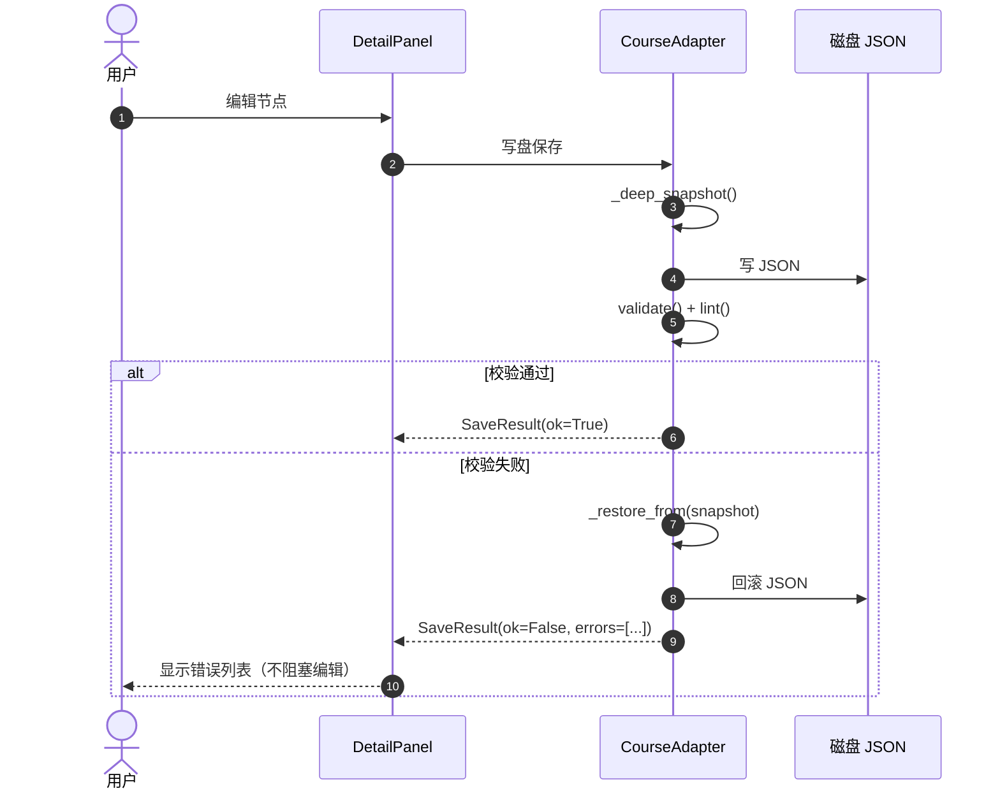
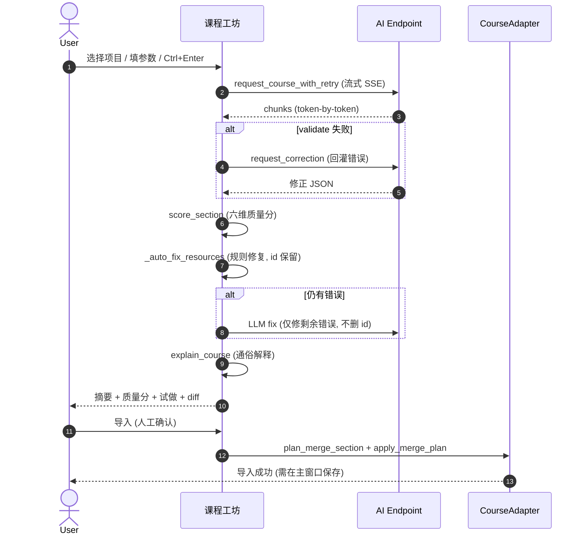

# 12. Varnamala GUI 课程编辑器（PySide6）

> 路径：[`tool/gui/`](file:///c:/Users/DsDogs/Desktop/developper/Varnamalaplus/Varnamalaplus/tool/gui/)
>
> 基于 PySide6 的桌面可视化课程编辑器。**JSON 仍是课程内容的唯一真理源**——GUI 是 CLI 的可视化前端，不引入独立的数据模型。

> 📘 **新手入门**：详见 [`tool/gui/README.md`](file:///c:/Users/DsDogs/Desktop/developper/Varnamalaplus/Varnamalaplus/tool/gui/README.md)
> 📐 **设计契约**：详见 [`docs/authoring/gui-course-editor.md`](file:///c:/Users/DsDogs/Desktop/developper/Varnamalaplus/Varnamalaplus/docs/authoring/gui-course-editor.md)

---

## 12.1 定位与设计哲学

### 12.1.1 三句话总结

1. **GUI = course_cli 的可视化前端**：编辑器不引入独立的数据模型，所有保存/校验/发布都通过 [`tool/course_cli.py`](../course_cli.py)。
2. **JSON 是真理源**：内存编辑态在保存时全量写入 JSON 磁盘文件，Git Diff 友好。
3. **AI 协作而非 AI 替代**：AI 提供生成 / 修复 / 抽取建议，**绝不自动导入**到主仓库。

### 12.1.2 关键设计约束（四条铁律）

1. **校验单一来源 (Validation Single Source)**：GUI 绝不自行定义二次校验规则，所有写盘一律调用 `CourseAdapter.save()`，底层走 `course_cli validate & lint`。
2. **JSON 为唯一真相源**：内存编辑态全量序列化到 JSON，格式契合 Git 版本控制与移动端解析。
3. **ID 强不可变 (Immutable IDs)**：新增节点用 `short_id` 生成唯一 ID，**不允许对现有 ID 重命名**——ID 是 `wordId`/`grammarPointId` 等引用的锚点。
4. **保存失败自动回滚 (Atomic Rollback)**：写盘 + 校验失败时自动 `_restore_from()` 回滚内存数据与磁盘文件，防止坏数据污染仓库。

---

## 12.2 顶层目录结构

```
tool/gui/
├── README.md                  # 用户使用文档（详见 12.3）
├── docs/                      # 设计文档（aiEnhance / E3 / E4 等）
│   ├── ai_configuration_and_features_report.md
│   ├── ai_refactor_contract.md
│   ├── a3-companion-ambient-design.md
│   ├── ai-intrusiveness-ladder-sovereign-proposal.md
│   ├── e4-m01-attachments-context-design.md
│   ├── e4-m0345-multimodal-design.md
│   └── k08-spiral-vocab-design.md
├── src/                       # 源代码
│   ├── main.py                # 程序入口（见 12.5）
│   ├── app.py                 # MainWindow（见 12.6）
│   ├── theme.py               # 深/浅主题与调色板
│   ├── theme_tokens.py        # 主题 token
│   ├── application/           # 应用层（控制器 / 命令）
│   ├── backend/               # 后端服务（CLI 适配 / AI / Git / 教材）
│   ├── dialogs/               # 对话框与子窗口
│   ├── widgets/               # 可复用 UI 组件
│   ├── teacher/               # 教师视图组件
│   ├── i18n/                  # 国际化
│   └── infrastructure/        # 基础设施（日志 / 遥测 / 监控）
├── tests/                     # 自动化测试套件（见 12.11）
├── build_gui.py               # PyInstaller 打包脚本
├── varnamala_gui.spec         # PyInstaller spec
├── pyproject.toml             # 项目配置
├── experienceai.md            # 体验式 AI 设计说明
└── run_gui_tests.py           # 测试运行器
```

---

## 12.3 核心功能特性（来自 README）

| 模块 | 功能 |
|---|---|
| **三级课程树** | Section → Unit → Lesson 层级展示；拖拽排序；批量复制/移动/删除；预设套用 |
| **可视化蓝图** | 6 种模板（intro / practice / listening / reading / review / mastery）的动态属性表单 |
| **课程工坊** | 非模态 AI 协同创作窗口；项目库 + 三栏画布；教材提取 / Grounded 生成 / 局部重生成 / 幂等导入 |
| **资源库** | vocab / expressions / grammar_points 集中管理；CSV 导入导出；引用依赖检测 |
| **校验/回滚** | 完全对接 `course_cli validate & lint`；保存失败自动回滚内存 + 磁盘 |
| **教师预览** | 切换为教师视角进行课程结构审查与实时交互试做 |
| **发布流水线** | 版本 Bump + 音频 Manifest 挂载 + Diff 比对 + 发布报告一键生成 |
| **Git 协作** | 远程协作 / LAN Smart HTTP 服务器 / 团队留言板 |
| **精修流水线** | Plan → 大纲 → 分课生成 → 校验 → 质量分 → 修复 → 通俗解释 → ReadyImport |

---

## 12.4 主界面布局

```
+-----------------------------------------------------------------------------------+
|  [课程仓库] [保存] [课程工坊] [总览] [资源库] [发布] [教师模式] [设置]            |
+------------------------------------+----------------------------------------------+
| 课程结构树                         | 详情面板                                     |
| ├── Section 1: 基础起步             |  ┌────────────────────────────────────────┐  |
| │   ├── Unit 1: 问候与介绍         |  │ 元数据表单 (名称 / 描述 / 前置依赖)      │  |
| │   │   ├── Lesson 1 (intro)       |  └────────────────────────────────────────┘  |
| │   │   └── Lesson 2 (practice)    |  ┌────────────────────────────────────────┐  |
| │   └── Unit 2: 数字与时间         |  │ Lesson 编辑器 / 题型表单 / 可视化蓝图     │  |
| └── Section 2: 日常生活             |  └────────────────────────────────────────┘  |
+------------------------------------+----------------------------------------------+
| 状态栏: 就绪 | AI 校验防护激活中 | 当前路径: /assets/courses/turkish                |
+-----------------------------------------------------------------------------------+
```

### 12.4.1 工具栏 8 大功能

| 按钮 | 功能 | 备注 |
|---|---|---|
| **课程仓库** | 打开/新建课程目录；最近历史（10 条） | |
| **保存** | 写盘 + 校验；失败自动回滚 | `Ctrl+S` |
| **课程工坊** | 非模态 AI 协同创作窗口 | 可并行操作 |
| **总览** | 鸟瞰图：统计 + 题型构成 + 课型徽标 + 跳转校验 | 多 Section 大颗粒度 |
| **资源库** | vocab/expressions/grammar_points 编辑表格 + CSV + Git 库 | |
| **发布** | 版本 Bump + 音频 Manifest + Diff + 报告 | |
| **教师模式** | 切换为教师审查视角 | 实时交互试做 |
| **设置** | 主题 / 字体 / AI 接口 / Git 库 / 撤销步数 | QSettings 持久化 |

### 12.4.2 课程树快捷键

| 快捷键 | 行为 |
|---|---|
| `Ctrl+D` | 克隆选中节点 |
| `Delete` | 删除（带二次确认） |
| `F2` | 重命名 |
| `Ctrl+↑` / `Ctrl+↓` | 上移 / 下移 |

---

## 12.5 入口与启动（src/main.py）

[`tool/gui/src/main.py`](file:///c:/Users/DsDogs/Desktop/developper/Varnamalaplus/Varnamalaplus/tool/gui/src/main.py)：

```python
def _install_excepthook() -> None:
    """Log unhandled exceptions, record telemetry, and offer AI analysis."""
    from src.infrastructure.telemetry import telemetry
    old_hook = sys.excepthook

    def _hook(exc_type, exc_value, exc_tb):
        detail = "".join(traceback.format_exception(exc_type, exc_value, exc_tb))
        logging.error("Uncaught exception:\n%s", detail)
        telemetry.record_error(exc_value, context={"hook": "sys.excepthook", "fatal": True})
        try:
            from src.dialogs.ai_error_analyzer import offer_ai_analysis
            if offer_ai_analysis(None, "未捕获的错误", ...):
                # 弹窗让 AI 分析异常 traceback
                from src.dialogs.ai_error_analyzer import AiErrorAnalyzerDialog
                dlg = AiErrorAnalyzerDialog(detail, context=...)
                dlg.exec()
        except Exception:
            pass
        old_hook(exc_type, exc_value, exc_tb)

    sys.excepthook = _hook


def main() -> int:
    from src.infrastructure.telemetry import telemetry
    _install_excepthook()
    telemetry.start_session()
    start = time.perf_counter()
    app = QApplication(sys.argv)
    app.setApplicationName("Varnamala Course Editor")
    apply_theme(app)
    # 全局事件过滤器：记录所有点击和 input commit
    from src.infrastructure.user_action_filter import UserActionFilter
    app.installEventFilter(UserActionFilter(app))
    window = MainWindow()
    window.show()
    startup_ms = (time.perf_counter() - start) * 1000
    telemetry.record_duration("app.startup", startup_ms)
    return app.exec()
```

**关键点**：

- 日志写入 `~/.varnamala-gui/app.log`
- `telemetry.start_session()` + `telemetry.record_duration("app.startup", ...)` 启动遥测
- `UserActionFilter` 安装到 app，记录每次点击 + input commit
- `_install_excepthook()` 捕获未处理异常，**主动询问用户是否要 AI 分析**

---

## 12.6 MainWindow（src/app.py）

[`tool/gui/src/app.py`](file:///c:/Users/DsDogs/Desktop/developper/Varnamalaplus/Varnamalaplus/tool/gui/src/app.py)：

```python
class MainWindow(QMainWindow):
    """Application main window: tree on the left, detail panel on the right."""

    # 当前打开的课程目录
    course_dir: Path | None
    course_adapter: CourseAdapter  # 内存编辑态
    ai_config: AiApiConfig        # AI 接口配置（仅内存）
    settings_obj: Settings       # 全局设置（QSettings 持久化）

    # 顶部工具栏
    # 左侧 CourseTreeWidget
    # 右侧 DetailPanel
    # 底部状态栏

    # QUndoStack 撤销/重做栈
    undo_stack: QUndoStack
```

### 12.6.1 关键全局辅助函数

```python
def _active_main_window() -> "MainWindow | None":
    """返回活动的 MainWindow；测试时返回 None。"""

def current_ai_config() -> AiApiConfig:
    """从活动 MainWindow 取 AI 配置；测试时返回空 config。"""

def current_settings() -> Settings:
    """从活动 MainWindow 取 Settings；测试时返回默认 Settings。"""
```

### 12.6.2 按钮尺寸策略

```python
class _ButtonSizePolicyFilter(QObject):
    """QPushButton 默认 Preferred，tight layout 会切掉文字。切换 Minimum 让按钮增长到 fit 文字。"""
    def eventFilter(self, obj, event):
        if event.type() == QEvent.Type.Polish and isinstance(obj, QPushButton):
            sp = obj.sizePolicy()
            if sp.horizontalPolicy() != QSizePolicy.Policy.Minimum:
                sp.setHorizontalPolicy(QSizePolicy.Policy.Minimum)
                obj.setSizePolicy(sp)
        return False
```

### 12.6.3 关键命令列表

```python
from src.application.commands import (
    AiEditLessonCommand,          # AI 改写单课（撤销栈）
    AiEditUnitCommand,            # AI 改写单单元
    AiEditSectionCommand,         # AI 改写整 section
    AppendLessonCommand,          # 新增 lesson
    AppendLessonsToUnitCommand,   # 批量新增 lesson 到 unit
    AppendUnitCommand,            # 新增 unit
    AppendUnitsToSectionCommand,  # 批量新增 unit 到 section
    MergeAiSectionCommand,        # AI 生成 section 的合并
    AddItemCommand,               # 加题目
    DeleteItemCommand,            # 删题目
    MoveItemCommand,              # 移动题目
    ReplaceItemCommand,           # 替换题目（AI 改写）
    AddListeningPhaseCommand,
    DeleteListeningPhaseCommand,
    MoveListeningPhaseCommand,
    RenameListeningPhaseCommand,
    BulkDeleteCommand,
    BulkDuplicateCommand,
    BulkMoveCommand,
    ApplyPresetCommand,
    DuplicateLessonCommand,
    ImportAiSectionCommand,
    ...
)
```

---

## 12.7 后端模块（src/backend/）

[`tool/gui/src/backend/`](file:///c:/Users/DsDogs/Desktop/developper/Varnamalaplus/Varnamalaplus/tool/gui/src/backend/) 是 GUI 的**业务逻辑层**——纯 Python（除 PySide6 外无第三方依赖），可独立单测。

### 12.7.1 `api.py` — 稳定后端 API（CLI 适配层）

[`backend/api.py`](file:///c:/Users/DsDogs/Desktop/developper/Varnamalaplus/Varnamalaplus/tool/gui/src/backend/api.py) 是**唯一允许** import `course_cli` 的 GUI 模块：

```python
import course_cli  # noqa: E402  ← 仅这里 import

@dataclass(frozen=True)
class Problem:
    level: str  # 'error' | 'warning'
    message: str
    path: str = ""

@dataclass
class CourseBundle:
    index: dict[str, Any]
    sections: list[dict[str, Any]]
    vocab: list[dict[str, Any]]
    expressions: list[dict[str, Any]]
    grammar_points: list[dict[str, Any]]
    expressions_version: int = 1

def load_course(course_dir: Path) -> CourseBundle:
    index = course_cli.load_index(course_dir)
    sections = [section for _sid, section in course_cli.load_sections(course_dir)]
    vocab = course_cli.load_vocab(course_dir)
    expressions = course_cli.load_expressions(course_dir)
    grammar_points = course_cli.load_grammar_points(course_dir)
    ...

MAX_UNITS_PER_SECTION = course_cli.MAX_UNITS_PER_SECTION
MAX_LESSONS_PER_UNIT = course_cli.MAX_LESSONS_PER_UNIT
ALLOWED_TAGS = course_cli.ALLOWED_TAGS
```

**为什么这样设计**：当 `course_cli.py` 内部变动时，**只需要修改 `api.py`**，GUI 其他代码无感知。

### 12.7.2 `course_adapter.py` — 课程目录适配器

[`backend/course_adapter.py`](file:///c:/Users/DsDogs/Desktop/developper/Varnamalaplus/Varnamalaplus/tool/gui/src/backend/course_adapter.py)：

```python
@dataclass
class SaveResult:
    ok: bool
    errors: list[dict[str, str]] = field(default_factory=list)
    warnings: list[dict[str, str]] = field(default_factory=list)
    message: str = ""

@dataclass
class MergeAction:
    """单条 unit/lesson 合并决策（add/replace/skip）"""
    kind: str
    action: str
    incoming: dict[str, Any]
    target_index: int | None = None

@dataclass
class SectionMergePlan:
    """AI 生成 section 合并到现有 section 的计划"""
    target_section_id: str | None
    incoming_section: dict[str, Any]
    added_units: list[MergeAction]
    replaced_units: list[MergeAction]
    added_lessons_by_unit: dict[str, list[MergeAction]]
    replaced_lessons_by_unit: dict[str, list[MergeAction]]

class CourseAdapter:
    """课程目录的内存编辑态 + save/validate/lint"""

    course_dir: Path | None
    index: dict[str, Any]
    sections: list[dict[str, Any]]
    vocab: list[dict[str, Any]]
    expressions: list[dict[str, Any]]
    grammar_points: list[dict[str, Any]]
    expressions_version: int = 1

    # 快照（用于保存失败回滚）
    _snapshot: dict[str, Any] | None
    _hash_cache: dict[str, int]

    # 节点索引（O(1) 查找）
    _unit_index: dict[str, tuple[dict, dict]]       # unit_id → (section, unit)
    _lesson_index: dict[str, tuple[dict, dict, dict]]  # lesson_id → (section, unit, lesson)
    _node_index_dirty: bool

    # 资源变更监听（用于词汇下拉刷新）
    _resource_listeners: list[Callable]

    # --- 核心方法 ---
    def load(self, course_dir: Path) -> None
    def init_new(self, course_dir: Path, meta: dict[str, Any]) -> None
    def save(self) -> SaveResult                 # 写盘 + validate + lint；失败回滚
    def validate(self) -> ValidationResult
    def lint(self) -> list[Problem]
    def add_resource_listener(self, callback) -> None
    def notify_resources_changed(self) -> None
    def find_unit(self, unit_id: str) -> tuple[dict, dict] | None
    def find_lesson(self, lesson_id: str) -> tuple[dict, dict, dict] | None
    def plan_merge_section(self, incoming: dict, target_id: str | None) -> SectionMergePlan
    def apply_merge_plan(self, plan: SectionMergePlan) -> None
    def invalidate_node_index(self) -> None

    @staticmethod
    def is_course_dir(path: Path) -> bool:
        return (Path(path) / "index.json").is_file()
```

**关键设计**：

- **写盘原子性**：保存前 `_deep_snapshot()` → 写盘 → validate → 失败时 `_restore_from(snapshot)`
- **节点索引懒重建**：`_ensure_node_index()` 在查询时按需 `_rebuild_node_indexes()`，避免每次命令都全树扫描
- **资源变更通知**：下拉框等 UI 组件注册 listener，词汇表变更时自动刷新

### 12.7.3 `lesson_content.py` — 模板规整与默认生成

```python
def slugify(s: str) -> str
def short_id(prefix: str = "") -> str
def default_interaction(runtime_type: str) -> dict[str, Any]
def build_intro_lesson(name: str, ...) -> dict[str, Any]
def build_practice_lesson(name: str, ...) -> dict[str, Any]
def all_lesson_ids(sections: list) -> set[str]
def all_unit_ids(sections: list) -> set[str]
# Tree-level mutators (used by QUndoCommand)
def add_item / delete_item / move_item / replace_item
def add_listening_phase / delete_listening_phase / move_listening_phase
def add_stage / delete_stage / move_stage
def add_sub_lesson / delete_sub_lesson / move_sub_lesson
```

**关键不变量**：所有 mutator 保持树结构合法；命令系统（`commands.py`）基于这些纯函数。

### 12.7.4 `ai_generator.py` — AI 课程生成（OpenAI 兼容）

[`backend/ai_generator.py`](file:///c:/Users/DsDogs/Desktop/developper/Varnamalaplus/Varnamalaplus/tool/gui/src/backend/ai_generator.py)：

```python
class AiCancelled(Exception):
    """用户在 AI 调用中途取消"""

@dataclass
class AiApiConfig:
    base_url: str = "https://api.deepseek.com"
    api_key: str = ""
    model: str = "deepseek-v4-pro"
    supports_reasoning: bool | None = None    # 是否支持 reasoning_effort

    # 第三枪 批次① 高级选项
    model_chat: str = ""      # 对话模型（alignment / chat）
    model_json: str = ""      # JSON 模型（生成 / 修复）
    strict_schema: str = "auto"   # auto / on / off
    _json_schema_supported: bool | None = field(default=None, repr=False)

    @property
    def is_complete(self) -> bool: ...
    @property
    def chat_completions_url(self) -> str: ...

# 主要 API
async def request_course_with_retry(...) -> dict[str, Any]
async def request_correction(...) -> dict[str, Any]
async def explain_course(...) -> str
async def generate_with_validate_loop(...) -> dict[str, Any]
def structural_diff(a: dict, b: dict) -> dict  # 三色 diff (added/removed/changed)

# 内部 helpers
def _normalize_resources(section: dict) -> None       # 资源规范化
def _auto_fix_resources(section: dict) -> None       # 规则级自动修复（id 保留）
def _coerce_problem_messages(problems: list) -> list
```

**两阶段聊天流（许愿模式）**：

1. **Alignment**：AI 用通俗语言解释课程设计，无 JSON
2. **Generation**：AI 返回最终 section JSON

### 12.7.5 `ai_pipeline.py` — 精修流水线（aiEnhance P5）

[`backend/ai_pipeline.py`](file:///c:/Users/DsDogs/Desktop/developper/Varnamalaplus/Varnamalaplus/tool/gui/src/backend/ai_pipeline.py)：

```
状态机：Plan → Extract?(可选) → Outline → Generate → Validate → QualityScore → Fix(loop≤N) → Explain → ReadyImport
```

```python
class PipelineStep:
    PLAN = "plan"
    EXTRACT = "extract"        # 前向兼容 Phase 4；当前总跳过
    OUTLINE = "outline"
    GENERATE = "generate"
    VALIDATE = "validate"
    QUALITY = "quality"
    FIX = "fix"
    EXPLAIN = "explain"
    READY_IMPORT = "ready_import"

PIPELINE_STEPS: tuple[str, ...] = (...)
CHECKLIST_STEPS: tuple[str, ...] = (
    PLAN, OUTLINE, GENERATE, VALIDATE, QUALITY, FIX, EXPLAIN,
)  # 工坊 checklist 显示这些
```

**设计约束**：
- Pure Python，no Qt
- 复用现有组件（`ai_generator` + `ai_phased` + `content_quality`）
- **绝不自动导入**：停在 `READY_IMPORT`，交回原有 import flow（diff/merge 预览 + 人工确认）
- `mode="fast"` 退化为当前单次路径

### 12.7.6 `ai_phased.py` — 大纲→分课精修

[`backend/ai_phased.py`](file:///c:/Users/DsDogs/Desktop/developper/Varnamalaplus/Varnamalaplus/tool/gui/src/backend/ai_phased.py)：

```python
async def request_outline(config, spec, ...) -> dict[str, Any]
async def fill_lessons_from_outline(config, outline, ...) -> list[dict[str, Any]]
```

`fast` 模式：单次生成整个 section；`refine` 模式：先大纲 → 每课独立生成 + 校验。

### 12.7.7 `ai_fixer.py` — AI 修正

[`backend/ai_fixer.py`](file:///c:/Users/DsDogs/Desktop/developper/Varnamalaplus/Varnamalaplus/tool/gui/src/backend/ai_fixer.py)：

```python
def build_correction_prompt(
    problems: list[dict[str, Any]],     # [{level, message, path}]
    node_json: dict[str, Any],
    course_context: dict[str, Any],     # language / source_language / node_kind / existing_resource_ids
    user_hint: str | None = None,
) -> str
```

**关键约束**：修正 prompt 强制要求

1. 只返回修正后的 JSON 对象
2. **保持所有 id 不变**（section/unit/lesson/stage/subLesson/item）
3. 不删除未出错的字段
4. 修正后必须能通过校验
5. wordId/expressionId/grammarPointId 引用修正时，要么补全资源，要么改为已存在 id

### 12.7.8 `ai_stream.py` — SSE 流式响应

[`backend/ai_stream.py`](file:///c:/Users/DsDogs/Desktop/developper/Varnamalaplus/Varnamalaplus/tool/gui/src/backend/ai_stream.py)：

```python
DONE = "__DONE__"

def parse_sse_line(line: str) -> str | None | Literal[DONE]
def parse_sse_usage(line: str) -> dict[str, Any] | None
def iter_sse(response) -> Iterator[str | Literal[DONE]]
def looks_like_sse(response) -> bool
```

**关键点**：
- 纯 `urllib.request`，无第三方依赖
- 容忍 `data:` 行中的非 JSON 内容（部分代理会插入）
- 终端 `data: [DONE]` 用 `DONE = "__DONE__"` 哨兵（空字符串合法 content，不能用）

### 12.7.9 `ai_usage.py` — Token 用量与成本

[`backend/ai_usage.py`](file:///c:/Users/DsDogs/Desktop/developper/Varnamalaplus/Varnamalaplus/tool/gui/src/backend/ai_usage.py)：

```python
PRICING: dict[str, dict[str, Any]] = ai_presets.PRICING  # 模型→价格表

def estimate_usage(body: dict) -> dict[str, int]   # 提取 usage 块
def estimate_tokens_from_text(text: str) -> int      # 启发式 token 估算（无 usage 时 fallback）
```

**Heuristic**：~4 chars/token for ASCII；~2 chars/token for CJK。

### 12.7.10 `ai_cache.py` — 响应缓存

[`backend/ai_cache.py`](file:///c:/Users/DsDogs/Desktop/developper/Varnamalaplus/Varnamalaplus/tool/gui/src/backend/ai_cache.py) — 进程内 LRU(128)：

- Key = `sha256(model | messages | response_format)`（不含 API key）
- 启用后重复请求直接命中缓存（仍跑 validator 防脏）
- 命中/未命中通过 `ai.cache.stats` telemetry 事件可见

### 12.7.11 `ai_presets.py` — 供应商预设

[`backend/ai_presets.py`](file:///c:/Users/DsDogs/Desktop/developper/Varnamalaplus/Varnamalaplus/tool/gui/src/backend/ai_presets.py)：

```python
PRESETS: dict[str, dict[str, str]] = {
    "deepseek":  {"base_url": "https://api.deepseek.com", "model": "deepseek-chat"},
    "openai":    {"base_url": "https://api.openai.com/v1", "model": "gpt-4o-mini"},
    "moonshot":  {"base_url": "https://api.moonshot.cn/v1", "model": "moonshot-v1-8k"},
    "ollama":    {"base_url": "http://localhost:11434/v1", "model": "llama3"},
}
PRICING: dict[str, dict[str, Any]] = {...}  # 模型价格表
```

### 12.7.12 `ai_prompt_library.py` — Prompt 模板库

[`backend/ai_prompt_library.py`](file:///c:/Users/DsDogs/Desktop/developper/Varnamalaplus/Varnamalaplus/tool/gui/src/backend/ai_prompt_library.py)：

- 按 template / CEFR / 题型索引的可复用 prompt
- 使用历史记录
- 支持 `save_extraction_override()` 持久化覆盖（设置 → 提取 Prompt tab）

### 12.7.13 `ai_pedagogy.py` — 教学法 prompt 块

[`backend/ai_pedagogy.py`](file:///c:/Users/DsDogs/Desktop/developper/Varnamalaplus/Varnamalaplus/tool/gui/src/backend/ai_pedagogy.py)：

```python
def pedagogy_prompt_block(cefr: str, language: str) -> str
```

注入 CEFR / 干扰项 / 土耳其语教学法约束。

### 12.7.14 `ai_genre.py` — Genre 标签

[`backend/ai_genre.py`](file:///c:/Users/DsDogs/Desktop/developper/Varnamalaplus/Varnamalaplus/tool/gui/src/backend/ai_genre.py)：

```python
GENRE_TAGS: tuple[str, ...] = ("[intro]", "[practice]", "[listening]", "[reading]", "[review]", "[mastery]")

def genre_tags_in_text(text: str) -> list[str]
def genre_to_template(tag: str) -> str
def template_label(template: str) -> str
def genre_prompt_block(...) -> str
```

主题文本中插入 `[intro]`/`[practice]`/`[listening]` 等标签，一次生成多种模板的课。

### 12.7.15 `ai_bench.py` — AI 草稿卫生探针

[`backend/ai_bench.py`](file:///c:/Users/DsDogs/Desktop/developper/Varnamalaplus/Varnamalaplus/tool/gui/src/backend/ai_bench.py)：

```python
PLACEHOLDER = "[待补]"

def count_placeholders(section: dict) -> int
def count_empty_translations(section: dict) -> int
def count_mcq_duplicate_options(section: dict) -> int
def count_needs_review(section: dict) -> int
def find_dangling_refs(section: dict) -> list[str]
def score_section_hygiene(section: dict) -> dict
```

**纯函数，无 Qt / 网络**——用于单元测试与 bench 脚本。

### 12.7.16 `content_quality.py` — 六维内容质量分

[`backend/content_quality.py`](file:///c:/Users/DsDogs/Desktop/developper/Varnamalaplus/Varnamalaplus/tool/gui/src/backend/content_quality.py)：

```python
Dimension = Literal[
    "coverage",       # 词汇覆盖率
    "balance",        # 题型平衡
    "distractor",     # MCQ 干扰项质量
    "level_fit",      # CEFR 等级适配
    "audio_ready",    # 听力就绪度
    "resource_hygiene",  # 资源卫生（[待补]/空翻译/悬空引用）
]
Badge = Literal["error", "warning", "ok"]

_LEVEL_WORD_CAP = {"A1": 10, "A2": 14, "B1": 18, "B2": 24}
_LEVEL_SENTENCE_WORDS = {"A1": 12, "A2": 16, "B1": 22, "B2": 30}

def score_section(section: dict) -> dict[Dimension, dict]
```

**重要约束**：scores **advisory only** — 不得阻塞保存/导入。

### 12.7.17 `grounded_stats.py` — 资源池聚焦摘要

```python
def draft_coverage(section: dict, pool: dict) -> dict  # 草稿覆盖率
def pool_summary(pool: dict) -> dict                    # 资源池摘要
```

### 12.7.18 `lesson_presets.py` — 功能课预设库

[`backend/lesson_presets.py`](file:///c:/Users/DsDogs/Desktop/developper/Varnamalaplus/Varnamalaplus/tool/gui/src/backend/lesson_presets.py)：

```python
def _listening_three_phase(name: str) -> dict[str, Any]
def _reading_with_questions(name: str) -> dict[str, Any]
def _mastery_check(name: str) -> dict[str, Any]
def _intro_three_step(name: str) -> dict[str, Any]
def _practice_mixed(name: str) -> dict[str, Any]
def _review_mixed(name: str) -> dict[str, Any]

FUNCTIONAL_PRESETS = {
    "listening_three_phase": _listening_three_phase,
    "reading_with_questions": _reading_with_questions,
    "mastery_check": _mastery_check,
    "intro_three_step": _intro_three_step,
    "practice_mixed": _practice_mixed,
    "review_mixed": _review_mixed,
}

def build_preset_lesson(preset_id: str, name: str = "") -> dict[str, Any]
def apply_preset_to_lesson(lesson: dict, preset_id: str) -> dict
def clone_lesson_with_fresh_ids(lesson: dict) -> dict
```

每个 preset 输出**校验通过**的 lesson dict，可直接喂给 `NewLessonDialog`。

### 12.7.19 `import_strategy.py` — 导入策略

```python
class ImportStrategy(Enum):
    CONSERVATIVE = "conservative"   # 跳过新建 / 跳过冲突 / 跳过缺失
    AGGRESSIVE = "aggressive"       # 新建 / 覆盖 / 补充
    INTERACTIVE = "interactive"     # 全部确认
```

### 12.7.20 `knowledge_*` — 教材抽取

| 文件 | 职责 |
|---|---|
| [`knowledge_extractor.py`](file:///c:/Users/DsDogs/Desktop/developper/Varnamalaplus/Varnamalaplus/tool/gui/src/backend/knowledge_extractor.py) | LLM 抽取词汇 / 表达 / 语法点 |
| [`knowledge_merger.py`](file:///c:/Users/DsDogs/Desktop/developper/Varnamalaplus/Varnamalaplus/tool/gui/src/backend/knowledge_merger.py) | 跨章节去重合并 |
| [`knowledge_schema.py`](file:///c:/Users/DsDogs/Desktop/developper/Varnamalaplus/Varnamalaplus/tool/gui/src/backend/knowledge_schema.py) | KnowledgePoints schema |
| [`knowledge_prompt.py`](file:///c:/Users/DsDogs/Desktop/developper/Varnamalaplus/Varnamalaplus/tool/gui/src/backend/knowledge_prompt.py) | 抽取 prompt + `KnowledgePromptLibrary` |
| [`extraction_quality.py`](file:///c:/Users/DsDogs/Desktop/developper/Varnamalaplus/Varnamalaplus/tool/gui/src/backend/extraction_quality.py) | 抽取质量校验（必填字段 / id 格式 / 引用） |
| [`markdown_chopper.py`](file:///c:/Users/DsDogs/Desktop/developper/Varnamalaplus/Varnamalaplus/tool/gui/src/backend/markdown_chopper.py) | 大 Markdown 自动分段（带重叠滑窗） |
| [`textbook_to_course.py`](file:///c:/Users/DsDogs/Desktop/developper/Varnamalaplus/Varnamalaplus/tool/gui/src/backend/textbook_to_course.py) | 知识条目 → 课程 JSON |
| [`textbook_presets.py`](file:///c:/Users/DsDogs/Desktop/developper/Varnamalaplus/Varnamalaplus/tool/gui/src/backend/textbook_presets.py) | 教材预设（语言对 / CEFR / 题型偏好） |
| [`textbook_project.py`](file:///c:/Users/DsDogs/Desktop/developper/Varnamalaplus/Varnamalaplus/tool/gui/src/backend/textbook_project.py) | 教材项目模型（`PROJECT_VERSION = 2`） |
| [`textbook_project_store.py`](file:///c:/Users/DsDogs/Desktop/developper/Varnamalaplus/Varnamalaplus/tool/gui/src/backend/textbook_project_store.py) | 项目持久化（`{base_dir}/{project_id}/project.json`） |
| [`attachment_extractor.py`](file:///c:/Users/DsDogs/Desktop/developper/Varnamalaplus/Varnamalaplus/tool/gui/src/backend/attachment_extractor.py) | 多模态附件提取 (PDF/Word/TXT/图片) |

**教材项目结构**：

```
tool/var/textbooks/
└── {project_id}/
    └── project.json    # 包含源文件引用、章节、抽取结果、当前步骤
```

### 12.7.21 `anki_import.py` — Anki 导入

[`backend/anki_import.py`](file:///c:/Users/DsDogs/Desktop/developper/Varnamalaplus/Varnamalaplus/tool/gui/src/backend/anki_import.py)：

- 解析 Anki `.apkg` / `.colpkg`（内置 `sqlite3` + `zipfile`，无第三方依赖）
- 转换 notes / cards → Varnamala Section JSON
- 与 `SectionImportService` 集成做 merge/insert

### 12.7.22 `git_library.py` — Git 协作

[`backend/git_library.py`](file:///c:/Users/DsDogs/Desktop/developper/Varnamalaplus/Varnamalaplus/tool/gui/src/backend/git_library.py) — 完整的 Git 协作后端：

- **远程协作**：`clone` / `pull` / `push` / `branch` / `rebase` / `stash+pull+pop` / `reset --hard/soft` / `revert`
- **LAN Smart HTTP 服务器**：内置 Git Smart HTTP 协议 handler（继承 `http.server.BaseHTTPRequestHandler`）
  - 绑定地址（0.0.0.0 / 127.0.0.1）
  - 访问令牌鉴权
  - 只读模式
  - IP 白名单
  - 端口自动 +1 重试（最多 10 次）
  - 在线成员 60s 超时剔除
  - 诊断日志
- **资源同步**：双向合并本地资源与 Git 仓库 vocab/expressions/grammar_points

**安全**：

```python
_DEFAULT_TIMEOUT = 60.0
_GIT_RPC_TIMEOUT = 120.0  # info/refs + upload/receive-pack
```

### 12.7.23 `credential_store.py` — Git 凭据存储

[`backend/credential_store.py`](file:///c:/Users/DsDogs/Desktop/developper/Varnamalaplus/Varnamalaplus/tool/gui/src/backend/credential_store.py)：

- **首选**：OS keyring（`keyring` 库）存 HTTPS tokens
- **Fallback**：QSettings 轻量混淆（keyring 不可用时，如无 D-Bus 的 headless Linux）
- **SSH key 路径**：明文存 QSettings（不算秘密）

### 12.7.24 其他后端模块

| 文件 | 职责 |
|---|---|
| [`overview_stats.py`](file:///c:/Users/DsDogs/Desktop/developper/Varnamalaplus/Varnamalaplus/tool/gui/src/backend/overview_stats.py) | 纯函数：课程总览统计（无 Qt，可单测） |
| [`semantic_search.py`](file:///c:/Users/DsDogs/Desktop/developper/Varnamalaplus/Varnamalaplus/tool/gui/src/backend/semantic_search.py) | 跨表搜索 |
| [`teacher_view_model.py`](file:///c:/Users/DsDogs/Desktop/developper/Varnamalaplus/Varnamalaplus/tool/gui/src/backend/teacher_view_model.py) | 教师视图数据模型 |
| [`ai_config_file.py`](file:///c:/Users/DsDogs/Desktop/developper/Varnamalaplus/Varnamalaplus/tool/gui/src/backend/ai_config_file.py) | AI 配置导入/导出（不含 API key） |
| [`ai_fix_batch.py`](file:///c:/Users/DsDogs/Desktop/developper/Varnamalaplus/Varnamalaplus/tool/gui/src/backend/ai_fix_batch.py) | 批量 AI 修正（按节点分批 merge） |
| [`import_step_result.py`](file:///c:/Users/DsDogs/Desktop/developper/Varnamalaplus/Varnamalaplus/tool/gui/src/backend/import_step_result.py) | 教材导入步骤结果结构 |

---

## 12.8 应用层（src/application/）

### 12.8.1 命令系统（src/application/commands.py）

[`application/commands.py`](file:///c:/Users/DsDogs/Desktop/developper/Varnamalaplus/Varnamalaplus/tool/gui/src/application/commands.py) — `QUndoStack` 命令集：

```python
class _Signals(QObject):
    """每个命令的信号发射器（QUndoCommand 自身不能是 QObject）"""
    changed = Signal()

# 粗粒度命令覆盖常见易错编辑
class AddItemCommand(QUndoCommand): ...               # 加题目
class DeleteItemCommand(QUndoCommand): ...            # 删题目
class MoveItemCommand(QUndoCommand): ...              # 移动题目
class ReplaceItemCommand(QUndoCommand): ...           # 替换题目（AI 改写）
class AddListeningPhaseCommand / Delete / Move / Rename
class AddStageCommand / Delete / Move
class AddSubLessonCommand / Delete / Move
class BulkDeleteCommand / BulkDuplicateCommand / BulkMoveCommand
class ApplyPresetCommand
class DuplicateLessonCommand
class AppendLessonCommand / AppendUnitCommand / AppendLessonsToUnitCommand / AppendUnitsToSectionCommand
class AiEditLessonCommand / AiEditUnitCommand / AiEditSectionCommand
class MergeAiSectionCommand
class ImportAiSectionCommand
class RenameNodeCommand                                # F2 重命名
```

**关键设计**：

- 每条命令 mutate `CourseAdapter`（通过 `lesson_content` 纯函数）+ emit `changed` 信号触发 teacher view 重新渲染
- MainWindow 拥有 `QUndoStack`，detail widgets push 命令而不是直接 mutate dicts
- 字段编辑 coalesce：跟踪 previous value，单次"编辑 prompt"产生一个 undoable step

### 12.8.2 控制器（controllers）

| Controller | 职责 |
|---|---|
| `commands.py` | QUndoStack 命令集（见上） |
| `settings.py` | Settings 模型与持久化（`QSettings`） |
| `section_import_service.py` | 章节导入与冲突解决管线 |
| `course_lifecycle.py` | 课程生命周期管理（新建/打开/保存/关闭） |
| `ai_edit_mixin.py` | AI 编辑混入（多组件复用） |
| `ai_runtime.py` | AI 调用运行时 |
| `ambient_heartbeat.py` | 环境心跳（防止长时间任务超时） |
| `close_controller.py` | 关闭时未保存检查 |
| `experience_dispatch.py` | Experience 派发（事件总线） |
| `experience_shell.py` | Experience Shell（M3/Companion 容器） |
| `experience_skills_mixin.py` | Experience Skills 混入 |
| `goal_controller.py` | Goal 控制器（E3b1-3） |
| `overview_controller.py` | 课程总览控制器 |
| `palette_controller.py` | 命令面板调色板控制器 |
| `presence_drive.py` / `presence_mode.py` / `presence_visual_host.py` | Presence 模式（AI 陪伴可视化） |
| `resources_controller.py` | 资源库控制器 |
| `save_host.py` / `save_pipeline.py` | 保存管线（与 CourseAdapter 协作） |
| `screenshot_controller.py` | 截图控制器 |
| `selection_hub.py` | 选中项 hub |
| `ui_guard.py` | UI 守护（防止 race） |
| `validation_controller.py` | 校验面板控制器 |
| `workshop_controller.py` | 课程工坊控制器 |

### 12.8.3 Experience Handlers（src/application/experience_handlers/）

| Handler | 职责 |
|---|---|
| `edit.py` | AI 编辑节点 |
| `fill.py` | AI 填充 `[待补]` 占位 |
| `memory_nav.py` | 记忆导航（指向最近 AI 工作） |
| `multimodal.py` | 多模态附件处理 |
| `outline.py` | 大纲生成与编辑 |
| `quality.py` | 质量分修复 |
| `regenerate.py` | 局部重生成 |
| `registry.py` | Experience handler 注册表 |
| `resources.py` | 资源修复 |
| `textbook.py` | 教材工作流 |
| `util.py` | 共用工具 |

### 12.8.4 Experience Backend（src/backend/experience/）

完整的 Experience AI 后端（60+ 模块）：

| 模块 | 职责 |
|---|---|
| `actions.py` | Experience actions |
| `attachments.py` | 附件处理 |
| `auto_apply.py` | 自动应用建议 |
| `compare_sections.py` | Section diff 比较 |
| `conflict_guard.py` | 冲突防护（防止错误应用） |
| `context_bus.py` | 上下文总线 |
| `defer_store.py` | 延迟建议存储 |
| `e4_multimodal_engine.py` | 多模态引擎 |
| `focus_ring.py` | Focus ring（视觉锚点） |
| `git_skill.py` | Git 技能（AI 触发 Git 操作） |
| `goal_generate.py` / `goal_llm.py` | Goal 生成 |
| `intent_llm.py` / `intent_router.py` | 意图路由 |
| `job_registry.py` | 任务注册表 |
| `json_path_skill.py` | JSON 路径技能 |
| `memory.py` | 经验记忆 |
| `metrics.py` | 经验指标 |
| `ocr_skill.py` | OCR 技能（可选） |
| `outline_skill.py` | 大纲技能 |
| `patch.py` | JSON patch 应用 |
| `planner.py` | 计划器 |
| `policy.py` | 策略（如建议/自动应用的分级） |
| `pos_constants.py` / `pos_skill.py` | POS 词性技能 |
| `precognition.py` | 预判（预先识别用户下一步） |
| `proactive.py` | 主动建议 |
| `publish_brief.py` | 发布简报生成 |
| `regret_suppression.py` | 后悔抑制（避免误操作） |
| `resource_batch_skill.py` | 批量资源技能 |
| `resource_refs.py` | 资源引用 |
| `resource_stub_select.py` | 资源 stub 选择 |
| `sandbox.py` | 沙箱（试运行） |
| `save_brief.py` | 保存简报 |
| `scope_format.py` | Scope 格式化 |
| `screenshot_skill.py` | 截图技能 |
| `soft_autopilot.py` | 软自动（温和的 autopilot） |
| `spiral_vocab_generator.py` | 螺旋词汇生成器（K08） |
| `term_conflict_skill.py` | 术语冲突技能 |
| `textbook_skill.py` | 教材技能 |
| `timeline.py` | 时间线 |
| `voice_skill.py` | 语音技能 |
| `why.py` | "为什么"建议 |
| `workshop_draft.py` | 工坊草稿管理 |

### 12.8.5 Experience Suggestions（src/backend/experience/suggestions/）

按 P0/P1/P2/P3 分级的建议：

| 文件 | 等级 | 触发 |
|---|---|---|
| `p0_validate.py` | P0 | 校验错误 |
| `p1_empty.py` | P1 | 空 lesson / 空 section |
| `p2_attachments.py` | P2 | 附件场景 |
| `p2_hygiene.py` | P2 | 卫生（[待补] / needs-review） |
| `p2_listening.py` | P2 | 听力课缺音频 |
| `p2_resources.py` | P2 | 资源引用断裂 |
| `p2_textbook.py` | P2 | 教材场景 |
| `p3_quality.py` | P3 | 质量分低 |
| `p3_structure.py` | P3 | 结构问题 |
| `ambient.py` | 持续 | 环境型建议 |

---

## 12.9 UI 层（src/dialogs/ + src/widgets/ + src/teacher/）

### 12.9.1 对话框与子窗口（src/dialogs/）

| 文件 | 职责 |
|---|---|
| [`workshop_window.py`](file:///c:/Users/DsDogs/Desktop/developper/Varnamalaplus/Varnamalaplus/tool/gui/src/dialogs/workshop_window.py) | 课程工坊壳：项目库 + 画布 + checklist + 底栏 |
| [`git_library_dialog.py`](file:///c:/Users/DsDogs/Desktop/developper/Varnamalaplus/Varnamalaplus/tool/gui/src/dialogs/git_library_dialog.py) | Git 资源库（远程/LAN/留言板 三标签） |
| [`textbook_library_dialog.py`](file:///c:/Users/DsDogs/Desktop/developper/Varnamalaplus/Varnamalaplus/tool/gui/src/dialogs/textbook_library_dialog.py) | 教材项目库 |
| [`ai_generator_dialog.py`](file:///c:/Users/DsDogs/Desktop/developper/Varnamalaplus/Varnamalaplus/tool/gui/src/dialogs/ai_generator_dialog.py) | 树节点 AI 快速编辑 |
| [`ai_lesson_helper_dialog.py`](file:///c:/Users/DsDogs/Desktop/developper/Varnamalaplus/Varnamalaplus/tool/gui/src/dialogs/ai_lesson_helper_dialog.py) | AI 课时助手 |
| [`ai_error_analyzer.py`](file:///c:/Users/DsDogs/Desktop/developper/Varnamalaplus/Varnamalaplus/tool/gui/src/dialogs/ai_error_analyzer.py) | AI 异常分析器 |
| [`ai_fix_dialog.py`](file:///c:/Users/DsDogs/Desktop/developper/Varnamalaplus/Varnamalaplus/tool/gui/src/dialogs/ai_fix_dialog.py) | AI 修复对话框 |
| [`init_course_dialog.py`](file:///c:/Users/DsDogs/Desktop/developper/Varnamalaplus/Varnamalaplus/tool/gui/src/dialogs/init_course_dialog.py) | 课程仓库初始化向导 |
| [`settings_dialog.py`](file:///c:/Users/DsDogs/Desktop/developper/Varnamalaplus/Varnamalaplus/tool/gui/src/dialogs/settings_dialog.py) | 全局配置面板 |
| [`new_lesson_dialog.py`](file:///c:/Users/DsDogs/Desktop/developper/Varnamalaplus/Varnamalaplus/tool/gui/src/dialogs/new_lesson_dialog.py) | 新建 Lesson |
| [`functional_lesson_wizard.py`](file:///c:/Users/DsDogs/Desktop/developper/Varnamalaplus/Varnamalaplus/tool/gui/src/dialogs/functional_lesson_wizard.py) | 功能课向导（3 步：选类型+预设 → 配置 → 蓝图预览） |
| [`quality_campaign_dialog.py`](file:///c:/Users/DsDogs/Desktop/developper/Varnamalaplus/Varnamalaplus/tool/gui/src/dialogs/quality_campaign_dialog.py) | 批量质量分修复活动 |
| [`import_target_dialog.py`](file:///c:/Users/DsDogs/Desktop/developper/Varnamalaplus/Varnamalaplus/tool/gui/src/dialogs/import_target_dialog.py) | 导入目标选择 |
| [`textbook_import_dialog.py`](file:///c:/Users/DsDogs/Desktop/developper/Varnamalaplus/Varnamalaplus/tool/gui/src/dialogs/textbook_import_dialog.py) | 教材导入向导 |
| [`textbook_import_controller.py`](file:///c:/Users/DsDogs/Desktop/developper/Varnamalaplus/Varnamalaplus/tool/gui/src/dialogs/textbook_import_controller.py) | 教材导入控制器 |

### 12.9.2 AI 子包（src/dialogs/ai/）

| 文件 | 职责 |
|---|---|
| [`worker.py`](file:///c:/Users/DsDogs/Desktop/developper/Varnamalaplus/Varnamalaplus/tool/gui/src/dialogs/ai/worker.py) | `AiRequestWorker`（后台线程 AI 调用） |
| [`chat_view.py`](file:///c:/Users/DsDogs/Desktop/developper/Varnamalaplus/Varnamalaplus/tool/gui/src/dialogs/ai/chat_view.py) | Chat 视图（纯渲染函数，无 PySide6 依赖可单测） |
| [`chat_expand_window.py`](file:///c:/Users/DsDogs/Desktop/developper/Varnamalaplus/Varnamalaplus/tool/gui/src/dialogs/ai/chat_expand_window.py) | 真子窗口扩展聊天（几何存 QSettings） |
| [`attachment_bar.py`](file:///c:/Users/DsDogs/Desktop/developper/Varnamalaplus/Varnamalaplus/tool/gui/src/dialogs/ai/attachment_bar.py) | 附件条 |
| [`prompt_template_bar.py`](file:///c:/Users/DsDogs/Desktop/developper/Varnamalaplus/Varnamalaplus/tool/gui/src/dialogs/ai/prompt_template_bar.py) | 单一共享模板选择器 |
| [`design_controller.py`](file:///c:/Users/DsDogs/Desktop/developper/Varnamalaplus/Varnamalaplus/tool/gui/src/dialogs/ai/design_controller.py) | 设计面板控制器 |
| [`design_panel.py`](file:///c:/Users/DsDogs/Desktop/developper/Varnamalaplus/Varnamalaplus/tool/gui/src/dialogs/ai/design_panel.py) | 设计面板（AI 工坊右侧） |
| [`review_panel.py`](file:///c:/Users/DsDogs/Desktop/developper/Varnamalaplus/Varnamalaplus/tool/gui/src/dialogs/ai/review_panel.py) | 审阅面板（草稿质量分展示） |
| [`result_window.py`](file:///c:/Users/DsDogs/Desktop/developper/Varnamalaplus/Varnamalaplus/tool/gui/src/dialogs/ai/result_window.py) | 结果窗口 |
| [`ai_merge_preview_dialog.py`](file:///c:/Users/DsDogs/Desktop/developper/Varnamalaplus/Varnamalaplus/tool/gui/src/dialogs/ai/ai_merge_preview_dialog.py) | AI 合并预览 |
| [`node_edit_dialog.py`](file:///c:/Users/DsDogs/Desktop/developper/Varnamalaplus/Varnamalaplus/tool/gui/src/dialogs/ai/node_edit_dialog.py) | 节点编辑 |

### 12.9.3 可复用 Widget（src/widgets/）

| Widget | 职责 |
|---|---|
| [`course_tree.py`](file:///c:/Users/DsDogs/Desktop/developper/Varnamalaplus/Varnamalaplus/tool/gui/src/widgets/course_tree.py) | 左侧 3 级课程结构树 |
| [`detail_panel.py`](file:///c:/Users/DsDogs/Desktop/developper/Varnamalaplus/Varnamalaplus/tool/gui/src/widgets/detail_panel.py) | 右侧属性与内容编辑器容器 |
| [`lesson_editor.py`](file:///c:/Users/DsDogs/Desktop/developper/Varnamalaplus/Varnamalaplus/tool/gui/src/widgets/lesson_editor.py) | Lesson 属性与可视化蓝图编辑器 |
| [`lesson_blueprint.py`](file:///c:/Users/DsDogs/Desktop/developper/Varnamalaplus/Varnamalaplus/tool/gui/src/widgets/lesson_blueprint.py) | Lesson Blueprint 卡片流（功能课默认视图） |
| [`resource_editor.py`](file:///c:/Users/DsDogs/Desktop/developper/Varnamalaplus/Varnamalaplus/tool/gui/src/widgets/resource_editor.py) | 本地资源编辑器 |
| [`resource_review_table.py`](file:///c:/Users/DsDogs/Desktop/developper/Varnamalaplus/Varnamalaplus/tool/gui/src/widgets/resource_review_table.py) | 知识点审校表 |
| [`interaction_forms.py`](file:///c:/Users/DsDogs/Desktop/developper/Varnamalaplus/Varnamalaplus/tool/gui/src/widgets/interaction_forms.py) | 12+ 题型动态表单 |
| [`metadata_form.py`](file:///c:/Users/DsDogs/Desktop/developper/Varnamalaplus/Varnamalaplus/tool/gui/src/widgets/metadata_form.py) | Section/Unit/Lesson 元数据 |
| [`json_editor.py`](file:///c:/Users/DsDogs/Desktop/developper/Varnamalaplus/Varnamalaplus/tool/gui/src/widgets/json_editor.py) | JSON 编辑器（高亮 / 格式化 / 错误红标） |
| [`diff_view.py`](file:///c:/Users/DsDogs/Desktop/developper/Varnamalaplus/Varnamalaplus/tool/gui/src/widgets/diff_view.py) | Section diff 视图 |
| [`course_overview.py`](file:///c:/Users/DsDogs/Desktop/developper/Varnamalaplus/Varnamalaplus/tool/gui/src/widgets/course_overview.py) | 课程总览窗口 |
| [`command_palette.py`](file:///c:/Users/DsDogs/Desktop/developper/Varnamalaplus/Varnamalaplus/tool/gui/src/widgets/command_palette.py) | 命令面板 |
| [`job_tray.py`](file:///c:/Users/DsDogs/Desktop/developper/Varnamalaplus/Varnamalaplus/tool/gui/src/widgets/job_tray.py) | 后台任务托盘 |
| [`unified_workspace.py`](file:///c:/Users/DsDogs/Desktop/developper/Varnamalaplus/Varnamalaplus/tool/gui/src/widgets/unified_workspace.py) | 创意画布三栏布局 |
| [`ai_orbit.py`](file:///c:/Users/DsDogs/Desktop/developper/Varnamalaplus/Varnamalaplus/tool/gui/src/widgets/ai_orbit.py) | 中栏 AI 轨道 |
| [`knowledge_bubble.py`](file:///c:/Users/DsDogs/Desktop/developper/Varnamalaplus/Varnamalaplus/tool/gui/src/widgets/knowledge_bubble.py) | 知识点气泡（拖入轨道） |
| [`ambient_banner.py`](file:///c:/Users/DsDogs/Desktop/developper/Varnamalaplus/Varnamalaplus/tool/gui/src/widgets/ambient_banner.py) | 环境 banner（提示下一步） |
| [`experience_dock.py`](file:///c:/Users/DsDogs/Desktop/developper/Varnamalaplus/Varnamalaplus/tool/gui/src/widgets/experience_dock.py) | Experience Dock |
| [`gaze_cursor_overlay.py`](file:///c:/Users/DsDogs/Desktop/developper/Varnamalaplus/Varnamalaplus/tool/gui/src/widgets/gaze_cursor_overlay.py) | 注视光标覆盖 |
| [`goal_merge_dialog.py`](file:///c:/Users/DsDogs/Desktop/developper/Varnamalaplus/Varnamalaplus/tool/gui/src/widgets/goal_merge_dialog.py) | Goal 合并对话框 |
| [`bulk_import_preview_panel.py`](file:///c:/Users/DsDogs/Desktop/developper/Varnamalaplus/Varnamalaplus/tool/gui/src/widgets/bulk_import_preview_panel.py) | 批量导入预览 |
| [`bulk_merge_resolve_panel.py`](file:///c:/Users/DsDogs/Desktop/developper/Varnamalaplus/Varnamalaplus/tool/gui/src/widgets/bulk_merge_resolve_panel.py) | 批量合并解决 |
| [`validation_report.py`](file:///c:/Users/DsDogs/Desktop/developper/Varnamalaplus/Varnamalaplus/tool/gui/src/widgets/validation_report.py) | 校验报告 |
| [`result_preview.py`](file:///c:/Users/DsDogs/Desktop/developper/Varnamalaplus/Varnamalaplus/tool/gui/src/widgets/result_preview.py) | 结果预览（结构树 + 错误跳转） |
| [`preview_host.py`](file:///c:/Users/DsDogs/Desktop/developper/Varnamalaplus/Varnamalaplus/tool/gui/src/widgets/preview_host.py) | 预览容器 |
| [`publish_dialog.py`](file:///c:/Users/DsDogs/Desktop/developper/Varnamalaplus/Varnamalaplus/tool/gui/src/widgets/publish_dialog.py) | 发布与报告导出 |
| [`flow_layout.py`](file:///c:/Users/DsDogs/Desktop/developper/Varnamalaplus/Varnamalaplus/tool/gui/src/widgets/flow_layout.py) | 流式布局 |
| [`option_models.py`](file:///c:/Users/DsDogs/Desktop/developper/Varnamalaplus/Varnamalaplus/tool/gui/src/widgets/option_models.py) | 选项数据模型 |

### 12.9.4 教师视图（src/teacher/）

| 模块 | 职责 |
|---|---|
| [`linear_flow.py`](file:///c:/Users/DsDogs/Desktop/developper/Varnamalaplus/Varnamalaplus/tool/gui/src/teacher/linear_flow.py) | 线性流（legacy lessons） |
| [`sublesson_flow.py`](file:///c:/Users/DsDogs/Desktop/developper/Varnamalaplus/Varnamalaplus/tool/gui/src/teacher/sublesson_flow.py) | SubLesson 流（intro/practice/review + 一键生成助手） |
| [`template_editors.py`](file:///c:/Users/DsDogs/Desktop/developper/Varnamalaplus/Varnamalaplus/tool/gui/src/teacher/template_editors.py) | listening/reading/mastery 模板编辑器 |
| [`question_cards.py`](file:///c:/Users/DsDogs/Desktop/developper/Varnamalaplus/Varnamalaplus/tool/gui/src/teacher/question_cards.py) | 题目卡片 |
| [`item_ai_chip.py`](file:///c:/Users/DsDogs/Desktop/developper/Varnamalaplus/Varnamalaplus/tool/gui/src/teacher/item_ai_chip.py) | 单题 AI 芯片 |
| [`shell_header.py`](file:///c:/Users/DsDogs/Desktop/developper/Varnamalaplus/Varnamalaplus/tool/gui/src/teacher/shell_header.py) | 教师视图壳头 |
| [`vocab_table.py`](file:///c:/Users/DsDogs/Desktop/developper/Varnamalaplus/Varnamalaplus/tool/gui/src/teacher/vocab_table.py) | 词汇表组件 |
| [`error_mapper.py`](file:///c:/Users/DsDogs/Desktop/developper/Varnamalaplus/Varnamalaplus/tool/gui/src/teacher/error_mapper.py) | 错误路径映射（标红 + humanize） |
| [`keyboard.py`](file:///c:/Users/DsDogs/Desktop/developper/Varnamalaplus/Varnamalaplus/tool/gui/src/teacher/keyboard.py) | 教师视图键盘处理 |
| [`preview_window.py`](file:///c:/Users/DsDogs/Desktop/developper/Varnamalaplus/Varnamalaplus/tool/gui/src/teacher/preview_window.py) | 预览窗口 |

### 12.9.5 基础设施（src/infrastructure/）

| 模块 | 职责 |
|---|---|
| [`telemetry.py`](file:///c:/Users/DsDogs/Desktop/developper/Varnamalaplus/Varnamalaplus/tool/gui/src/infrastructure/telemetry.py) | 结构化遥测（JSON 行 → `~/.varnamala-gui/telemetry.log`，7 日保留） |
| [`operations_log.py`](file:///c:/Users/DsDogs/Desktop/developper/Varnamalaplus/Varnamalaplus/tool/gui/src/infrastructure/operations_log.py) | 操作日志 |
| [`user_action_filter.py`](file:///c:/Users/DsDogs/Desktop/developper/Varnamalaplus/Varnamalaplus/tool/gui/src/infrastructure/user_action_filter.py) | 全局用户操作事件过滤器 |
| [`window_usage.py`](file:///c:/Users/DsDogs/Desktop/developper/Varnamalaplus/Varnamalaplus/tool/gui/src/infrastructure/window_usage.py) | 窗口使用统计 |

### 12.9.6 主题（src/theme.py + theme_tokens.py）

[`theme.py`](file:///c:/Users/DsDogs/Desktop/developper/Varnamalaplus/Varnamalaplus/tool/gui/src/theme.py)：

- 深/浅主题样式与调色板
- `apply_theme(app)` 应用于整个 `QApplication`
- `current_palette()` / `ai_color()` 提供 AI 调色板查询
- `theme_tokens.py` 集中定义所有颜色 token（避免硬编码 hex）

### 12.9.7 国际化（src/i18n/labels.py）

[`i18n/labels.py`](file:///c:/Users/DsDogs/Desktop/developper/Varnamalaplus/Varnamalaplus/tool/gui/src/i18n/labels.py) — 集中 UI 文案。

---

## 12.10 课程工坊（Workshop）

### 12.10.1 信息架构

```
+------------------------------------------------------------------------------------------------------+
| 课程工坊  项目：[土耳其语初级教程]  Chinese → Turkish     ✓素材 · ✓知识 · ○草稿 · ○导入              |
+------------------------------------------------------------------------------------------------------+
| 创意画布                                                                                             |
| ┌─ 左栏 ──────────┐  ┌─ 中栏 AI 轨道 ──────────┐  ┌─ 右栏 ─────────────────────────────────────────┐ |
| │ 教材与章节       │  │ 拖入知识点气泡          │  │ 结构大纲（默认）  试做 · diff · AI 修复 · 导入 │ |
| │ 知识点审校       │  │ 主题 / 等级 / 模板      │  │ 对话与高级：聊天 · 模板 · JSON（折叠）     │ |
| │ 气泡池           │  │ [ AI 核心 开始设计 ]    │  │ 章节导入：策略与批量预览                     │ |
| └──────────────────┘  │ Ctrl+Enter 生成         │  └───────────────────────────────────────────────┘ |
|                       └─────────────────────────                                                    |
+------------------------------------------------------------------------------------------------------+
| 定位到课程树 | 进度… | 生成中… | 用量 | 已自动保存 | 取消任务 | 关闭                               |
+------------------------------------------------------------------------------------------------------+
```

### 12.10.2 双轨道项目类型

| 项目模式 | 建立方式 | 适用场景 |
|---|---|---|
| **教材项目** | 项目库「从教材新建…」，选 PDF/Word/TXT/图片 | 自上而下提取 + Grounded 编排 |
| **空白 AI 项目** | 项目库「空白 AI 项目」 | 无教材自由生成 |

**自动保存与续作**：勾选、知识点、聊天、草稿、tab/splitter 布局均会保存。关窗可中断任务；重开恢复上次项目（`workshop/last_project_id`）。

**项目文件**：`tool/gui/var/textbooks/{project_id}/project.json`。

### 12.10.3 创作者五条主路径（AI 感知增强）

| 路径 | 怎么做 | 关注点 |
|---|---|---|
| **A 空白→一节课** | 工坊空白项目 → 主题/等级 → 快速或精修生成 → 看摘要+质量分 → 导入 | 不用翻 JSON 也能决定导不导入 |
| **B 教材→课** | 从教材新建 → 抽章（状态灯）→ 勾选入池 → Grounded 生成 → 导入 | 抽取失败有自动降级 |
| **C 改一处** | 教师模式题目「AI」/ 树右键 AI 编辑 / Review 局部重生成 | 预设指令统一；可 Ctrl+Z |
| **D 校验清零** | 校验面板 **多选** 问题 →「AI 自动修正」按节点分批 merge | 不必逐条点修 |
| **E 导入后改进** | 总览看 section **质量分** → 回工坊/教师定向修 | 低分课有着色提示 |

### 12.10.4 精修流水线（aiEnhance 第三枪 批次②）

```
Plan → Extract?(optional) → Outline → Generate(units/lessons)
  → Validate → QualityScore → Fix(loop≤N) → Explain → ReadyImport
```

工坊 checklist 实时显示：`pending` / `running` / `done` / `skipped` / `failed`。可「跳过修复 / 跳过解释」裁剪步骤；支持取消，取消后大纲/草稿中间态随项目自动保存，重开可从大纲续跑。

**关键约束**：

- **流水线只到草稿为止**：导入仍走原有「校验 → 目标选择 → diff/merge 预览 → 人工确认」流程，**绝不自动导入**
- LLM Fix **不得删除既有 id**，否则回滚

---

## 12.11 测试套件（tool/gui/tests/）

### 12.11.1 测试运行

```bash
cd tool/gui

# 1. 后端逻辑与界面隔离测试（Headless/Offscreen，无须图形服务器）
QT_QPA_PLATFORM=offscreen python -m pytest tests/ --ignore=tests/test_app.py -q

# 2. 全量 GUI 界面测试
python -m pytest tests/test_app.py -q

# 3. GUI ↔ CLI 双向 round-trip 回归集成测试
python ../test/tool/gui_round_trip_test.py -v

# 4. 底层 CLI 单元测试
python -m unittest discover -s ../test -p "*_cli_test.py"
```

### 12.11.2 测试文件清单（80+ 测试文件）

**AI 相关**（24+ 个）：

```
test_ai_bench.py           test_ai_cache.py            test_ai_chat_view.py
test_ai_config_file.py     test_ai_facade.py           test_ai_fix_batch.py
test_ai_fix_dialog_guard.py test_ai_fix_dialog_preview.py test_ai_fixer.py
test_ai_generator.py       test_ai_generator_dialog.py test_ai_pedagogy.py
test_ai_phased.py          test_ai_pipeline.py         test_ai_presets.py
test_ai_prompt_library.py  test_ai_scope.py            test_ai_stream.py
test_ai_summary.py         test_ai_usage.py            test_ai_widget_bindings.py
```

**Experience 相关**（30+ 个）：

```
test_experience_actions.py            test_experience_align_pos.py
test_experience_ambient_batch.py      test_experience_ambient_live.py
test_experience_attachments.py        test_experience_balance.py
test_experience_batch_polish.py       test_experience_context.py
test_experience_defer_resurface.py    test_experience_dispatch.py
test_experience_fill_stubs_batch.py   test_experience_memory.py
test_experience_metrics.py            test_experience_ocr.py
test_experience_outline_shells.py     test_experience_patch.py
test_experience_perf.py               test_experience_reading_gen.py
test_experience_regenerate.py         test_experience_screenshot.py
test_experience_shell.py              test_experience_spiral_vocab.py
test_experience_term_conflicts.py     test_experience_timeline.py
test_experience_to_listening.py       test_experience_transcript_gap.py
test_experience_voice.py              test_experience_why.py
```

**Goal / Workshop**：

```
test_goal_e3b1.py   test_goal_e3b2.py   test_goal_e3b3.py
test_goal_planner.py   test_goal_sandbox.py
```

**编辑器与命令**：

```
test_commands_and_ai_edit.py    test_commands_bulk.py
test_lesson_blueprint.py        test_lesson_presets.py
test_functional_lesson_wizard.py test_course_tree.py
test_course_overview.py         test_course_lifecycle.py
test_metadata_form.py           test_option_models.py
```

**数据与校验**：

```
test_knowledge_extractor.py     test_knowledge_merger.py
test_extraction_quality.py      test_content_quality.py
test_lesson_content.py          test_lesson_round_trip.py
test_compare_sections.py        test_conflict_guard.py
test_grounded_stats.py          test_overview_stats.py
```

**Git / 网络**：

```
test_git_skill.py               test_git_library.py
test_git_library_dialog.py      test_git_remote_catalog.py
test_credential_store.py
```

**资源 / 工具**：

```
test_resource_editor 相关       test_resource_review_table.py
test_attachment_extractor.py    test_import_strategy.py
test_import_target_dialog.py    test_lesson_heat.py
test_textbook_skill.py          test_lesson_heat.py
```

**UI / 体验**：

```
test_app.py                     test_button_sizing.py
test_close_controller.py        test_focus_ring.py
test_intent_llm.py              test_intent_router.py
test_interception_sampling.py   test_item_chip_metrics.py
test_item_similar.py            test_job_registry.py
test_job_tray.py                test_json_editor.py
test_json_path_skill.py         test_labels.py
test_linear_flow.py             test_memory_persist.py
test_observer_mode.py           test_operations_log.py
test_palette_controller.py      test_direct_commit_and_regret.py
```

**基线**：详见 [`tool/gui/tests/BASELINE.md`](file:///c:/Users/DsDogs/Desktop/developper/Varnamalaplus/Varnamalaplus/tool/gui/tests/BASELINE.md)。

### 12.11.3 Golden 测试数据

`tool/gui/tests/ai_goldens/`：

- `a1_greetings_clean.json` — 干净 A1 问候课
- `a1_dangling_refs.json` — 悬空引用样本
- `a1_grounded_pool.json` — Grounded 池样本
- `a1_with_placeholders.json` — `[待补]` 占位样本
- `intent_llm_parse.json` / `intent_routes.json` — Intent LLM 解析
- `listening_phases.json` — 听力阶段
- `mcq_dup_options.json` — MCQ 重复选项样本

### 12.11.4 Walkthrough 文档

- `E2_WALKTHROUGH.md`
- `E3_WALKTHROUGH.md`
- `E_INTRUSIVE_WALKTHROUGH.md`
- `experience_e1_gate_smoke.py`

---

## 12.12 打包与发布（PyInstaller）

```bash
# 安装
pip install pyinstaller

# 默认构建（onefile → dist/varnamala-gui.exe）
python tool/gui/build_gui.py

# 清理并重建
python tool/gui/build_gui.py --clean

# onedir 模式（适合调试）
python tool/gui/build_gui.py --onedir
```

**Spec 文件**：[`tool/gui/varnamala_gui.spec`](file:///c:/Users/DsDogs/Desktop/developper/Varnamalaplus/Varnamalaplus/tool/gui/varnamala_gui.spec)

**打包已知说明**：发布阶段的音效清单检测（`sound-manifest`）需要访问相对路径 `assets/sounds`。打包后的独立 exe 运行于非仓库根目录时，音效检查可能提示路径缺失，但核心编辑 / 保存 / 校验 / 发布报告导出功能不受影响。**推荐在仓库根目录环境下运行或打包**。

---

## 12.13 SLA 语言学设计依据

数据结构和交互逻辑围绕二语习得（SLA）核心规律构建：

### 12.13.1 6 大模板习得逻辑

| Template | 习得阶段 |
|---|---|
| `intro` | 新知引入 / 建立形式-意义映射（Nation 框架） |
| `practice` | 受控操练 / 陈述性向程序性知识转化 |
| `listening` | 听力解码 / 音位训练 |
| `reading` | 语篇阅读 / 附带习得 |
| `review` | 螺旋复习 / 抗遗忘 |
| `mastery` | 综合精通 / 自动化产出 |

### 12.13.2 题型与认知梯度

- **识别层**（低负荷）：`showWord` / `multipleChoice` / `listenAndPick`
- **回忆层**（中负荷）：`fillBlank` / `typeTheWord`
- **产出层**（高负荷）：`translateSentence` / `reorderSentence`

**支架式教学**（Scaffolding）：建立课时内的难度阶梯。

### 12.13.3 听力三段式（`debut` → `main` → `fin`）

对应 Pre-listening / While-listening / Post-listening 框架；主音频支持叠加场景背景音训练环境噪音中的语音感知。

### 12.13.4 资源独立解耦

vocab / expressions / grammar_points 独立建模与 ID 引用，跨课复用 + 语法点覆盖度统计。

---

## 12.14 关键交互流程图

### 12.14.1 保存与回滚



### 12.14.2 AI 生成与导入



---

## 12.15 故障排查

| 问题 | 排查 |
|---|---|
| GUI 启动白屏 | 检查 Python ≥ 3.11 + PySide6 安装；删除 `~/.varnamala-gui/` 缓存 |
| 保存失败（validate 错误） | 打开校验面板；按节点看具体错误；用 AI 修复批量 merge |
| AI 调用 401/403 | 检查 API Key 是否过期；在 Settings → AI 重新配置 |
| 教材 PDF 未提取到文本 | PDF 是扫描件？需 Tesseract OCR 预处理；详见 README §2 |
| Git push 失败（非快进） | 留言板会自动 `pull --rebase` 再 push；手动 `git pull --rebase` |
| keyring 不可用 | 自动 fallback QSettings；会有一次警告，可忽略（headless Linux） |
| AI 调用未取消 | 流式调用通过 `AiCancelToken` 取消；长时间卡顿可能因 SSE 解析失败，可重试 |
| 校验数与 overview 不一致 | 校验来自 `course_cli validate`；overview 来自 `overview_stats.py`（纯函数）— 二者口径不同 |

---

## 12.16 进一步阅读

> 🌟 **Experience AI 深度专题**：本文档 §12.8 简要列出 Experience Controllers/Handlers/Skills 模块清单；其**完整架构**（L0–L6 融合深度、Context Bus、Intent Router、Planner / Goal Agent、Policy / Mode Spectrum、Patch 协议、Focus Ring / ConflictGuard、Memory、Auto Apply、B / C 集合、A3 Ambient 升级、Sovereign 极端档探索稿）详见 [13. Experience AI 中枢神经系统](./13-experience-ai.md)。

- [tool/gui/README.md](file:///c:/Users/DsDogs/Desktop/developper/Varnamalaplus/Varnamalaplus/tool/gui/README.md) — 完整用户文档
- [tool/gui/experienceai.md](file:///c:/Users/DsDogs/Desktop/developper/Varnamalaplus/Varnamalaplus/tool/gui/experienceai.md) — 体验式 AI 设计说明
- [tool/gui/docs/ai_refactor_contract.md](file:///c:/Users/DsDogs/Desktop/developper/Varnamalaplus/Varnamalaplus/tool/gui/docs/ai_refactor_contract.md) — AI 重构契约
- [tool/gui/docs/ai_configuration_and_features_report.md](file:///c:/Users/DsDogs/Desktop/developper/Varnamalaplus/Varnamalaplus/tool/gui/docs/ai_configuration_and_features_report.md) — AI 配置与功能报告
- [tool/gui/tests/BASELINE.md](file:///c:/Users/DsDogs/Desktop/developper/Varnamalaplus/Varnamalaplus/tool/gui/tests/BASELINE.md) — 测试基线
- [docs/authoring/gui-course-editor.md](file:///c:/Users/DsDogs/Desktop/developper/Varnamalaplus/Varnamalaplus/docs/authoring/gui-course-editor.md) — 设计契约
- [docs/authoring/gui-beginner-guide.md](file:///c:/Users/DsDogs/Desktop/developper/Varnamalaplus/Varnamalaplus/docs/authoring/gui-beginner-guide.md) — 新手指南